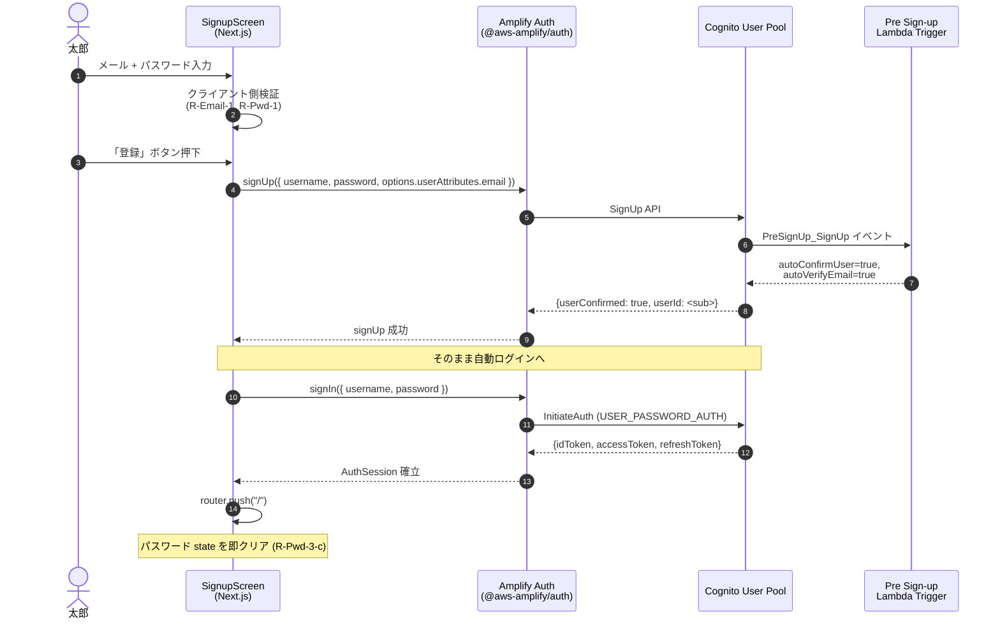
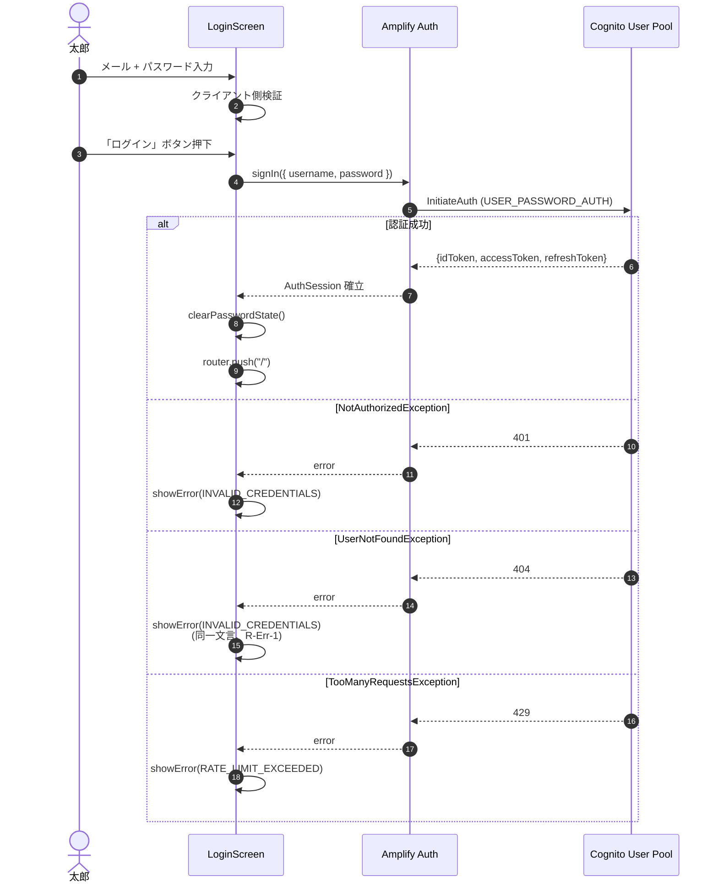
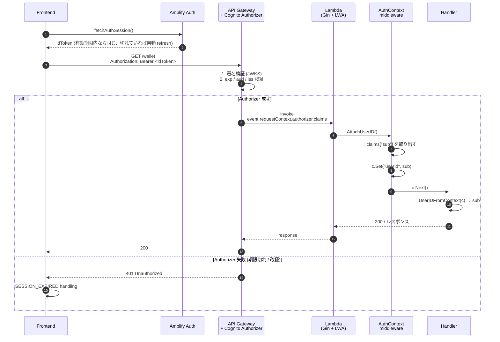
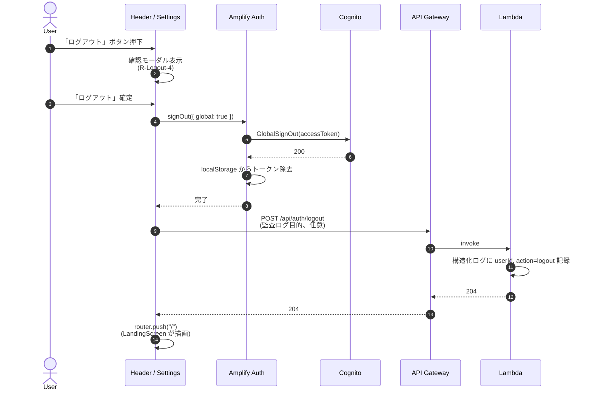
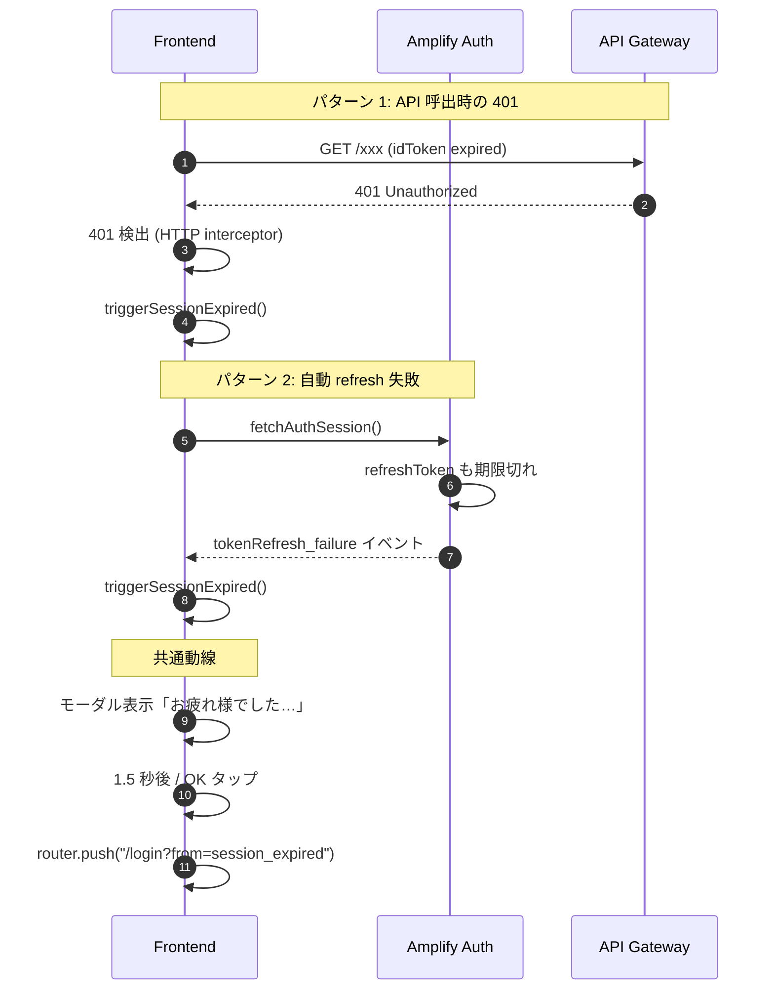
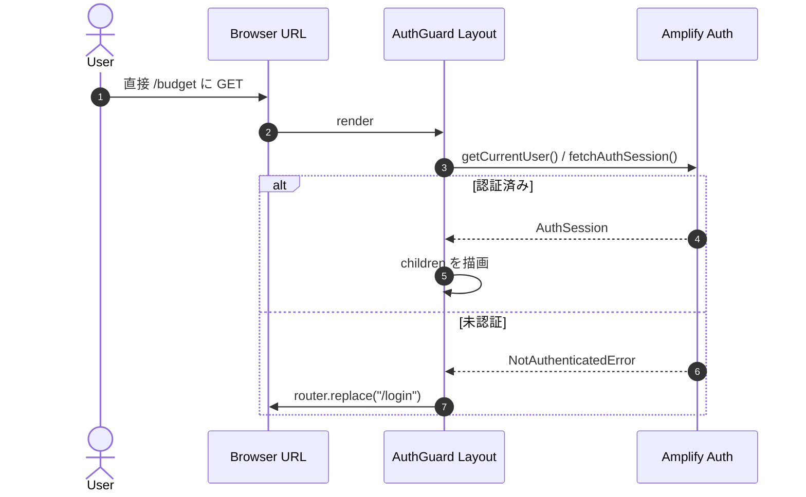

# Auth Unit — Business Logic Model

**Document Version**: 1.0
**Created**: 2026-05-21
**Unit**: A (`auth`)
**Stage**: Functional Design / Construction

本ドキュメントは Unit A の **業務フロー** をシーケンス図とアルゴリズム記述で示す。技術スタックの参照は最小限とし、フローのロジックそのものに焦点を当てる。

参照: [domain-entities.md](./domain-entities.md), [business-rules.md](./business-rules.md)

---

## 1. 全体フロー俯瞰

```
            ┌─────────────────┐
            │  LandingScreen  │ (未認証 / "/")
            └────────┬────────┘
                     │
        ┌────────────┴────────────┐
        ▼                         ▼
 ┌─────────────┐          ┌─────────────┐
 │ SignupScreen│          │ LoginScreen │
 └──────┬──────┘          └──────┬──────┘
        │                        │
        │  Signup → 自動 SignIn   │  SignIn
        ▼                        ▼
        └────────┬───────────────┘
                 ▼
        ┌────────────────┐
        │  AuthSession   │ 確立
        │  router.push("/")
        └────────┬───────┘
                 ▼
       ┌──────────────────────────┐
       │  / (MainScreen, Unit B/C)│
       │  予算未設定なら /budget へ │
       └──────────────────────────┘

            （セッション中）
                 │
                 │ 401 検出 or
                 │ tokenRefresh_failure
                 ▼
       ┌──────────────────┐
       │  Session Expired │
       │  Modal → /login  │
       └──────────────────┘

       「ログアウト」 ボタン押下
                 │
                 ▼
       ┌──────────────────────────┐
       │  GlobalSignOut →         │
       │  POST /api/auth/logout → │
       │  router.push("/")        │
       └──────────────────────────┘
```

---

## 2. Flow F-1: 新規登録（Signup）

### 2.1 シーケンス図



### 2.2 アルゴリズム（疑似コード）

```pseudo
function handleSignup(email: string, password: string):
    # クライアント側事前検証
    assert isValidEmailFormat(email)        # R-Email-1
    assert meetsPasswordPolicy(password)    # R-Pwd-1

    normalizedEmail = email.toLowerCase()   # R-Email-3

    try:
        signUpResult = AmplifyAuth.signUp({
            username: normalizedEmail,
            password: password,
            options: { userAttributes: { email: normalizedEmail } }
        })
        # signUpResult.userConfirmed === true (auto-confirm 効いている)

        # 自動ログイン
        AmplifyAuth.signIn({ username: normalizedEmail, password: password })
        # Amplify が AuthSession を確立し localStorage に保存

        # メモリからパスワードを除去
        clearPasswordState()                # R-Pwd-3-c

        router.push("/")                    # R-Signup-3
    except UsernameExistsException:
        showError(EMAIL_ALREADY_EXISTS)
    except InvalidPasswordException:
        showError(WEAK_PASSWORD)
    except NetworkError:
        showError(NETWORK_ERROR)
    except others:
        showError(UNKNOWN)
        logErrorWithoutPassword(error)      # R-Pwd-3-b
```

### 2.3 例外分岐

| 例外 | 表示エラー | 後続動作 |
|---|---|---|
| `UsernameExistsException` | EMAIL_ALREADY_EXISTS | フォームに留まる、ログインへの導線提示 |
| `InvalidPasswordException` | WEAK_PASSWORD | フォームに留まる、ヒント表示 |
| `InvalidParameterException` | INVALID_EMAIL_FORMAT | フォームに留まる |
| Network error | NETWORK_ERROR | リトライボタン表示 |
| その他 | UNKNOWN | フォームに留まる、エラー報告ヒント |

---

## 3. Flow F-2: ログイン（Login）

### 3.1 シーケンス図



### 3.2 アルゴリズム

```pseudo
function handleLogin(email: string, password: string):
    assert isValidEmailFormat(email)
    normalizedEmail = email.toLowerCase()

    try:
        AmplifyAuth.signIn({ username: normalizedEmail, password: password })
        clearPasswordState()
        router.push("/")
    except NotAuthorizedException, UserNotFoundException:
        showError(INVALID_CREDENTIALS)      # R-Err-1, R-Login-2
    except TooManyRequestsException:
        showError(RATE_LIMIT_EXCEEDED)
    except NetworkError:
        showError(NETWORK_ERROR)
```

---

## 4. Flow F-3: 認証付き API 呼出

### 4.1 シーケンス図



### 4.2 middleware 疑似コード

```pseudo
function AttachUserID() handler:
    return func(c *gin.Context):
        claims = c.Request.Context["authorizer.claims"]
        if claims == nil or claims["sub"] == "":
            log.error("missing claims, possible misconfiguration")
            c.AbortWithStatus(500)               # R-JWT-4
            return
        c.Set("userId", claims["sub"])
        c.Set("userEmail", claims["email"])      # 監査用、永続化禁止
        c.Next()

function UserIDFromContext(c) -> (userId, error):
    v = c.Get("userId")
    if v == nil:
        return "", ErrUnauthorized
    return v.(string), nil
```

---

## 5. Flow F-4: ログアウト（Logout）

### 5.1 シーケンス図



### 5.2 サーバ側の最小実装

```pseudo
# POST /api/auth/logout
function handleLogout(c *gin.Context):
    userId, _ = UserIDFromContext(c)
    log.info("user logout", "userId", userId, "at", time.Now())
    c.Status(204)
    return
```

サーバ側で GlobalSignOut を再実行しない（クライアント側で既に呼出済）。

---

## 6. Flow F-5: セッション失効（Session Expiry）

### 6.1 シーケンス図



### 6.2 アルゴリズム（クライアント側 HTTP interceptor）

```pseudo
function apiClient.onResponse(response):
    if response.status == 401:
        triggerSessionExpired()
    return response

function setupAmplifyAuthHub():
    Amplify.Hub.listen("auth", (event) => {
        if event.payload.event == "tokenRefresh_failure":
            triggerSessionExpired()
    })

function triggerSessionExpired():
    if alreadyHandling: return                 # 二重発火防止
    alreadyHandling = true
    closeAllOpenModals()
    showModal(SESSION_EXPIRED_MESSAGE)
    setTimeout(() => router.push("/login?from=session_expired"), 1500)
```

---

## 7. Flow F-6: 未認証アクセスのガード

### 7.1 シーケンス図



### 7.2 ルートポリシー

[business-rules.md §8 R-Unauth-1](./business-rules.md) に基づき、ルートを 2 グループに分ける:

- **Public**: `/`, `/login`, `/(auth)/signup` — `<AuthGuard>` で囲まない
- **Authenticated**: `/budget`, `/budget-empty`, `/order/*` 等 — Next.js の `app/(authenticated)/` レイアウトで `<AuthGuard>` を適用

`/` だけは特殊で、Public だが認証状態に応じて `<LandingScreen>` か `<MainScreen>` を切り替える。

---

## 8. データフロー（Unit 横断）

```
┌─────────┐    JWT付きリクエスト   ┌──────────┐  claims抽出   ┌────────┐
│Frontend ├──────────────────────►│API Gateway├─────────────►│ Lambda │
│         │                        │+Cog Auth  │              │        │
│Amplify  │                        └──────────┘              │ Gin    │
│Auth     │                                                   │+Auth   │
│         │                                                   │MW      │
│         │   AuthSession (memory)                            │        │
│         │   ┌────────────────────┐                          │ ┌────┐ │
│  user   │   │ idToken/access/    │                          │ │user│ │
│  state  │   │ refresh tokens     │                          │ │Id  │ │
│         │   └────────────────────┘                          │ │ctx │ │
└─────────┘                                                   │ └─┬──┘ │
                                                              │   │    │
                                                              │   ▼    │
                                                              │ Unit B/│
                                                              │ C/D/E  │
                                                              │ ハンド │
                                                              │ ラへ   │
                                                              └────────┘

UserIdentity の永続化は Cognito User Pool のみ。アプリ DB には userId のみ保存される。
```

---

## 9. 受入基準（US-0-01 / US-0-02）の検証マッピング

| 受入基準 | 検証ポイント | フロー |
|---|---|---|
| US-0-01: Cognito にユーザが登録される | Pre Sign-up Trigger 経由で `userConfirmed=true` になる | F-1 |
| US-0-01: ログイン済み状態でメイン画面へ遷移 | F-1 末尾の自動 SignIn → `router.push("/")` | F-1 |
| US-0-01: 総タップ数 5 回以下 | R-Signup-4 で定義、実装は UI 設計と E2E テストで検証 | F-1 |
| US-0-02: 認証され JWT を受け取る | F-2 シーケンス図 step 8 の Cognito レスポンス | F-2 |
| US-0-02: メイン画面へ遷移 | F-2 末尾 `router.push("/")` | F-2 |
| US-0-02: セッション 1 時間以上維持 | Token Validity (Infrastructure Design で確定、目標 1 時間以上) | NFR Design 領域 |
| US-0-02: パスワード誤りでエラー表示 | F-2 alt 分岐 `INVALID_CREDENTIALS` | F-2 |

---

## 10. 後続ステージへの引き継ぎ

| 引き継ぎ先 | 内容 |
|---|---|
| NFR Requirements | F-2 の応答時間目標、F-3 middleware の処理オーバーヘッド許容値 |
| NFR Design | リトライ戦略（NetworkError 時）、HTTP interceptor の実装パターン |
| Infrastructure Design | Pre Sign-up Lambda Trigger の関数定義、Cognito User Pool 全パラメータ |
| Code Generation | F-1〜F-6 の実装、`AuthGuard` コンポーネント、`useAuth` フック、Gin middleware |
