# Unit B `budget` — Business Logic Model

**Document Version**: 1.0
**Created**: 2026-05-21
**Unit**: B (`budget` / ダメ予算)
**Stage**: Functional Design (Construction Phase)
**Depth**: Standard

---

## 0. このドキュメントの目的

Unit B `budget` のビジネスロジックを、ユースケース・処理フロー・状態遷移・データフローの 4 視点で技術非依存に記述する。エンティティ定義は [domain-entities.md](./domain-entities.md)、ルール詳細は [business-rules.md](./business-rules.md) を参照のこと。

**凍結された Unit 間 Interface 契約**: 公開 Go interface・公開 DTO・REST API path・Sentinel error の名称は [unit-interfaces.md](../../interfaces/unit-interfaces.md) (Wave 1 並列化用 Interface 契約集) で凍結済みであり、本ドキュメントはそれと整合する範囲でのみ内部ロジックを記述する。差異が必要な場合は先に unit-interfaces.md を更新する。

---

## 1. ユースケースサマリ

| ユースケース | トリガ | 主要担当 | 関連ストーリー |
|---|---|---|---|
| UC-B-01: 予算を初回設定する | ユーザが BudgetSetupScreen で送信 | `WalletService.SetBudget`（初回パス） | US-0-03, US-0-04 |
| UC-B-02: 予算を変更する | ユーザが既存値を上書き送信 | `WalletService.SetBudget`（変更パス） | US-0-03 |
| UC-B-03: 残高を取得する | フロントが MainScreen 描画時 | `WalletService.GetBalance` | US-0-04, US-1-02 |
| UC-B-04: 残高を減算する | Unit C `OrderService.PlaceOrder` から呼び出し | `WalletService.Deduct` | US-1-04, US-1-05, US-1-06 |
| UC-B-05: 月初リセットする | EventBridge Scheduler | `WalletService.ResetAll`（Scheduler Lambda） | US-3-05 |
| UC-B-06: 増額誘導の予算更新を受ける | Unit E `BudgetRaiseService.Accept` から呼び出し | `WalletService.SetBudget`（変更パス、内部経由） | US-3-04（Unit E 主担当） |

---

## 2. ユースケース詳細

### UC-B-01: 予算を初回設定する

**アクター**: 認証済みユーザ（BudgetSettings なし、Wallet なし）
**前提条件**: Unit A の認証完了、`userID` 取得済み
**事後条件**: `BudgetSettings` と `Wallet` が両方作成され、`balance == monthlyBudget`

**主シナリオ**:

```
1. ユーザは BudgetSetupScreen で予算 (例: 30,000) をクイックボタンまたは数値入力で選択
2. クライアントが POST /api/wallet/budget {monthlyBudget: 30000} を送信
3. WalletHandler.SetBudget が auth.UserIDFromContext(c) で userID を取得
4. WalletService.SetBudget(ctx, userID, 30000) を呼び出し:
   4.1 バリデーション: VR-B-01（範囲）, VR-B-02（刻み）
   4.2 WalletRepository.Get(userID) → NotFound（初回判定 DR-B-01 = B）
   4.3 BudgetSettingsRepository.Set(userID, 30000, effectiveFrom=now) で新規作成
   4.4 WalletRepository.Create(userID, balance=30000) で新規作成
5. SetBudget は error のみ返却（凍結IF）。Handler は { monthlyBudget, appliedFrom } JSON を組み立てて 200 を返す
6. クライアントが MainScreen にリダイレクト
```

**代替シナリオ**:
- バリデーション違反 → HTTP 400 `VALIDATION_FAILED`、フロントはインライン表示
- 既に Wallet が存在 → UC-B-02（変更パス）に分岐

---

### UC-B-02: 予算を変更する

**アクター**: 認証済みユーザ（BudgetSettings あり、Wallet あり）
**前提条件**: Unit A の認証完了、既存の `BudgetSettings` あり
**事後条件**: `BudgetSettings.monthlyBudget` が更新され、`Wallet.balance` が差分調整 (DR-B-02)

**主シナリオ**:

```
1. ユーザは BudgetSetupScreen で新予算 (例: 50,000) を入力（同じ画面、再入場時）
2. クライアントが POST /api/wallet/budget {monthlyBudget: 50000} を送信
3. WalletHandler.SetBudget が auth.UserIDFromContext(c) で userID を取得
4. WalletService.SetBudget(ctx, userID, 50000) を呼び出し:
   4.1 バリデーション: VR-B-01, VR-B-02
   4.2 WalletRepository.Get(userID) → Wallet あり（変更判定）
   4.3 oldBudget = BudgetSettings.monthlyBudget (例: 30000)
   4.4 delta = 50000 - 30000 = +20000
   4.5 BudgetSettingsRepository.Set(userID, 50000, effectiveFrom=now)
   4.6 WalletRepository.UpdateBalance(userID, +delta) で残高 +20,000
        （減額時は max(balance, newBudget) で打ち切り、DR-B-02）
5. SetBudget は error のみ返却。Handler は { monthlyBudget, appliedFrom } JSON を組み立てて 200 を返す
```

**代替シナリオ**:
- 増額誘導経由（US-3-04 / Unit E）: 凍結 IF (unit-interfaces.md §6.3) では Unit E の `BudgetRaiseService.Accept` が `BudgetSettingsWriter.Set(ctx, userID, newMonthlyBudget, effectiveFrom)` を **直接呼ぶ**（`WalletService.SetBudget` 経由ではない）。HTTP は `POST /api/budget/raise` で受け、Unit E 配下で扱う。Unit B は `BudgetSettingsWriter` を Unit E 専用に公開する責務のみを負う（[domain-entities.md §4.5](./domain-entities.md) 参照）
- 減額時 (newBudget < oldBudget): `Wallet.balance` が新予算を超えていたら新予算で打ち切り

---

### UC-B-03: 残高を取得する

**アクター**: 認証済みユーザ（フロントの `useWallet` フック）
**前提条件**: 認証済み、BudgetSettings 存在（または初回判定）
**事後条件**: `WalletSnapshot{userID, balance, monthlyBudget, updatedAt}` を返す

**主シナリオ**:

```
1. フロントが MainScreen 描画時に GET /api/wallet 発行
2. WalletHandler.GetBalance が auth.UserIDFromContext(c) で userID を取得
3. WalletService.GetBalance(ctx, userID) を呼び出し:
   3.1 WalletRepository.Get(userID) を ConsistentRead で取得 (PR-B-05)
   3.2 BudgetSettingsRepository.Get(userID) を取得
   3.3 両者を *WalletSnapshot{ UserID, Balance, MonthlyBudget, UpdatedAt } に合成して返却
4. Handler は 200 OK で { balance, monthlyBudget, updatedAt } JSON を返却
```

**代替シナリオ**:
- Wallet 未作成（予算未設定ユーザ）: フロントは `BudgetSetupScreen` にリダイレクト判定
- TanStack Query 30 秒 fresh / `Deduct` 成功時に自動 invalidate (PR-B-05)

---

### UC-B-04: 残高を減算する（Unit C からの呼び出し）

**アクター**: Unit C `OrderService` (内部呼び出し、HTTP 経由ではない)
**前提条件**: Unit C が Bedrock 推論で `amount` を確定済み、`idempotencyKey` をクライアント発行済み
**事後条件**: `Wallet.balance` が `amount` 減算され、`IdempotencyRecord` が作成される

**主シナリオ（成功）**:

```
1. OrderService が WalletService.Deduct(userID, amount=850, key="user_abc:01HKQ...") を呼び出し
2. WalletService.Deduct:
   2.1 バリデーション: VR-B-03 (amount > 0), VR-B-04 (key 形式), VR-B-05 (key の userID 一致)
   2.2 payload = serialize({amount: 850})
   2.3 acquired, prevResp = IdempotencyRepository.TryAcquire(key, payload, ttl=24h)
       → acquired=true（初回）
   2.4 wallet, err = WalletRepository.DeductConditional(userID, 850)
       → 成功、wallet.balance = 29,150
   2.5 IdempotencyRepository.SaveResponse(key, serialize({newBalance: 29150}))
   2.6 return DeductResult{newBalance: 29150, idempotent: false}
```

**代替シナリオ A（残高不足）** (DR-B-04):
```
   2.4' DeductConditional → ConditionFailed → ErrInsufficientBalance
   2.5' IdempotencyRepository.SaveResponse(key, serialize({error: "ErrInsufficientBalance"}))
   2.6' return ErrInsufficientBalance
   → OrderService が HTTP 402 INSUFFICIENT_BALANCE を返却
   → クライアントは BudgetEmptyScreen に遷移
```

**代替シナリオ B（冪等性ヒット — 同一 key, 同一 payload）** (DR-B-03):
```
   2.3' acquired=false, prevResp = serialize({newBalance: 29150})
   2.4'' return DeductResult{newBalance: 29150, idempotent: true}（再減算なし、初回結果を再生）
```

**代替シナリオ C（冪等性コンフリクト — 同一 key, 異 payload）** (DR-B-03):
```
   2.3'' acquired=false, prev payload = {amount: 500} だが現リクエスト = {amount: 850}
   → return ErrIdempotencyConflict
   → HTTP 409 IDEMPOTENCY_CONFLICT
```

**代替シナリオ D（前回失敗の再生）** (PR-B-04):
```
   2.3''' acquired=false, prevResp = serialize({error: "ErrInsufficientBalance"})
   → return ErrInsufficientBalance（保存済み失敗結果を再生、再実行しない）
```

---

### UC-B-05: 月初リセットする

**アクター**: EventBridge Scheduler（システムアクター）
**前提条件**: Scheduler Lambda が IAM Role で DynamoDB アクセス権限を持つ
**事後条件**: 全アクティブユーザの `Wallet.balance` が `BudgetSettings.monthlyBudget` にリセット、`BudgetResetLog` に履歴

**主シナリオ**:

```
1. EventBridge Scheduler が cron(0 15 L * ? *) UTC で起動
2. Lambda HandleMonthlyReset(ctx, event) が実行
3. WalletService.ResetAll(ctx) を呼び出し:
   3.1 resetDate = "2026-06" (now JST → 翌月の YYYY-MM)
   3.2 userIDs = WalletRepository.ListAllUserIDs()
   3.3 各 userID に対して:
       3.3.1 BudgetResetLogRepository.Get(resetDate, userID) → 既存ならスキップ (DR-B-05)
       3.3.2 BudgetSettingsRepository.Get(userID) → settings 取得（nil ならスキップ）
       3.3.3 prevBalance = Wallet.balance
       3.3.4 newBalance = settings.monthlyBudget （Q-B9=A: 素直に現在値）
       3.3.5 WalletRepository.ResetTo(userID, newBalance) （Q-B10=A: 完全リセット）
       3.3.6 BudgetResetLogRepository.Insert(resetDate, userID, prevBalance, newBalance, at=now)
              （ConditionExpression: attribute_not_exists で冪等性確保）
       3.3.7 失敗時: errors 配列に追加して継続
   3.4 ResetResult{processedUsers, errors} を返却
4. CloudWatch Logs に構造化ログ出力（成功数・エラー数）
```

**代替シナリオ**:
- Lambda タイムアウト（15 分）: `BudgetResetLog` の主キーで自動冪等性確保。手動 Lambda 再 invoke で残り処理可能 (PR-B-06)
- 個別ユーザの DynamoDB 障害: errors に集約して継続、全体は停止しない
- BudgetSettings なしユーザ: スキップ（予算未設定の新規登録後すぐリセット日が来た場合等）

---

### UC-B-06: 増額誘導の予算更新を受ける（Unit E から、Writer 経由）

**アクター**: Unit E `BudgetRaiseService.Accept`
**前提条件**: ユーザが RaiseModal で増額に同意（例: 30,000 → 45,000）
**事後条件**: `BudgetSettings.monthlyBudget` が更新（`appliedFrom` は翌月 1 日 00:00 JST）。`Wallet.balance` の即時調整は本ユースケースの責務外（凍結 IF 上、`BudgetRaiseService.Accept` は翌月 1 日適用モデル）。

**主シナリオ** (凍結 IF 通り):

```
1. Unit E BudgetRaiseService.Accept(ctx, userID, newMonthlyBudget=45000) が呼ばれる
2. Unit E は Unit B が公開する budget_settings.BudgetSettingsWriter.Set(ctx, userID, 45000, effectiveFrom=翌月1日00:00 JST) を直接呼び出す
   （unit-interfaces.md §6.3 で Unit B が Unit E 向けに公開する Writer Interface）
3. BudgetSettingsRepository.Set:
   3.1 BudgetSettings.monthlyBudget = 45000、effectiveFrom = 翌月 1 日 00:00 JST
   3.2 raiseHistory にエントリ追加（at=now, prevBudget=30000, newBudget=45000）は Unit E の Accept 内で組み立てて Writer に渡すか、Writer 内でフックする（実装詳細）
4. 翌月 1 日の月初リセット (UC-B-05) で Wallet.balance = 45000 に再設定される
5. ユーザは MainScreen で予算が 45,000 円に更新されたのを翌月から目撃
```

**注**:
- 凍結 IF (unit-interfaces.md §6) では `BudgetRaiseResult.AppliedFrom = 翌月 1 日 00:00 JST` であり、即時の `Wallet.balance` 加算は行わない（UC-B-02 の即時反映ロジックとは経路が分離されている）
- 当月の即時増額が必要なケース（変更）はユーザが BudgetSetupScreen から `POST /api/wallet/budget` を直接呼ぶ UC-B-02 のパスを使う
- Unit B 側の責務は `BudgetSettingsWriter` を Unit E 向けに公開し、Set 操作で raiseHistory を更新することのみ（[domain-entities.md §4.5](./domain-entities.md)）

---

## 3. 状態遷移図

### 3.1 `Wallet` の状態遷移

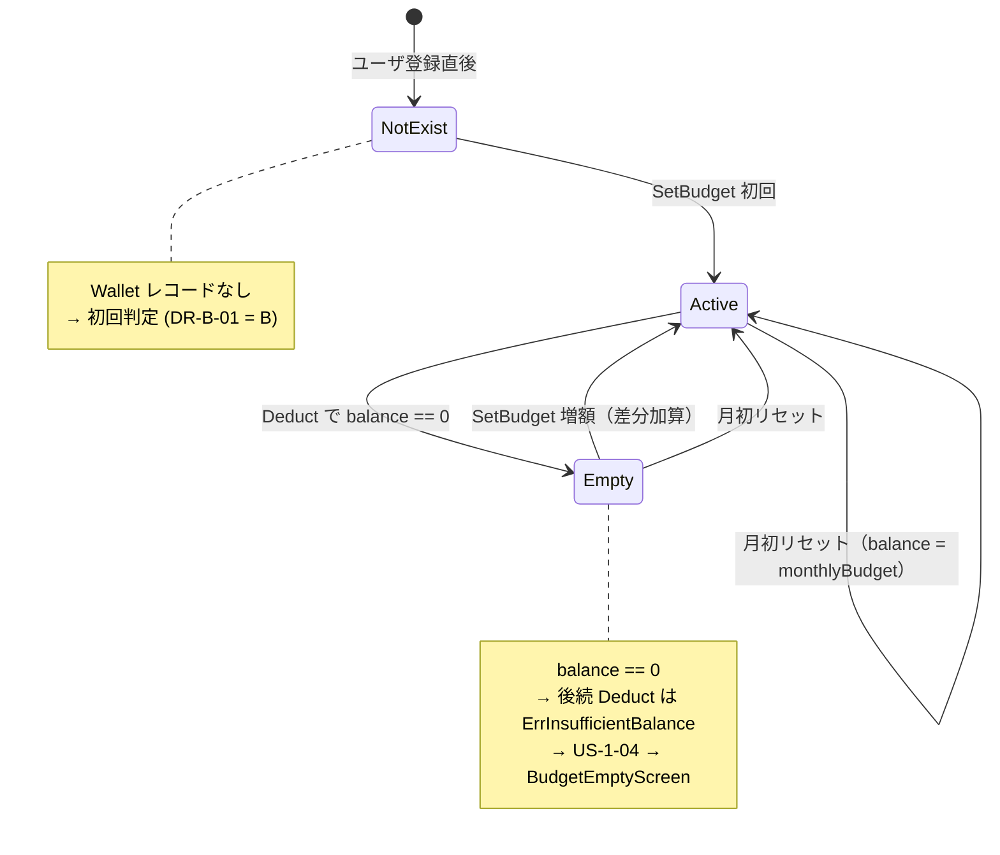

### 3.2 `IdempotencyRecord` の状態遷移

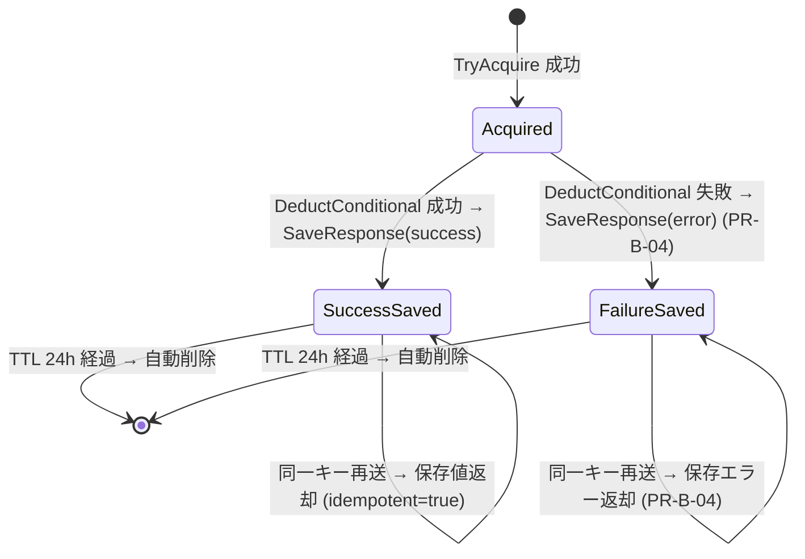

---

## 4. 主要処理シーケンス（Mermaid）

### 4.1 SetBudget 初回 (UC-B-01)

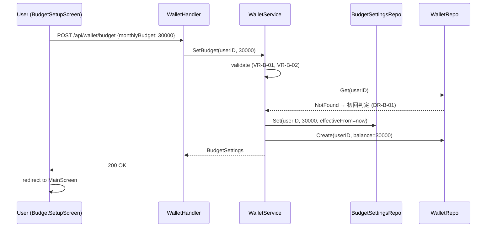

### 4.2 SetBudget 変更（増額） (UC-B-02)

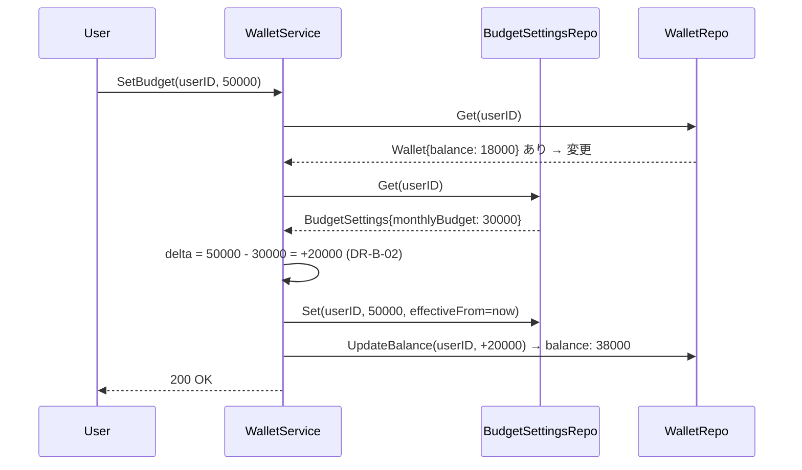

### 4.3 SetBudget 変更（減額、打ち切り発生） (UC-B-02)

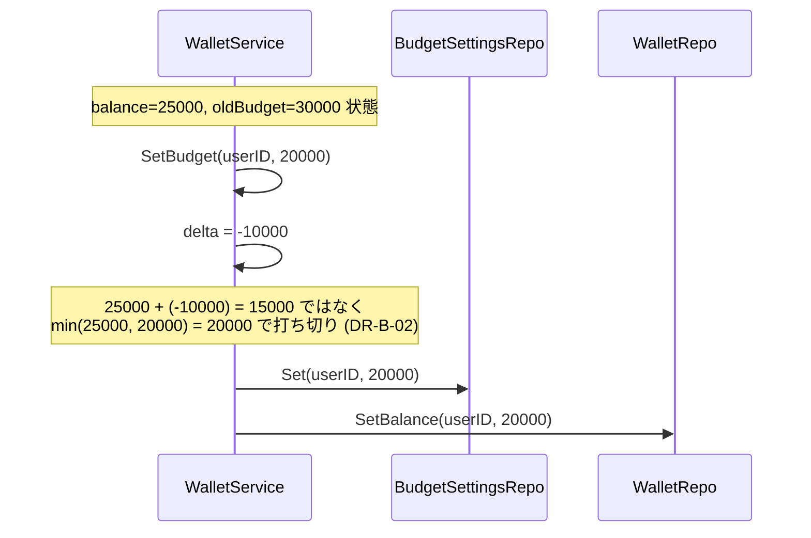

### 4.4 Deduct 成功 (UC-B-04 主シナリオ)

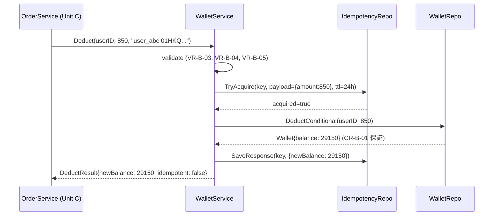

### 4.5 Deduct 残高不足 (UC-B-04 代替 A)

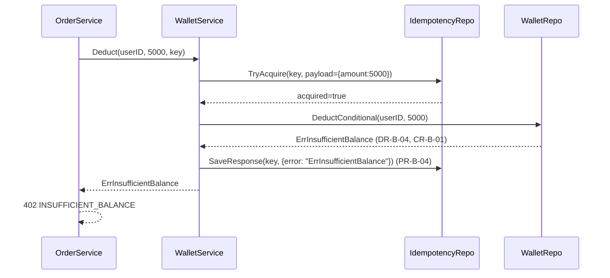

### 4.6 Deduct 冪等性ヒット (UC-B-04 代替 B)

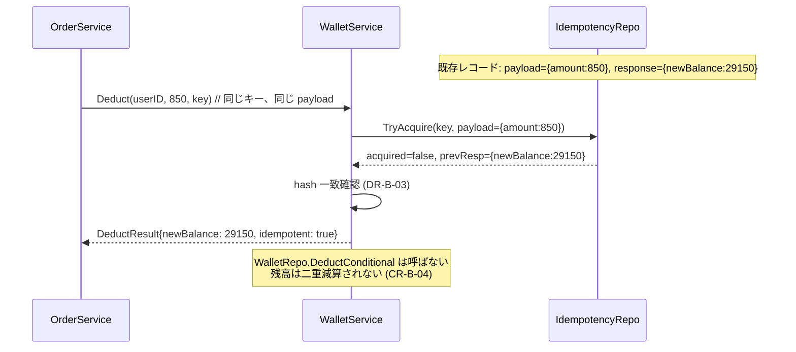

### 4.7 月初リセット (UC-B-05)

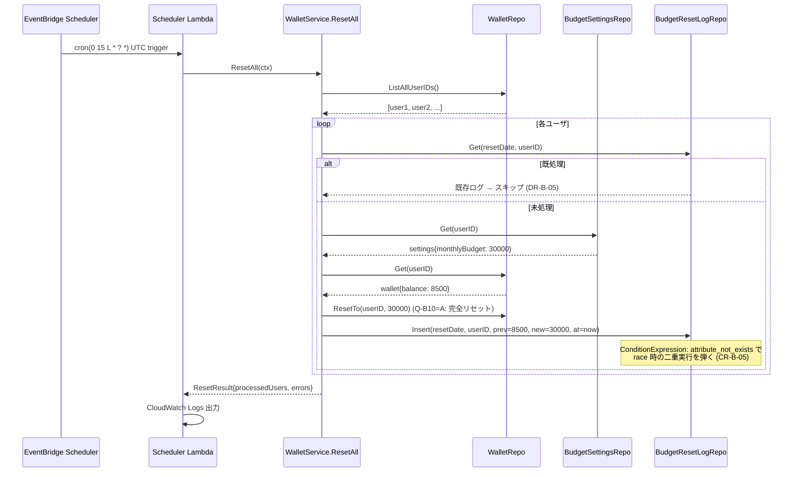

---

## 5. データフロー図（DFD）

### 5.1 SetBudget のデータフロー

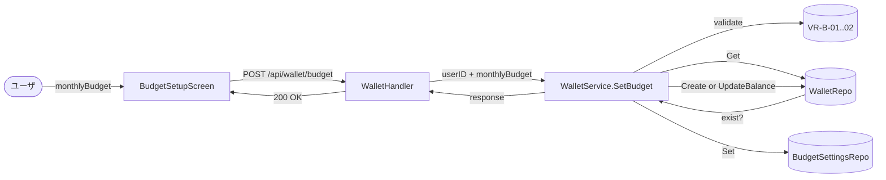

### 5.2 Deduct のデータフロー

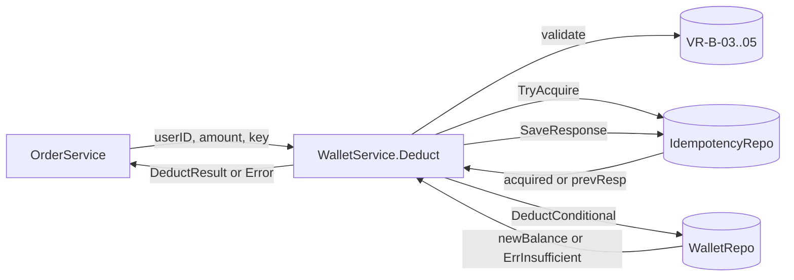

### 5.3 月初リセットのデータフロー

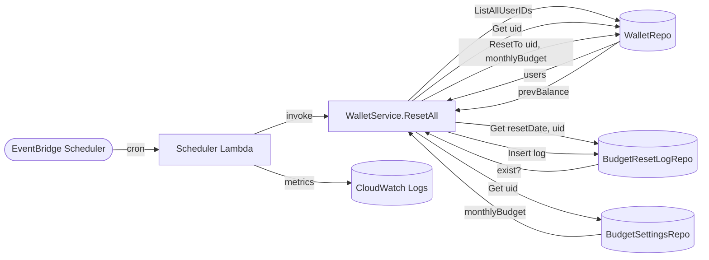

---

## 6. ダメ化UX の織り込み

| 体験 | Unit B での実装 |
|---|---|
| 低摩擦オンボーディング (NFR-DEG-01) | UC-B-01 で 1 タップ（クイックボタン） + バリデーション即時表示で離脱回避 |
| 残高常時可視化 (NFR-DEG-03) | UC-B-03 ConsistentRead + フロント自動 invalidate でリアルタイム残高 |
| 即時甘やかし (NFR-DEG-01) | UC-B-02 の即時反映（PR-B-02）、増額がその場で残高に反映される |
| 退化ループ (NFR-DEG-04) | UC-B-05 完全リセット（PR-B-01）で「使い切り圧力」を演出 |
| ダメになれない圧力 (NFR-DEG-03) | UC-B-04 残高不足時の 402 → BudgetEmptyScreen 遷移（Unit E と連携） |

---

## 7. 横断的関心事

### 7.1 トランザクション境界

本 MVP の DynamoDB は **TransactWriteItems を使わず、単一テーブル単一アイテムの ConditionExpression** で原子性を確保する。複数テーブル同時書き込みが必要な箇所:

- `SetBudget` 初回: BudgetSettings + Wallet の 2 テーブル書き込み → 失敗時は片方残るリスクあり
  - 対策: 先に BudgetSettings、次に Wallet の順で書く。Wallet 書き込み失敗時は次回 SetBudget で BudgetSettings 上書き + Wallet 作成のリカバリが効く
- `Deduct`: IdempotencyRecord 書き込み → Wallet 減算 → IdempotencyRecord に response 保存
  - レコード不整合時の挙動: PR-B-04 で「失敗結果も保存」により race 耐性を確保

### 7.2 監視・ログ

- 全 `Deduct` 呼び出しは構造化ログ（userID, amount, idempotencyKey, result）を出力
- `ResetAll` は処理サマリ（processedUsers, errors）を Lambda 出力
- 詳細はインフラデザインの CloudWatch 設計を参照

### 7.3 認証・認可

- 全 HTTP エンドポイントは Cognito JWT 検証済み（Unit A の `auth.AttachUserID()` middleware が `gin.Context` に `userID` を注入。Handler は `auth.UserIDFromContext(c)` で取得し、不正時は `auth.ErrUnauthorized` を返す）
- `Deduct` 内部呼び出しでも `userID` パラメータと `idempotencyKey` のプレフィックスを照合 (VR-B-05)
- Scheduler Lambda は IAM Role で DynamoDB 全テーブル R/W 権限（後続の Infrastructure Design で詳細）

---

## 8. 審査観点へのトレーサビリティ

| 審査観点 | 本ドキュメントでの対応 |
|---|---|
| ビジネス意図の明確さ | 各 UC のシナリオで「ダメ化UX」の体験フェーズ（低摩擦・即時甘やかし・退化ループ）を明示 §6 |
| 創造性とテーマ適合性 | UC-B-05 の「完全リセット」、UC-B-02 の「即時反映」がダメ化UX 思想を実装で具体化 |
| Unit 分解の適切さ | UC-B-04（Unit C 連携）、UC-B-06（Unit E 連携）で他 Unit との境界を明示 |
| ドキュメント品質 | 状態遷移図 + シーケンス図 7 本 + DFD 3 本 + ストーリー / NFR / ルールへの明示参照 |
