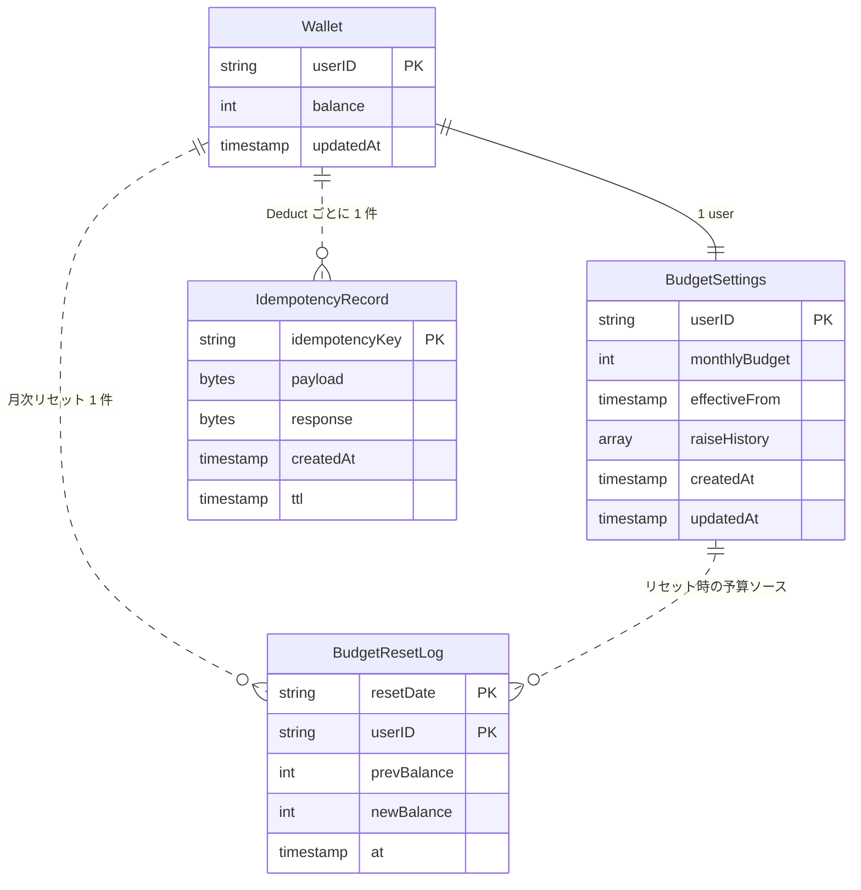

# Unit B `budget` — Domain Entities

**Document Version**: 1.0
**Created**: 2026-05-21
**Unit**: B (`budget` / ダメ予算)
**Stage**: Functional Design (Construction Phase)
**Depth**: Standard

---

## 0. このドキュメントの目的

Unit B `budget` のドメインモデル（エンティティ・値オブジェクト・関連）を技術非依存で定義する。永続化やインフラの詳細は Infrastructure Design / Code Generation で記述する。

---

## 1. エンティティ一覧

| エンティティ | 識別子 | 概要 |
|---|---|---|
| `Wallet` | `userID` | ユーザの仮想ウォレット。残高（balance）と更新時刻を保持 |
| `BudgetSettings` | `userID` | ユーザの月間予算設定。予算額と増額履歴を保持 |
| `IdempotencyRecord` | `idempotencyKey` | 冪等性レコード。`Deduct` の二重実行防止 |
| `BudgetResetLog` | `(resetDate, userID)` | 月初リセット履歴。前残高・新残高・実施時刻 |

---

## 2. エンティティ詳細

### 2.1 `Wallet`

ユーザが現在保有するダメ予算残高を表現する集約ルート。

| 属性 | 型 | 制約 | 説明 |
|---|---|---|---|
| `userID` | string | UNIQUE, NOT NULL | Cognito `sub` 由来のユーザ識別子 |
| `balance` | int | `0 ≤ balance ≤ 100,000` | 残高（円）。負にならない不変条件あり |
| `updatedAt` | timestamp | NOT NULL | 最終更新時刻（`Deduct` / `ResetTo` / 初回作成時） |

**ライフサイクル**:
- **生成**: `SetBudget` 初回呼び出し時、`balance = monthlyBudget` で作成
- **更新**: `Deduct` で減算 / `ResetTo` で予算額にリセット / `SetBudget` 変更時の差分調整
- **削除**: 本 MVP では実装しない（ユーザ削除機能なし）

**不変条件**:
- `balance >= 0` を常に満たす（`DeductConditional` の ConditionExpression で保証）
- `balance <= BudgetSettings.MonthlyBudget` （`SetBudget` 変更時の減額調整 max() 打ち切りで保証）

**ストーリー対応**: US-0-04（残高初期表示）、US-1-02（残高常時可視化）、US-1-04（不足検出）、US-1-06（負にならない）

---

### 2.2 `BudgetSettings`

ユーザの月間予算とその変更履歴を保持する。

| 属性 | 型 | 制約 | 説明 |
|---|---|---|---|
| `userID` | string | UNIQUE, NOT NULL | Cognito `sub` 由来 |
| `monthlyBudget` | int | `1 ≤ monthlyBudget ≤ 100,000`, **1,000 円刻み** | 月間予算（円） |
| `effectiveFrom` | timestamp | NOT NULL | 最終 SetBudget 時刻（**監査メタデータ**として記録、リセット時の判定には使用しない） |
| `raiseHistory` | `[]RaiseLog` | optional | 増額履歴（NFR-DEG-04 退化ループのトレース用） |
| `createdAt` | timestamp | NOT NULL | 初回作成時刻 |
| `updatedAt` | timestamp | NOT NULL | 最終更新時刻 |

**バリデーション** (Q-B1 = A, Q-B11 補足 γ):
- `1 ≤ monthlyBudget ≤ 100,000`
- `monthlyBudget % 1000 == 0`（1,000 円刻み）
- 上記を満たさないリクエストは `ErrValidation`（HTTP 400 `VALIDATION_FAILED`）

**ライフサイクル** (Q-B2 = B, Q-B3 = B):
- **生成**: `SetBudget` 初回呼び出し時（Wallet が存在しない時を初回判定）
- **更新**: `SetBudget` 変更呼び出し時。同時に Wallet の差分調整も実行
- **削除**: 本 MVP では実装しない

**ストーリー対応**: US-0-03（予算設定）、US-3-04（増額誘導の適用先 — Unit E から呼ばれる）、US-3-05（リセット時の予算ソース）

---

### 2.2.1 値オブジェクト `RaiseLog`

`BudgetSettings.raiseHistory` の要素。

| 属性 | 型 | 説明 |
|---|---|---|
| `at` | timestamp | 増額が実施された時刻 |
| `prevBudget` | int | 増額前の予算 |
| `newBudget` | int | 増額後の予算 |

`BudgetRaiseService.Accept`（Unit E）から呼ばれる際に追加される。Unit B 自体は履歴の記録のみ責務、判定には使わない。

---

### 2.3 `IdempotencyRecord`

`Deduct` の冪等性キーごとに作られるレコード。

| 属性 | 型 | 制約 | 説明 |
|---|---|---|---|
| `idempotencyKey` | string | UNIQUE, NOT NULL | `{userID}:{clientGeneratedUlid}` 形式 (Q-B4 = A) |
| `payload` | bytes | NOT NULL | `Deduct` リクエストの本質情報（`amount`、結果のエラー種別など）のシリアライズ |
| `response` | bytes | optional | 初回処理の結果（`DeductResult` の JSON）。失敗時は失敗結果を保存 (Q-B5 = A) |
| `createdAt` | timestamp | NOT NULL | レコード作成時刻 |
| `ttl` | timestamp | NOT NULL | `createdAt + 24h`（DynamoDB TTL で自動削除） |

**ライフサイクル** (Q-B4 = A, Q-B5 = A):
- **生成**: `IdempotencyRepository.TryAcquire` で `acquired=true` を返す瞬間にコミット
- **更新**: 同一キーで再呼び出しされた場合は読み取りのみ（更新しない）
- **削除**: TTL 24 時間経過後に DynamoDB が自動削除

**ストーリー対応**: US-1-05（二重引き落とし防止）

**race condition 対策**:
- DynamoDB の `PutItem` with `ConditionExpression: attribute_not_exists(idempotencyKey)` を使う
- 衝突時は ConditionFailedException を捕捉して既存レコードを `GetItem` で取得し、`response` を返す

---

### 2.4 `BudgetResetLog`

月初リセット 1 ユーザ × 1 月分のログ。

| 属性 | 型 | 制約 | 説明 |
|---|---|---|---|
| `resetDate` | string | NOT NULL | リセット対象月（`YYYY-MM` 形式、例: `"2026-06"`） |
| `userID` | string | NOT NULL | リセット対象ユーザ |
| `prevBalance` | int | NOT NULL | リセット直前の残高 |
| `newBalance` | int | NOT NULL | リセット後の残高（= `BudgetSettings.MonthlyBudget`） |
| `at` | timestamp | NOT NULL | リセット実施時刻 |

**主キー**: `(resetDate, userID)` の複合キー (Q-B8 = A)

**ライフサイクル**:
- **生成**: 月初リセットで 1 ユーザ処理ごとに 1 レコード Insert
- **更新**: なし（イミュータブル）
- **削除**: 本 MVP では実装しない（履歴は永続保持）

**冪等性保証**: `(resetDate, userID)` 主キーで Insert する際、`ConditionExpression: attribute_not_exists(resetDate)` を付与。既存ならスキップ → リセット処理全体の冪等性を確保。

**ストーリー対応**: US-3-05（月初リセット履歴）

---

## 3. エンティティ関連図



---

## 4. ドメインサービス（メソッド契約）

ドメインサービスは「複数のエンティティをまたぐ操作」を表現する。実装は `WalletService` (Unit B 内部) に集約。

### 4.1 `GetBalance(userID)`

| 項目 | 内容 |
|---|---|
| 入力 | `userID: string` |
| 出力 | `WalletSnapshot{ userID, balance, monthlyBudget, updatedAt }` |
| 例外 | `ErrUnauthorized`（認証失敗、Unit A の責務）、`ErrInternal` |
| 副作用 | なし（読み取り専用） |
| 整合性 | `Wallet` と `BudgetSettings` の両方を取得して合成 |

---

### 4.2 `SetBudget(userID, monthlyBudget)`

| 項目 | 内容 |
|---|---|
| 入力 | `userID: string`, `monthlyBudget: int` |
| 出力 | `BudgetSettings`（更新後） |
| 例外 | `ErrValidation`（範囲外 / 1,000 円刻み外）、`ErrInternal` |
| 副作用 | `BudgetSettings` の Upsert + `Wallet` の作成または差分調整 |
| 初回判定 | `Wallet` が存在しない場合を初回とする (Q-B3 = B) |
| 初回処理 | `Wallet` を `balance = monthlyBudget` で新規作成、`BudgetSettings` を新規作成 |
| 変更処理 | `BudgetSettings.monthlyBudget` を更新、`Wallet.balance` を差分調整 |

**変更時の差分調整ロジック** (Q-B2 = B):
```
delta = newBudget - oldBudget
if delta > 0:
    # 増額: 当月残高に delta を加算
    Wallet.balance += delta
elif delta < 0:
    # 減額: max(現残高, 新予算) で打ち切り（残高が新予算を超えないようにする）
    Wallet.balance = min(Wallet.balance, newBudget)
```

**注**: 減額時に「現残高が新予算より大きい場合、新予算まで切り下げる」ことで `balance <= monthlyBudget` 不変条件を保つ。負にならない不変条件は `0 ≤ newBudget` から自動的に保たれる。

---

### 4.3 `Deduct(userID, amount, idempotencyKey)`

| 項目 | 内容 |
|---|---|
| 入力 | `userID: string`, `amount: int (>0)`, `idempotencyKey: string` |
| 出力 | `DeductResult{ newBalance, idempotent }` |
| 例外 | `ErrInsufficientBalance`（残高不足、HTTP 402）、`ErrIdempotencyConflict`（同一キー × 異なる payload）、`ErrInternal` |
| 副作用 | `IdempotencyRecord` の作成 + `Wallet.balance` の条件付き減算 |
| 冪等性 | 同一 `idempotencyKey` × 同一 `payload` の再呼び出しは `idempotent=true` で初回結果を返す |
| 失敗時の冪等レコード | 失敗結果も `response` として保存、同一キー再送には保存通り返却 (Q-B5 = A) |

**処理フロー**:
```
1. payload = serialize({amount: amount})
2. acquired, prevResponse, err = IdempotencyRepository.TryAcquire(key, payload, ttl=24h)
   if err != nil: return ErrInternal
   if !acquired:
       # 既存レコード
       if prevPayloadHash != payloadHash: return ErrIdempotencyConflict
       deserializedResult = parse(prevResponse)
       return deserializedResult with idempotent=true
3. wallet, err = WalletRepository.DeductConditional(userID, amount)
   if err == ErrInsufficientBalance:
       # 失敗結果を IdempotencyRecord.response に保存（race condition で再送される場合に同じエラーを返す）
       IdempotencyRepository.SaveResponse(key, serialize({error: "ErrInsufficientBalance"}))
       return ErrInsufficientBalance
   if err != nil: return ErrInternal
4. successResponse = serialize({newBalance: wallet.balance})
   IdempotencyRepository.SaveResponse(key, successResponse)
   return DeductResult{newBalance: wallet.balance, idempotent: false}
```

---

### 4.4 `ResetAll(ctx)` — Scheduler Lambda 専用

| 項目 | 内容 |
|---|---|
| 入力 | `ctx: context.Context` |
| 出力 | `ResetResult{ processedUsers, errors[] }` |
| 例外 | 個別ユーザの失敗は集約して継続、致命的失敗のみ停止 |
| 副作用 | 全ユーザの `Wallet.balance` を `BudgetSettings.monthlyBudget` にリセット + `BudgetResetLog` を Insert |
| 冪等性 | `BudgetResetLog` の `(resetDate, userID)` 主キー条件付き Insert で保証 (Q-B8 = A) |

**処理フロー** (Q-B9 = A, Q-B10 = A):
```
1. resetDate = formatYYYYMM(now JST)
2. userIDs = WalletRepository.ListAllUserIDs()
3. for each uid in userIDs:
   try:
     existing, err = BudgetResetLogRepository.Get(resetDate, uid)
     if existing != nil: continue  // 既に処理済み（再実行時のスキップ）
     wallet = WalletRepository.Get(uid)
     settings = BudgetSettingsRepository.Get(uid)
     if settings == nil: continue  // 予算未設定ユーザはスキップ
     prevBalance = wallet.balance
     newBalance = settings.monthlyBudget  // ← Q-B9=A: 素直に現在値を採用
     WalletRepository.ResetTo(uid, newBalance)  // ← Q-B10=A: 完全リセット、持ち越しなし
     BudgetResetLogRepository.Insert(BudgetResetLog{
         resetDate: resetDate, userID: uid,
         prevBalance: prevBalance, newBalance: newBalance, at: now
     })
   catch:
     errors = append(errors, err)
4. return ResetResult{processedUsers: len(userIDs) - len(errors), errors: errors}
```

---

## 5. 認証境界

Unit B のすべてのドメインサービスは Unit A の `AuthContextService` で認証済みコンテキスト（`userID`）を前提とする。`Deduct` のリクエスト元 (`OrderService`) は同一 Lambda 内であり Cognito JWT 検証は API Gateway 段で完了している。

`ResetAll` のみ EventBridge Scheduler 経由で Lambda が呼ばれ、認証コンテキストを持たない。Lambda の IAM Role が DynamoDB への読み書き権限を持つ前提（Infrastructure Design で定義）。

---

## 6. 不変条件サマリ

| 不変条件 | 保証手段 |
|---|---|
| `Wallet.balance >= 0` | `DeductConditional` の DynamoDB ConditionExpression: `balance >= :amount` |
| `Wallet.balance <= BudgetSettings.monthlyBudget` | `SetBudget` 減額時の `min(balance, newBudget)` 打ち切り |
| `BudgetSettings.monthlyBudget ∈ [1, 100000]` かつ `% 1000 == 0` | `SetBudget` の入力バリデーション |
| 同一 `idempotencyKey` の `Deduct` で残高は最大 1 回しか減らない | `IdempotencyRepository.TryAcquire` の Put with ConditionExpression |
| 月初リセットは 1 ユーザ 1 月で最大 1 回のみ | `BudgetResetLog.(resetDate, userID)` 複合キー条件付き Insert |
| `Wallet` と `BudgetSettings` は同一ユーザに対し対で存在する（または両方なし） | `SetBudget` の初回判定で同時作成、本 MVP では削除なし |

これらは Property-Based Testing 拡張（Partial 適用）の対象となる（NFR Requirements ステージで詳細化）。
