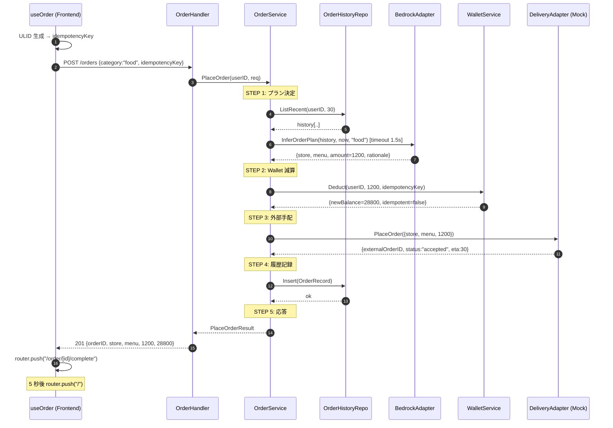
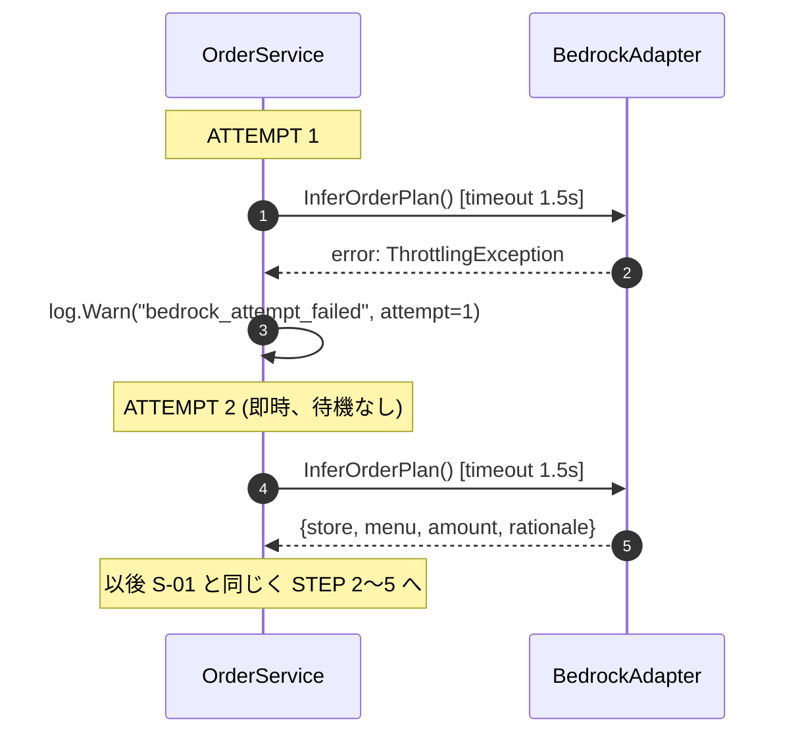
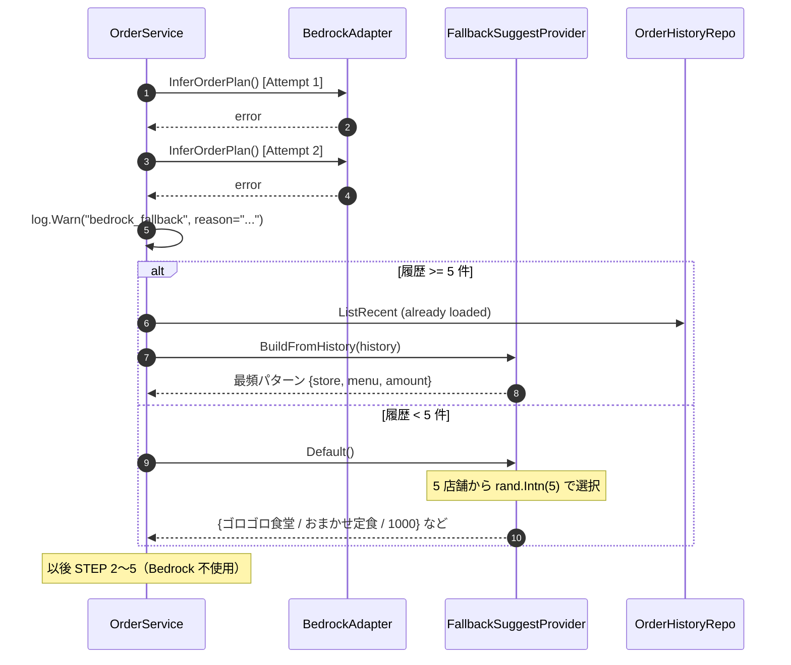
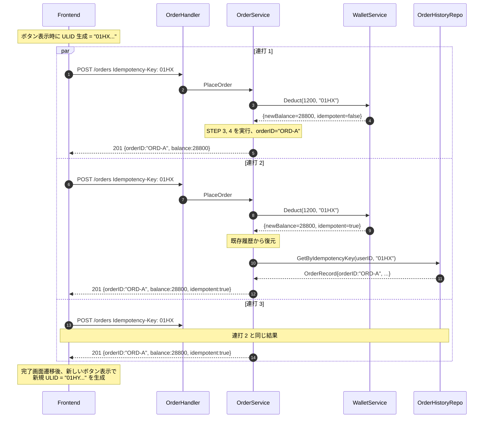
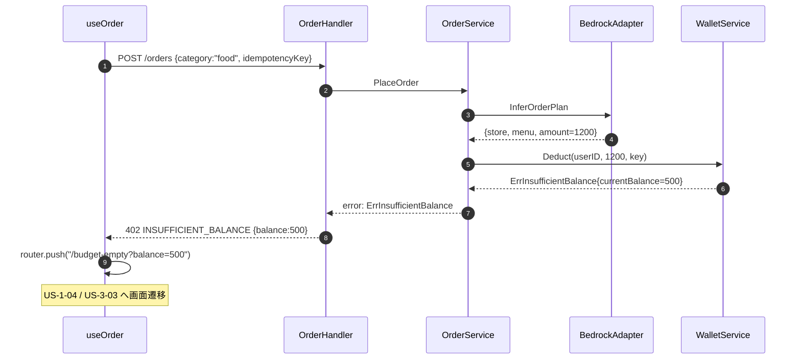
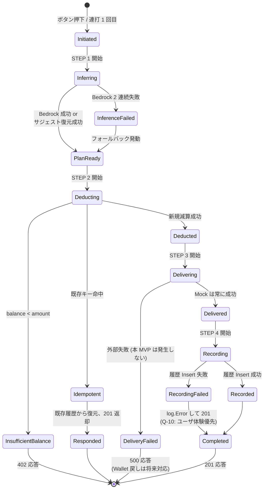
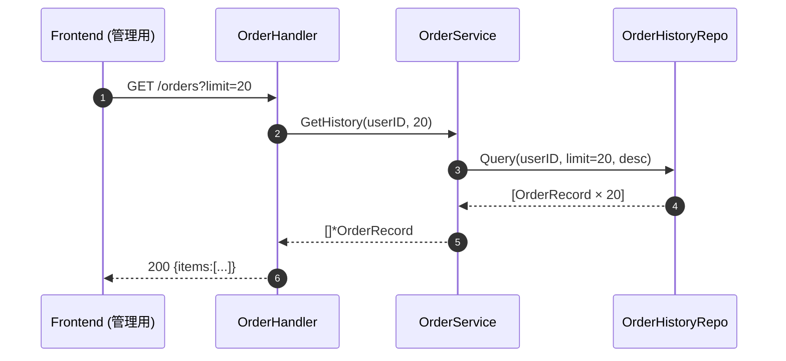

# Unit C (`order`) — Business Logic Model

**Document Version**: 1.0
**Created**: 2026-05-21
**Stage**: Construction / Functional Design
**Unit**: C — `order` (代行手配コア)
**Depth**: **Comprehensive**
**Related**: [business-rules.md](./business-rules.md), [domain-entities.md](./domain-entities.md), [frontend-components.md](./frontend-components.md)

本ドキュメントは、Unit C `order` の **業務ロジック構造** を技術非依存（Go / DynamoDB の実装詳細抜き）で記述する。Comprehensive 深度として、ユースケースの詳細シーケンス図・状態遷移・主要 5 シナリオを網羅する。

---

## 1. ユースケース概要

### 1.1 主要ユースケース

| UC ID | 名称 | エントリポイント | 担当ストーリー |
|---|---|---|---|
| **UC-C-01** | **代行手配（PlaceOrder）** | `POST /orders` | US-1-01 / US-1-03 / US-1-07 / US-X-01 |
| UC-C-02 | サジェスト経由代行手配 | `POST /orders` (with `suggestionId`) | US-2-03（Resolve 側） |
| UC-C-03 | 履歴取得 | `GET /orders` | US-1-03（参照系） |

### 1.2 ユースケース間関係

```
UC-C-01 (PlaceOrder)
  ├─ Bedrock 推論経由   ← suggestionId なし
  └─ サジェスト復元経由 ← suggestionId あり = UC-C-02
       └─ Unit D の SuggestService.ResolveSuggestion を呼び出し

UC-C-03 (GetHistory)
  └─ 独立、内部利用が中心（管理画面 / Unit D / Unit E から参照）
```

UC-C-01 と UC-C-02 は **PlaceOrder の同一エントリポイント** で吸収される（リクエスト body に `suggestionId` が入っているかで分岐）。

---

## 2. UC-C-01 PlaceOrder の処理フロー（基本）

### 2.1 高レベル擬似コード

```
PlaceOrder(userID, req):
  STEP 1: プラン決定
    if req.SuggestionID != nil:
      plan = ResolvePlanFromSuggestion(req.SuggestionID)   # Q-5: 保存値そのまま
      if plan == nil:                                       # Q-6: 失効時
        plan = InferPlanViaBedrock(userID, req.Category)   #   透過的フォールバック
    else:
      plan = InferPlanViaBedrock(userID, req.Category)

  STEP 2: Wallet 減算（冪等性付き）
    deductResult = WalletService.Deduct(userID, plan.Amount, req.IdempotencyKey)
    if deductResult.Err == ErrInsufficientBalance:
      return Response(402, INSUFFICIENT_BALANCE)
    if deductResult.Idempotent:
      # 既存 OrderHistory から復元して返す（Q-8: TTL 24h 内なら命中）
      existingOrder = OrderHistoryRepository.GetByIdempotencyKey(userID, req.IdempotencyKey)
      return existingOrder.AsResponse(idempotent=true)

  STEP 3: 外部手配（Mock）
    deliveryOutput, err = DeliveryAdapter.PlaceOrder(plan)
    if err:
      log.Error("delivery_failed", userID, plan, idempotencyKey)   # Q-9: 補償なし
      return Response(500, DELIVERY_FAILED)

  STEP 4: 履歴記録（best-effort）
    err = OrderHistoryRepository.Insert(OrderRecord{
      OrderID:        ulid.Make(),
      UserID:         userID,
      IdempotencyKey: req.IdempotencyKey,
      Category:       plan.Category,
      StoreName:      plan.StoreName,
      MenuName:       plan.MenuName,
      Amount:         plan.Amount,
      OrderedAt:      now,
      Source:         req.SuggestionID ? "suggest" : "button",
    })
    if err:
      log.Error("order_history_insert_failed", userID, ...)   # Q-10: 200 を返す

  STEP 5: 応答組み立て
    return Response(201, {
      OrderID:           orderID,
      StoreName:         plan.StoreName,
      MenuName:          plan.MenuName,
      Amount:            plan.Amount,
      RemainingBalance:  deductResult.NewBalance,
      Idempotent:        false,
    })
```

### 2.2 InferPlanViaBedrock サブルーチン

Q-1 (1 回リトライ) + Q-2 (タイムアウト 1.5 秒) + Q-3 (フォールバック分岐) を統合した擬似コード。

```
InferPlanViaBedrock(userID, category):
  history = OrderHistoryRepository.ListRecent(userID, limit=30)

  ATTEMPT 1:
    ctx, cancel = context.WithTimeout(parent, 1.5s)
    plan, err = BedrockAdapter.InferOrderPlan(ctx, history, now, category)
    cancel()
    if err == nil: return plan

  ATTEMPT 2 (Q-1: リトライ 1 回のみ、即時、待機なし):
    ctx, cancel = context.WithTimeout(parent, 1.5s)
    plan, err = BedrockAdapter.InferOrderPlan(ctx, history, now, category)
    cancel()
    if err == nil: return plan

  FALLBACK (Q-3):
    log.Warn("bedrock_fallback", userID, error=err)
    if len(history) >= 5:
      plan = FallbackSuggestProvider.BuildFromHistory(history)
    else:
      plan = FallbackSuggestProvider.Default()   # Q-4: 架空店舗 5 件からランダム
    return plan
```

### 2.3 ResolvePlanFromSuggestion サブルーチン

```
ResolvePlanFromSuggestion(suggestionID):
  saved = SuggestService.ResolveSuggestion(suggestionID)
  if saved == nil:                # 失効 (TTL 30 分超過)
    log.Warn("suggestion_expired", suggestionID)
    return nil                    # 呼び出し側 (PlaceOrder) が透過フォールバック (Q-6)
  return Plan{
    StoreName: saved.StoreName,
    MenuName:  saved.MenuName,
    Amount:    saved.Amount,
    Category:  saved.Category,
  }                                # Q-5: Bedrock 再検証なし
```

---

## 3. シーケンス図（5 シナリオ）

Comprehensive 深度として、**起こりうる主要 5 パターン全て** を網羅する。

### 3.1 シナリオ S-01: ハッピーパス（Bedrock 1 発成功）



**特性**: 全ステップ成功、レイテンシ ≈ Bedrock(0.8s) + Wallet(0.2s) + Delivery(0.05s) + History(0.05s) ≈ **1.1 秒** → NFR-PERF-01（3 秒以内）余裕

---

### 3.2 シナリオ S-02: Bedrock 失敗 → リトライ成功



**特性**: ワーストレイテンシ Bedrock × 2 = 3.0 秒 → NFR-PERF-01 ぎりぎり収まる（Q-1+Q-2 の合算境界）

---

### 3.3 シナリオ S-03: Bedrock 完全失敗 → フォールバック発動



**特性**: フォールバックが選ばれてもユーザは気づかない（NFR-DEG-05: 透過性）。サーバログのみで観測可能。

---

### 3.4 シナリオ S-04: 連打（同一 idempotencyKey 3 回送信）



**特性**: 残高は 1 回分（1200 円）しか減らない、orderID は同一（"ORD-A"）、Bedrock も 1 回しか呼ばれない（idempotent=true 分岐で短絡）

---

### 3.5 シナリオ S-05: 残高不足 → 402 応答



**特性**: 残高 500 円 < 推論額 1200 円 → Wallet で `balance >= amount` の条件付き書き込みが失敗 → ErrInsufficientBalance → 402 → BudgetEmpty 画面（Q-12 採用）

---

## 4. 状態遷移図（注文の状態モデル）

注文 1 件のライフサイクル。Comprehensive 深度として、**観測可能な全状態と遷移**を定義する。



**観測可能な状態の対応** (CloudWatch ログ):

| 状態 | ログイベント |
|---|---|
| Initiated | `event="order_initiated"` |
| InferenceFailed | `event="bedrock_fallback"` |
| InsufficientBalance | `event="insufficient_balance"` |
| Idempotent | `event="idempotency_hit"` |
| DeliveryFailed | `event="delivery_failed"` (本 MVP は発生しない) |
| RecordingFailed | `event="order_history_insert_failed"` |
| Completed | `event="order_completed"` |

---

## 5. UC-C-03 GetHistory の処理フロー

### 5.1 擬似コード

```
GetHistory(userID, limitParam):
  # Q-11 採用
  if limitParam == 0: limit = 20            # デフォルト
  else if limitParam < 0 or limitParam > 100: return 400 InvalidLimit
  else: limit = limitParam

  records = OrderHistoryRepository.Query(
    userID,
    sort:        "OrderedAt DESC",
    limit:       limit,
    scanForward: false,
  )
  # TTL 過ぎは DynamoDB 側で自動削除済 → アプリでフィルタ不要
  return records
```

### 5.2 シーケンス図



---

## 6. 横串コンポーネントとの相互作用

Unit C は単体では完結せず、**横串コンポーネント 3 つ**と密に連携する。

### 6.1 BedrockAdapter（共有: Unit C / D）

| Unit C 側の利用 | パラメータ |
|---|---|
| `InferOrderPlan(history, now, category)` | history は最新 30 件、category は "food" 固定（MVP） |

タイムアウト・リトライは Unit C の `OrderService` 側で制御（Adapter 自体は単純な Bedrock 呼び出しのみ）。

### 6.2 DeliveryAdapter（主利用: Unit C）

| Unit C 側の利用 | パラメータ |
|---|---|
| `PlaceOrder({store, menu, amount, userID})` | Mock は常に固定応答 (status="accepted", eta=30) |

将来の実 API 連携時の interface は本 Functional Design で確定（domain-entities.md §3.3 で詳述）。

### 6.3 FallbackSuggestProvider（共有: Unit C / D）

| Unit C 側の利用 | 戻り値 |
|---|---|
| `BuildFromHistory(history)` | 最頻パターン Plan |
| `Default()` | 5 店舗からランダム選択 (Q-4) |

---

## 7. Unit 間境界の確認

Unit C が **やること / やらないこと** を Comprehensive 深度で明示。

| 領域 | Unit C やる | Unit C やらない（誰がやる） |
|---|---|---|
| Bedrock 推論呼び出し | ✓ | — |
| Bedrock 失敗時のリトライ・フォールバック | ✓ | — |
| Wallet 減算ロジック本体 | — | Unit B (`WalletService.Deduct`) |
| 冪等性キー保存・命中判定 | — | Unit B (`IdempotencyRepository`) |
| 残高条件付き書き込み | — | Unit B |
| サジェスト生成 | — | Unit D (`SuggestService.GetSuggestion`) |
| サジェスト復元（保存値読取） | — | Unit D (`SuggestService.ResolveSuggestion`) |
| 認証 / userId 注入 | — | Unit A (`AuthContextService`) |
| 履歴 Insert | ✓ | — |
| 履歴 Query (`GetHistory`) | ✓ | — |
| 履歴 Query (Unit D 学習用) | 提供 | Unit D が読取参照 |
| 履歴 Query (Unit E メトリクス用) | 提供 | Unit E が読取参照 |
| メトリクス集計 | — | Unit E |
| 月初予算リセット | — | Unit B (`SchedulerLambda`) |

---

## 8. ダメ化UX の織り込み（業務ロジック観点）

| ダメ化UX 観点 | Unit C 業務ロジックでの実装 |
|---|---|
| NFR-DEG-01: 1 タップ完結 | UC-C-01 が「ボタン押下 → 完了画面」の単一ユースケース。中間画面なし |
| NFR-DEG-01: 体感 3 秒以内 | Bedrock 1.5s × 2 + Wallet/Delivery/History の合算でワースト 3 秒（NFR-PERF-01） |
| NFR-DEG-02: 自己委譲 | `InferOrderPlan` が太郎の履歴を読み取り Bedrock に渡す。太郎は何も選ばない |
| NFR-DEG-03: 残高即時可視化 | `RemainingBalance` を 201 応答に含める → Frontend が即時更新 |
| NFR-DEG-05: 失敗の透過性 | Bedrock 失敗 / suggestionId 失効 / フォールバック発動 → 全てユーザに気づかせず注文完了 |
| US-X-01: 決定疲れの解放 | UC-C-01 全体がこれを具現化。Bedrock が選び、Wallet が引き、Delivery が手配 |

---

## 9. 次ステージ（business-rules.md）への引き継ぎ

本ドキュメントは **「いつ・誰が・どのような順序で・何を呼ぶか」** までを記述した。次の business-rules.md では、各分岐条件・閾値・バリデーション・コピー文言・将来の補償戦略を **業務ルールカタログ** として整理する。
