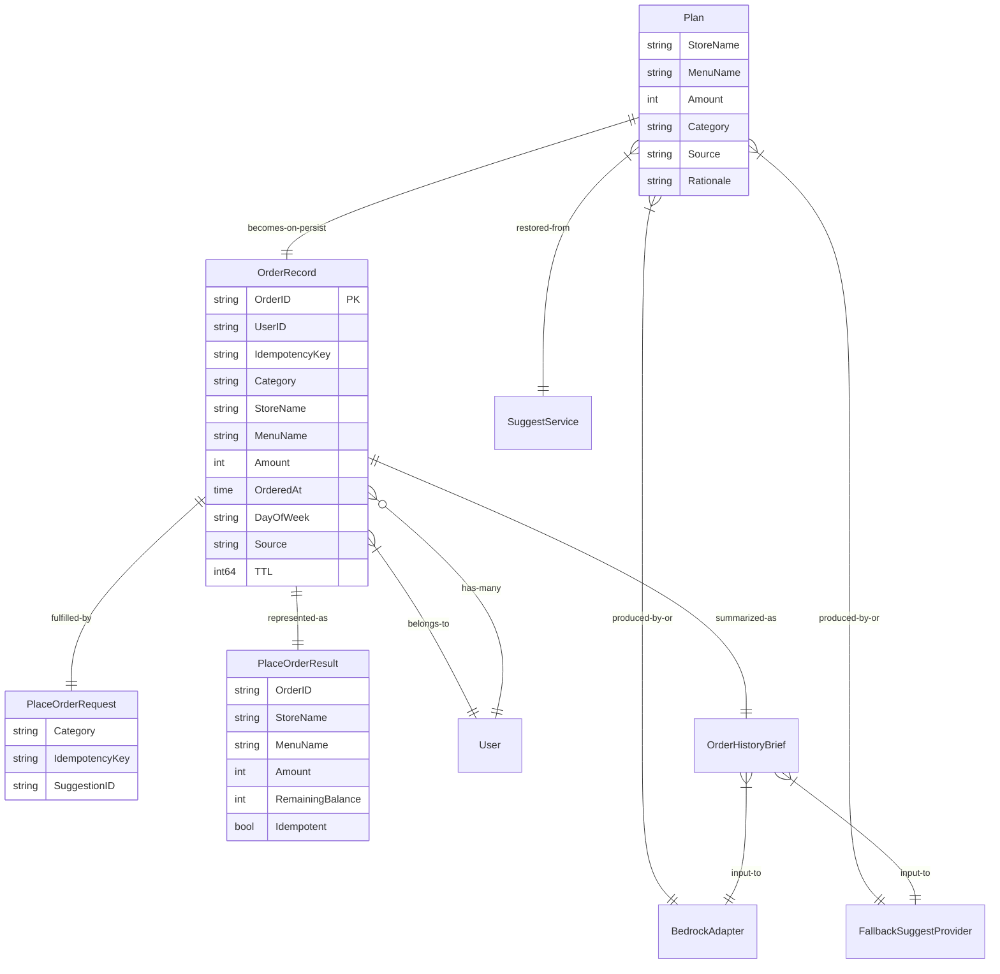

# Unit C (`order`) — Domain Entities

**Document Version**: 1.0
**Created**: 2026-05-21
**Stage**: Construction / Functional Design
**Unit**: C — `order`
**Depth**: Comprehensive
**Related**: [business-logic-model.md](./business-logic-model.md), [business-rules.md](./business-rules.md), [frontend-components.md](./frontend-components.md)

本ドキュメントは Unit C `order` のドメインエンティティ・値オブジェクト・DTO を **技術非依存** で記述する。Go の interface / struct を使ったメモは含めるが、これは表現手段であり、本質は **業務概念の構造と制約** を確定することにある。Comprehensive 深度として、フィールド単位の意味・制約・由来 BR-ID を網羅する。

---

## 1. エンティティマップ

```
[Aggregate / Entity]                  [所属]    [永続化先]
─────────────────────────────────────────────────────────
OrderRecord                            Unit C   DynamoDB GoroPay_OrderHistory
─────────────────────────────────────────────────────────
[Value Object / DTO（永続化なし）]
─────────────────────────────────────────────────────────
Plan                                   Unit C   メモリ内
PlaceOrderRequest                      Unit C   API I/F
PlaceOrderResult                       Unit C   API I/F
DeliveryInput / DeliveryOutput         横串     Adapter I/F
InferOrderPlanInput / Output           横串     Adapter I/F
OrderHistoryBrief                      横串     Adapter I/F
─────────────────────────────────────────────────────────
[Error 値]
─────────────────────────────────────────────────────────
ErrInsufficientBalance                 Unit B → C で受信
ErrSuggestionExpired                   Unit D → C で受信（透過フォールバック扱い）
```

---

## 2. エンティティ詳細

### 2.1 `OrderRecord` — 注文履歴エンティティ

**目的**: 1 回の代行手配の事実を永続化する集約ルート

**永続化先**: DynamoDB `GoroPay_OrderHistory`
**所有 Unit**: C（書き込み専有）。Unit D / E は読取参照のみ
**主キー設計**:
- PK: `USER#<userID>`
- SK: `ORDER#<orderedAtUnix>#<orderID>`（時系列ソート可能）
- GSI1 (`GSI_IdempotencyKey`): PK = `IDEM#<userID>#<idempotencyKey>` → BR-C15 で利用

**フィールド定義**:

| フィールド | 型 | 必須 | 制約 | 由来 |
|---|---|---|---|---|
| `OrderID` | string (ULID) | ✓ | 26 文字 Crockford Base32 | BR-C22 |
| `UserID` | string | ✓ | Cognito sub UUID 形式 | BR-C22 |
| `IdempotencyKey` | string (ULID) | ✓ | Frontend 発行、26 文字 | BR-C12, BR-C22 |
| `Category` | string | ✓ | `"food"` のみ（MVP） | BR-C27 |
| `StoreName` | string | ✓ | 1〜80 文字、UTF-8 | — |
| `MenuName` | string | ✓ | 1〜80 文字、UTF-8 | — |
| `Amount` | int | ✓ | 1 ≤ Amount ≤ 100,000 整数円 | BR-C17, BR-C18 |
| `OrderedAt` | time.Time | ✓ | UTC RFC3339（永続化は Unix epoch 秒） | BR-C22 |
| `DayOfWeek` | string | ✓ | `Monday` 〜 `Sunday`、JST 換算 | BR-C22 |
| `Source` | string | ✓ | `"button"` または `"suggest"` | BR-C23 |
| `TTL` | int64 | ✓ | Unix epoch 秒、`OrderedAt + 90 日` | BR-C20 |

**Go 表現**（参考、Code Generation で詳細化）:

```go
type OrderRecord struct {
    OrderID        string    `json:"orderId"        dynamodbav:"OrderID"`
    UserID         string    `json:"userId"         dynamodbav:"UserID"`
    IdempotencyKey string    `json:"idempotencyKey" dynamodbav:"IdempotencyKey"`
    Category       string    `json:"category"       dynamodbav:"Category"`
    StoreName      string    `json:"storeName"      dynamodbav:"StoreName"`
    MenuName       string    `json:"menuName"       dynamodbav:"MenuName"`
    Amount         int       `json:"amount"         dynamodbav:"Amount"`
    OrderedAt      time.Time `json:"orderedAt"      dynamodbav:"OrderedAt"`
    DayOfWeek      string    `json:"dayOfWeek"      dynamodbav:"DayOfWeek"`
    Source         string    `json:"source"         dynamodbav:"Source"`
    TTL            int64     `json:"-"              dynamodbav:"TTL"`
}
```

**インバリアント**（永続化前に必ず満たす）:
- INV-OR-1: すべての必須フィールドが非ゼロ値
- INV-OR-2: `Amount >= 1`
- INV-OR-3: `OrderID` が ULID 形式
- INV-OR-4: `IdempotencyKey` が ULID 形式
- INV-OR-5: `TTL == OrderedAt.Add(90*24h).Unix()`

---

## 3. 値オブジェクト / DTO

### 3.1 `Plan` — 注文プラン値オブジェクト

**目的**: Bedrock 推論 / フォールバック / サジェスト復元のいずれの経路でも生成される **「これから手配する内容」** の中立表現

**ライフサイクル**: メモリ内のみ、永続化されない（永続化版は `OrderRecord`）

**フィールド定義**:

| フィールド | 型 | 制約 | 由来 |
|---|---|---|---|
| `StoreName` | string | 1〜80 文字 | — |
| `MenuName` | string | 1〜80 文字 | — |
| `Amount` | int | 1 ≤ Amount ≤ 100,000 | BR-C17 |
| `Category` | string | `"food"` | BR-C27 |
| `Source` | string | `"bedrock"` / `"fallback_history"` / `"fallback_default"` / `"suggest"` | BR-C36（ログ向け） |
| `Rationale` | string | 任意（Bedrock 由来時のみ）、80 文字以内に切り詰め | デバッグ用 |

**経路別の Source 値**:

| 経路 | Source 値 |
|---|---|
| Bedrock 1 回目成功 | `"bedrock"` |
| Bedrock リトライ成功 | `"bedrock"` |
| 履歴ベースフォールバック | `"fallback_history"` |
| Default ランダム店舗 | `"fallback_default"` |
| サジェスト保存値 | `"suggest"` |

**Go 表現**:

```go
type Plan struct {
    StoreName string
    MenuName  string
    Amount    int
    Category  string
    Source    string  // "bedrock" | "fallback_history" | "fallback_default" | "suggest"
    Rationale string  // optional, Bedrock 由来時のみ
}
```

**変換規則**:
- `Plan` → `OrderRecord`: STEP 4 で `OrderID` / `UserID` / `IdempotencyKey` / `OrderedAt` / `DayOfWeek` / `TTL` を補完して生成
- `Plan` → `DeliveryInput`: STEP 3 で `UserID` を加えて生成
- `SuggestionPlan` (Unit D の戻り値) → `Plan`: `Source = "suggest"` を付与してコピー

---

### 3.2 `PlaceOrderRequest` — API リクエスト DTO

**目的**: `POST /orders` のリクエスト body / Header の型表現

**フィールド定義**:

| フィールド | 出処 | 型 | 必須 | 制約 | 由来 |
|---|---|---|---|---|---|
| `Category` | body | string | ✓ | `"food"` のみ | BR-C27 |
| `IdempotencyKey` | Header `Idempotency-Key` + body | string (ULID) | ✓ | 26 文字 | BR-C12 |
| `SuggestionID` | body | *string (ULID) | ✗ | 任意、26 文字 | BR-C09, BR-C11 |

**HTTP リクエスト例**:

```http
POST /orders HTTP/1.1
Authorization: Bearer <JWT>
Idempotency-Key: 01HXAB12CD34EF56GH78IJ9KLM
Content-Type: application/json

{
  "category": "food",
  "idempotencyKey": "01HXAB12CD34EF56GH78IJ9KLM",
  "suggestionId": "01HXMN98PO76QR54ST32UV1WXY"
}
```

**バリデーション順序**（BR-C28）:
1. JWT 認可 → middleware で済 → `userID` を `gin.Context` から取得
2. `Category == "food"` → 不一致なら 400 UNSUPPORTED_CATEGORY
3. `IdempotencyKey` ULID 形式 → 不一致なら 400 INVALID_IDEMPOTENCY_KEY
4. Header `Idempotency-Key` と body `idempotencyKey` の一致 → 不一致なら 400 IDEMPOTENCY_KEY_MISMATCH
5. `SuggestionID`（あれば）ULID 形式 → 不一致なら 400 INVALID_SUGGESTION_ID

---

### 3.3 `PlaceOrderResult` — API レスポンス DTO（成功時）

**目的**: `POST /orders` の 201 レスポンス body 表現

**フィールド定義**:

| フィールド | 型 | 必須 | 由来 |
|---|---|---|---|
| `OrderID` | string (ULID) | ✓ | — |
| `StoreName` | string | ✓ | — |
| `MenuName` | string | ✓ | — |
| `Amount` | int | ✓ | — |
| `RemainingBalance` | int | ✓ | NFR-DEG-03 即時可視化 |
| `Idempotent` | bool | ✓ | BR-C14（連打 2 回目以降は true） |

**HTTP レスポンス例（成功）**:

```http
HTTP/1.1 201 Created
Content-Type: application/json

{
  "orderId":          "01HXAB99XX00YY11ZZ22AB3CDE",
  "storeName":        "ゴロゴロ食堂",
  "menuName":         "おまかせ定食",
  "amount":           1000,
  "remainingBalance": 28000,
  "idempotent":       false
}
```

**HTTP レスポンス例（連打 2 回目）**:

```http
HTTP/1.1 201 Created
Content-Type: application/json

{
  "orderId":          "01HXAB99XX00YY11ZZ22AB3CDE",   ← 1 回目と同一
  "storeName":        "ゴロゴロ食堂",
  "menuName":         "おまかせ定食",
  "amount":           1000,
  "remainingBalance": 28000,
  "idempotent":       true
}
```

---

### 3.4 エラーレスポンス DTO

#### 3.4.1 `ErrorResponse` 共通形式

```json
{
  "code":    "INSUFFICIENT_BALANCE",
  "message": "今月、ダメになれません",
  "details": { "balance": 500 }
}
```

#### 3.4.2 エラー一覧

| HTTP | code | 発生原因 | details | 由来 |
|---|---|---|---|---|
| 400 | UNSUPPORTED_CATEGORY | Category != "food" | `{got: "..."}` | BR-C27, BR-C28 |
| 400 | INVALID_IDEMPOTENCY_KEY | ULID 形式違反 | `{got: "..."}` | BR-C28 |
| 400 | IDEMPOTENCY_KEY_MISMATCH | Header と body 不一致 | `{header: "...", body: "..."}` | BR-C28 |
| 400 | INVALID_SUGGESTION_ID | ULID 形式違反 | `{got: "..."}` | BR-C11, BR-C28 |
| 400 | INVALID_LIMIT | GetHistory の limit 範囲外 | `{got: 200, max: 100}` | BR-C21 |
| 401 | UNAUTHORIZED | JWT 不正 | — | Unit A 担当 |
| 402 | INSUFFICIENT_BALANCE | 残高不足 | `{balance: <現残高>}` | BR-C16 |
| 500 | DELIVERY_FAILED | DeliveryAdapter 失敗 | — | BR-C25（Mock では発生しない） |
| 500 | INTERNAL_ERROR | その他予期せぬエラー | — | フォールスルー |

---

### 3.5 `OrderHistoryBrief` — Bedrock / FallbackProvider 用の軽量履歴

**目的**: `OrderRecord` の縮約版を Bedrock / FallbackProvider に渡す。プロンプトトークン削減 + 必要最小限の情報のみ

**フィールド定義**:

| フィールド | 型 | 由来 |
|---|---|---|
| `Category` | string | OrderRecord.Category |
| `StoreName` | string | OrderRecord.StoreName |
| `MenuName` | string | OrderRecord.MenuName |
| `Amount` | int | OrderRecord.Amount |
| `OrderedAtJST` | string (`"YYYY-MM-DDTHH:MM:SS+09:00"`) | OrderRecord.OrderedAt → JST 換算 |
| `DayOfWeek` | string | OrderRecord.DayOfWeek |

**Go 表現**:

```go
type OrderHistoryBrief struct {
    Category      string
    StoreName     string
    MenuName      string
    Amount        int
    OrderedAtJST  string
    DayOfWeek     string
}
```

**変換**: `OrderRecord` → `OrderHistoryBrief` は `OrderHistoryRepository.ListRecent` の戻り値変換で実施（Repository 層の責務）

---

### 3.6 Adapter I/F の DTO（横串）

#### 3.6.1 `InferOrderPlanInput` (BedrockAdapter 入力)

| フィールド | 型 | 説明 |
|---|---|---|
| `UserID` | string | プロンプトに含めない（ログ用） |
| `History` | []OrderHistoryBrief | 直近 30 件 |
| `NowJST` | time.Time | プロンプト用に JST で渡す |
| `Category` | string | `"food"` 固定 |

#### 3.6.2 `InferOrderPlanOutput` (BedrockAdapter 出力)

| フィールド | 型 | 説明 |
|---|---|---|
| `StoreName` | string | Bedrock が推論した店舗名 |
| `MenuName` | string | Bedrock が推論したメニュー名 |
| `Amount` | int | Bedrock が推論した金額（円） |
| `Rationale` | string | デバッグ用の推論理由 |

#### 3.6.3 `DeliveryInput` (DeliveryAdapter 入力)

| フィールド | 型 | 由来 |
|---|---|---|
| `UserID` | string | 監査用 |
| `Category` | string | `"food"` |
| `StoreName` | string | Plan |
| `MenuName` | string | Plan |
| `Amount` | int | Plan |

#### 3.6.4 `DeliveryOutput` (DeliveryAdapter 出力)

| フィールド | 型 | Mock の固定値 |
|---|---|---|
| `ExternalOrderID` | string | `"mock-<ulid>"` |
| `Status` | string | `"accepted"` |
| `ETAMinutes` | int | 30 |

---

## 4. ドメイン Errors（センチネル）

Unit C で発生する / 受け取る代表的なエラーの定義。Code Generation で `internal/apperrors/` に集約される予定。

| エラー名 | 発生元 | Unit C での扱い |
|---|---|---|
| `ErrInsufficientBalance` | Unit B `WalletService.Deduct` | 402 INSUFFICIENT_BALANCE に変換 |
| `ErrIdempotentHit` | Unit B（情報提供のみ、エラーではない） | 既存履歴復元へ分岐（業務上の正常系） |
| `ErrSuggestionNotFound` | Unit D `SuggestService.ResolveSuggestion` | BR-C10 透過フォールバック（エラー応答にしない） |
| `ErrBedrockUnavailable` | 横串 BedrockAdapter | リトライ/フォールバックへ |
| `ErrDeliveryFailed` | 横串 DeliveryAdapter | 500 DELIVERY_FAILED（Mock では発生しない） |
| `ErrInvalidRequest` | OrderHandler | 400 + code を返す |

**Go 表現の方針**: `errors.Is` で判定可能なセンチネルエラーまたは `*XxxError` 型として実装（Code Generation で確定）

---

## 5. 整合性ルール（Cross-Entity）

複数のエンティティ・DTO 間で守るべき不変条件。Property-Based Testing でも検査対象とする。

| ID | ルール | 関係 |
|---|---|---|
| INV-X-1 | 連打 2 回目以降の `PlaceOrderResult` は初回と完全一致（`Idempotent` フラグのみ true） | `PlaceOrderRequest.IdempotencyKey` × `PlaceOrderResult` |
| INV-X-2 | `OrderRecord.Amount == PlaceOrderResult.Amount`（同一注文での金額一致） | OrderRecord ↔ PlaceOrderResult |
| INV-X-3 | `OrderRecord.IdempotencyKey == PlaceOrderRequest.IdempotencyKey` | 全経路で一致 |
| INV-X-4 | フォールバック経路でも `OrderRecord.Amount` は BR-C17 範囲内 | BR-C17 |
| INV-X-5 | `Plan.Source == "suggest"` のとき、`PlaceOrderRequest.SuggestionID != nil` で復元成功時に限る | サジェスト経路の整合 |
| INV-X-6 | `OrderRecord.TTL > OrderRecord.OrderedAt.Unix()` | TTL の単調性 |

これらは NFR Requirements 段の Property-Based Testing 検討（NFR-PBT 拡張、`property-based-testing.opt-in.md` で Partial 採択済）の対象候補となる。

---

## 6. ドメインモデル ER 図（Mermaid）



---

## 7. 永続化スキーマ（DynamoDB 詳細）

### 7.1 テーブル: `GoroPay_OrderHistory`

| 属性 | 型 | 用途 |
|---|---|---|
| PK (`PK`) | S | `USER#<userID>` |
| SK (`SK`) | S | `ORDER#<orderedAtUnix>#<orderID>` |
| OrderID | S | ULID |
| UserID | S | Cognito sub |
| IdempotencyKey | S | ULID |
| Category | S | `food` |
| StoreName | S | UTF-8 |
| MenuName | S | UTF-8 |
| Amount | N | int |
| OrderedAt | N | Unix epoch 秒 |
| DayOfWeek | S | Monday〜Sunday |
| Source | S | button/suggest |
| TTL | N | DynamoDB TTL 属性、`OrderedAt + 7776000` |

### 7.2 GSI: `GSI_IdempotencyKey`

| 属性 | 型 |
|---|---|
| PK (`GSI1PK`) | S | `IDEM#<userID>#<idempotencyKey>` |
| 投影 | ALL |

**用途**: BR-C15 連打時の既存 `OrderRecord` 検索

### 7.3 アクセスパターン

| アクセス | テーブル/GSI | キー |
|---|---|---|
| 注文 1 件取得（OrderID 不明） | GSI1 | `IDEM#alice#01HXAB...` |
| ユーザの最新 N 件取得 | テーブル | `PK = USER#alice`, `Limit=N`, `ScanIndexForward=false` |
| ユーザの月間 / 期間集計 | テーブル | `PK = USER#alice`, `SK BETWEEN ORDER#<m_start> AND ORDER#<m_end>` (Unit E が利用) |
| TTL 自動削除 | 自動 | `TTL` 属性 |

### 7.4 容量見積（NFR Requirements / Infrastructure Design で再評価）
- 1 注文 ≈ 400 バイト
- 1 ユーザ平均 30 注文/月 × 90 日保持 → 90 注文/ユーザ × 400B = 36KB/ユーザ
- 100 ユーザで 3.6MB → On-Demand キャパシティで十分

---

## 8. 次ステージ（frontend-components.md）への引き継ぎ

- 本ドキュメントの **`PlaceOrderRequest` / `PlaceOrderResult` / エラー一覧 / `Plan`** が `useOrder` hook の API 接続契約となる
- Frontend は **JSON snake_case ではなく camelCase** を使う（上記例参照）
- `Idempotent` フラグは Frontend 表示には使わない（内部状態判定のみ、ユーザに見せない）
