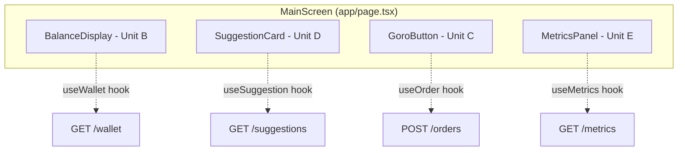
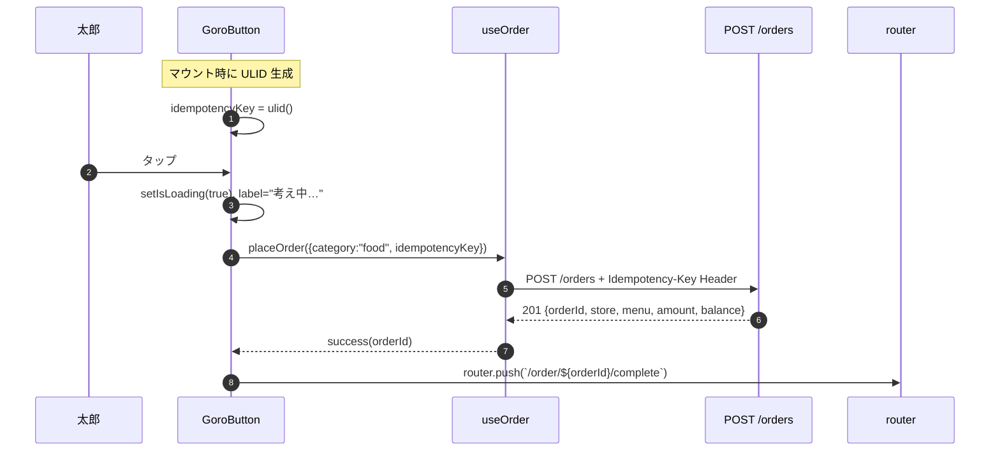
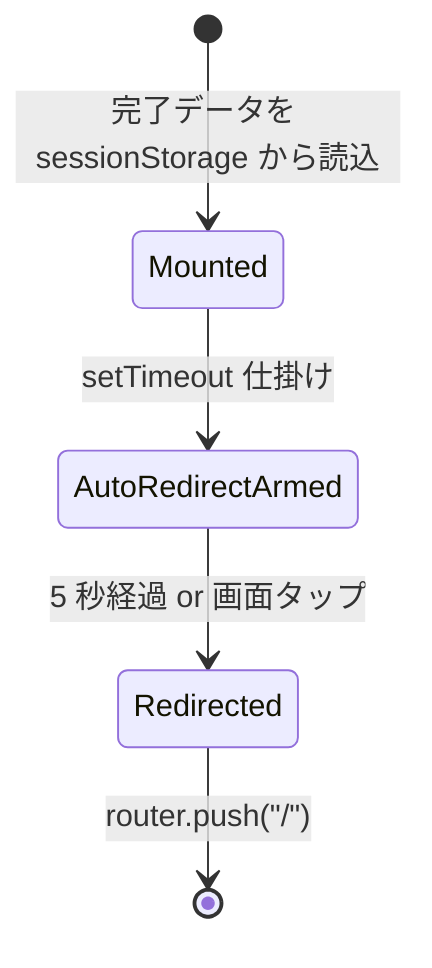
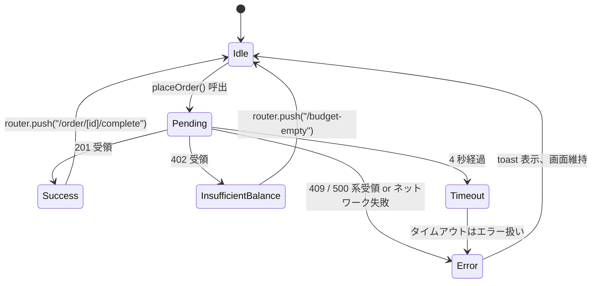

# Unit C (`order`) — Frontend Components

**Document Version**: 1.0
**Created**: 2026-05-21
**Stage**: Construction / Functional Design
**Unit**: C — `order`
**Depth**: Comprehensive
**Related**: [business-logic-model.md](./business-logic-model.md), [business-rules.md](./business-rules.md), [domain-entities.md](./domain-entities.md), 凍結契約 [unit-interfaces.md](../../interfaces/unit-interfaces.md)
**Aligned with**: 凍結契約 §4.3（REST API 契約 / Idempotency-Key Header / エラー一覧）

本ドキュメントは Unit C `order` の **Frontend コンポーネント / hooks / 状態遷移 / API 統合** を Comprehensive 深度で記述する。Next.js 14 (App Router) + Tailwind + Jotai + TanStack Query の前提（application-design.md §1.1）。

---

## 1. Unit C 所有の Frontend 成果物

| 種別 | パス | 役割 |
|---|---|---|
| Page | `web/app/page.tsx` | MainScreen の **GoroButton 部分** のみ Unit C 所有（残高表示は Unit B、サジェストカードは Unit D、メトリクスは Unit E） |
| Page | `web/app/order/[id]/complete/page.tsx` | OrderCompletionScreen 全体 |
| Component | `web/components/GoroButton.tsx` | 「ご飯めんどくさい」ボタン |
| Hook | `web/hooks/useOrder.ts` | `placeOrder` / 状態管理 / API 統合 |
| Lib | `web/lib/ulid.ts` | ULID 生成（横串）★ Unit A / B / C / D で共有 |
| Lib | `web/lib/api/orders.ts` | OrderService API クライアント関数群 |

---

## 2. コンポーネント階層

```
app/
├── layout.tsx                        ★ 横串（Provider 群: TanStack Query, Jotai）
│
├── page.tsx                          MainScreen
│   ├── BalanceDisplay                Unit B 所有
│   ├── SuggestionCard                Unit D 所有
│   ├── ── GoroButton                 ★ Unit C 所有
│   └── MetricsPanel                  Unit E 所有
│
└── order/
    └── [id]/
        └── complete/
            └── page.tsx              ★ Unit C 所有: OrderCompletionScreen
```

**MainScreen 内の責務分担**:



---

## 3. `GoroButton` コンポーネント（Unit C）

### 3.1 役割
- 「ご飯めんどくさい」ボタンの描画
- ボタン押下時に `useOrder.placeOrder()` を呼ぶ
- 処理中 / エラー / 成功の状態に応じて表示変更

### 3.2 Props

| Prop | 型 | 必須 | 説明 |
|---|---|---|---|
| `suggestionId` | `string \| undefined` | ✗ | Unit D の `SuggestionCard` から「YES」が押された場合に伝播。なし = 通常のボタン押下 |
| `onSuccess` | `(orderId: string) => void` | ✗ | テスト・ストーリーブック用フック。本番は default で `router.push('/order/[id]/complete')` |
| `disabled` | `boolean` | ✗ | 残高 0 などで親が制御したい場合 |

### 3.3 状態（Jotai atom or local state）

| 状態名 | 型 | 説明 |
|---|---|---|
| `isLoading` | boolean | API 応答待機中（true 中は disabled） |
| `idempotencyKey` | string (ULID) | ボタン活性化時に生成、画面遷移までキャッシュ |

### 3.4 表示遷移

| 状態 | ラベル | disabled | 由来 |
|---|---|---|---|
| アイドル | 「ご飯めんどくさい」 | false | デフォルト |
| 押下中（API 待機） | 「考え中…」 | true | BR-C34 |
| 4 秒経過（タイムアウト） | 「ご飯めんどくさい」 | false | BR-C34（disabled 解除） |

### 3.5 操作フロー（ユーザ視点）



### 3.6 Tailwind スタイル方針（参考）

```tsx
<button
  className="
    w-full max-w-md
    py-12 px-8
    text-3xl font-bold text-white
    bg-orange-500 hover:bg-orange-600 active:bg-orange-700
    disabled:bg-gray-400 disabled:cursor-not-allowed
    rounded-3xl shadow-lg
    transition
  "
  disabled={isLoading || disabled}
>
  {isLoading ? "考え中…" : "ご飯めんどくさい"}
</button>
```

**ダメ化UX 観点**:
- 大きく / 中央 / 単一ボタン（NFR-DEG-01: 視線誘導の主役）
- 他の操作要素なし（メニュー / 戻るボタンなど一切配置しない）

---

## 4. `OrderCompletionScreen` (Page Component)

### 4.1 役割
- 注文完了直後の表示（5 秒後に自動遷移）
- 完了 / 連打（idempotent: true）両方のレスポンスに対応

### 4.2 ルート

`app/order/[id]/complete/page.tsx`

### 4.3 Props（URL params + Search params）

| 入力源 | 名前 | 型 | 由来 |
|---|---|---|---|
| URL params | `id` | string (ULID) | OrderID |
| sessionStorage または Search | `store` / `menu` / `amount` / `balance` | string | API 応答を MainScreen → OrderCompletionScreen へ橋渡し |

**伝達方法**（実装案、Code Generation で確定）:
- A) **`sessionStorage`** に `placeOrder` 結果を保存し、Completion 画面で読み取り（クリーン、URL 短い）
- B) **Search params** で渡す（URL に金額が出てしまう、共有時に意味を持つので NG）

→ **A 採用** をデフォルトとする

### 4.4 表示内容（BR-C29）

```
┌────────────────────────────────┐
│       注文完了！                 │
│                                │
│   ゴロゴロ食堂                   │
│   おまかせ定食                   │
│   ¥1,000                       │
│                                │
│   残りダメ予算 ¥28,000          │
│                                │
│   (5 秒後に自動でメインへ戻ります) │
└────────────────────────────────┘
   ↑ どこをタップしても即時遷移
```

### 4.5 動作

| イベント | 動作 |
|---|---|
| マウント | `setTimeout(() => router.push("/"), 5000)` を仕掛ける |
| 画面任意タップ | 即時 `router.push("/")` + `clearTimeout` |
| アンマウント | `clearTimeout` （メモリリーク防止） |

### 4.6 状態遷移図



### 4.7 ダメ化UX 観点
- 「メインに戻る」ボタンは設置しない（BR-C31）
- 5 秒タイマー = 「待ちすら奪う」（NFR-DEG-01）
- 文字を大きく、背景は単色、装飾なし（注意散漫を排除）

---

## 5. `useOrder` Hook

### 5.1 シグネチャ

```ts
type UseOrderResult = {
  placeOrder: (input: PlaceOrderInput) => Promise<void>;
  fetchHistory: (limit?: number) => Promise<OrderRecord[]>;
  isPlacing: boolean;
  error: ErrorResponse | null;
};

type PlaceOrderInput = {
  category: "food";
  idempotencyKey: string;   // GoroButton が生成
  suggestionId?: string;    // SuggestionCard 経由のみ
};

function useOrder(): UseOrderResult;
```

### 5.2 内部実装の擬似コード

```ts
function useOrder() {
  const router = useRouter();
  const setError = useSetAtom(orderErrorAtom);
  const queryClient = useQueryClient();

  const mutation = useMutation({
    mutationFn: async (input: PlaceOrderInput) => {
      const res = await fetch("/api/orders", {
        method: "POST",
        headers: {
          "Content-Type": "application/json",
          "Idempotency-Key": input.idempotencyKey,
        },
        body: JSON.stringify(input),
      });

      if (!res.ok) {
        const errBody = await res.json();
        throw new ApiError(res.status, errBody);
      }
      return await res.json() as PlaceOrderResult;
    },

    onSuccess: (result) => {
      // BR-C29: 完了画面に必要なデータを sessionStorage 経由で渡す
      sessionStorage.setItem("lastOrder", JSON.stringify(result));

      // Wallet 残高を再取得（楽観更新でも可）
      queryClient.invalidateQueries({ queryKey: ["wallet"] });

      router.push(`/order/${result.orderId}/complete`);
    },

    onError: (err: ApiError) => {
      // BR-C32 / BR-C33 / BR-C39
      if (err.status === 402 && err.body.code === "INSUFFICIENT_BALANCE") {
        const balance = err.body.details?.balance ?? 0;
        router.push(`/budget-empty?balance=${balance}`);
        return;
      }
      // 409 IDEMPOTENCY_CONFLICT は本 MVP では実質発生しない（BR-C39）
      // フォールスルーで 500 系扱い → 自虐トーストを表示
      // （ユーザにエラー詳細は見せない、開発時のみログ出力）
      toast.error("ちょっとうまくいかないみたい");
      if (process.env.NODE_ENV !== "production") {
        console.error("[useOrder] placeOrder failed:", err);
      }
      setError(err.body);
    },
  });

  return {
    placeOrder: mutation.mutateAsync,
    fetchHistory: async (limit = 20) => {
      const res = await fetch(`/api/orders?limit=${limit}`);
      if (!res.ok) throw new ApiError(res.status, await res.json());
      return (await res.json()).items;
    },
    isPlacing: mutation.isPending,
    error: mutation.error?.body ?? null,
  };
}
```

### 5.3 状態遷移図



**ステート対応表**:

| 状態 | mutation.isPending | mutation.isError | router 遷移 | 通知 |
|---|---|---|---|---|
| Idle | false | false | — | — |
| Pending | true | false | — | ボタンに「考え中…」 |
| Success | false | false | `/order/[id]/complete` | — |
| InsufficientBalance | false | true | `/budget-empty?balance=N` | — |
| Error (500/409/ネットワーク) | false | true | — | toast `"ちょっとうまくいかないみたい"` |

---

## 6. API 統合契約（Frontend ↔ Backend）

### 6.1 エンドポイント一覧

| メソッド | パス | 担当 hook | レスポンス DTO |
|---|---|---|---|
| `POST` | `/api/orders` | `useOrder.placeOrder` | `PlaceOrderResult` |
| `GET` | `/api/orders?limit=N` | `useOrder.fetchHistory` | `{ items: OrderRecord[] }` |

`/api/*` プレフィックスは Next.js → API Gateway へのプロキシ前提（Amplify Hosting からの転送ルールで設定、Infrastructure Design 段で確定）

### 6.2 Header 規約

| ヘッダ | 必須 | 値 | 由来 |
|---|---|---|---|
| `Authorization: Bearer <JWT>` | ✓ | Cognito JWT | Unit A |
| `Idempotency-Key: <ULID>` | POST のみ ✓ | Frontend 発行 | BR-C12 |
| `Content-Type: application/json` | POST のみ ✓ | — | — |

### 6.3 リクエスト Body 例

```json
POST /api/orders
{
  "category": "food",
  "idempotencyKey": "01HXAB12CD34EF56GH78IJ9KLM",
  "suggestionId": null
}
```

### 6.4 成功レスポンス（201）

```json
{
  "orderId":          "01HXAB99XX00YY11ZZ22AB3CDE",
  "storeName":        "ゴロゴロ食堂",
  "menuName":         "おまかせ定食",
  "amount":           1000,
  "remainingBalance": 28000,
  "idempotent":       false
}
```

### 6.5 エラーレスポンス例

```json
HTTP 402
{
  "code":    "INSUFFICIENT_BALANCE",
  "message": "今月、ダメになれません",
  "details": { "balance": 500 }
}
```

エラー一覧は `domain-entities.md §3.4.2` を参照。

---

## 7. 横断ライブラリ（共有）

### 7.1 `lib/ulid.ts`

ULID 生成のラッパー。`ulid` npm パッケージを利用。

```ts
import { ulid } from "ulid";
export const newUlid = (): string => ulid();
```

**他 Unit との共有**:
- Unit C: `idempotencyKey` 生成
- Unit A: 不使用（OrderID は Backend 採番）
- 将来: Unit D / E でも使用可能

### 7.2 `lib/api/orders.ts`

OrderService 関連の API クライアント関数群。`useOrder` hook 内から使う。

```ts
export async function placeOrder(input: PlaceOrderInput): Promise<PlaceOrderResult> { ... }
export async function fetchOrderHistory(limit: number): Promise<OrderRecord[]> { ... }
```

**理由**: hook と fetch を分離することで、テスト容易性を上げる（hook を mock する代わりに fetch を mock）

---

## 8. アクセシビリティ（基本のみ、Comprehensive 補完）

| 要素 | a11y 対応 |
|---|---|
| GoroButton | `aria-label="ご飯めんどくさい注文ボタン"`、`aria-busy={isLoading}` |
| OrderCompletionScreen | `role="status"`、自動遷移は `aria-live="polite"` で読み上げ通知 |
| エラートースト | `role="alert"` |

詳細は NFR Requirements / NFR Design 段でアクセシビリティ NFR を起こすかを判断。

---

## 9. テスト戦略（Functional Design 視点）

| テスト対象 | 種別 | 例 |
|---|---|---|
| `GoroButton` | Component test (RTL) | クリックで `placeOrder` が呼ばれる、isLoading 中は disabled |
| `useOrder` | Hook test (RTL renderHook) | 201/402/500 各レスポンスでの遷移挙動 |
| `OrderCompletionScreen` | Component test | sessionStorage から読取、5 秒後 `router.push` |
| API 結合 | MSW モック | `Idempotency-Key` Header が送信されること |
| E2E | Playwright（Build & Test 段） | ボタン押下 → 完了画面 → MainScreen 復帰のフルフロー |

具体的なテストケースは Code Generation Plan で展開。

---

## 10. 状態の所属マトリクス

複数 Unit が触る画面 (`app/page.tsx`) での状態管理を整理。

| 状態 | 所属 Unit | 種別 | 共有方法 |
|---|---|---|---|
| `isLoading` (注文中) | C | local | GoroButton の useState |
| `idempotencyKey` | C | local | GoroButton の useState（マウント時に ulid()） |
| `lastOrder` (完了画面用) | C | sessionStorage | `placeOrder.onSuccess` が書き込み、Completion が読取 |
| `walletBalance` | B | TanStack Query | `useWallet`、`placeOrder.onSuccess` で invalidate |
| `suggestion` | D | TanStack Query | `useSuggestion` |
| `metrics` | E | TanStack Query | `useMetrics` |
| `auth` (JWT) | A | Jotai atom | `useAuth` |

**Unit 間連携の規律**:
- Unit C は他 Unit の状態を **読み取らない / 書き換えない**
- 注文成功時に Wallet を更新するのは `queryClient.invalidateQueries(["wallet"])` の経由のみ（疎結合）

---

## 11. 次ステージへの引き継ぎ

- Functional Design 完了後、**NFR Requirements (Comprehensive)** へ進む
- Frontend 関連の NFR では以下が論点になる
  - **NFR-PERF-01**: Frontend の表示までの体感 3 秒（Backend 3 秒 + Frontend 描画）
  - **NFR-DEG-01**: 1 タップ完結 / 中間画面ゼロ
  - **NFR-DEG-03**: 残高即時可視化（楽観更新 vs invalidate のトレードオフ）
- 本ドキュメントの `useOrder` 状態遷移図と API 統合契約は NFR Design / Infrastructure Design で **エラー処理戦略 / レイテンシ予算** の入力として再参照される
