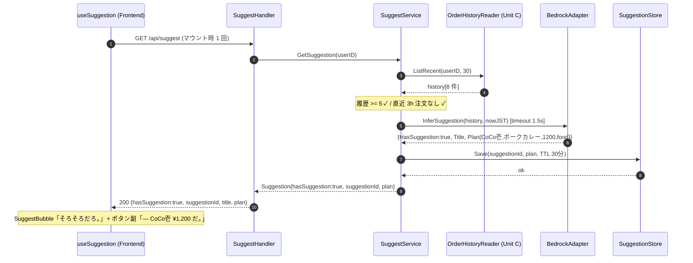
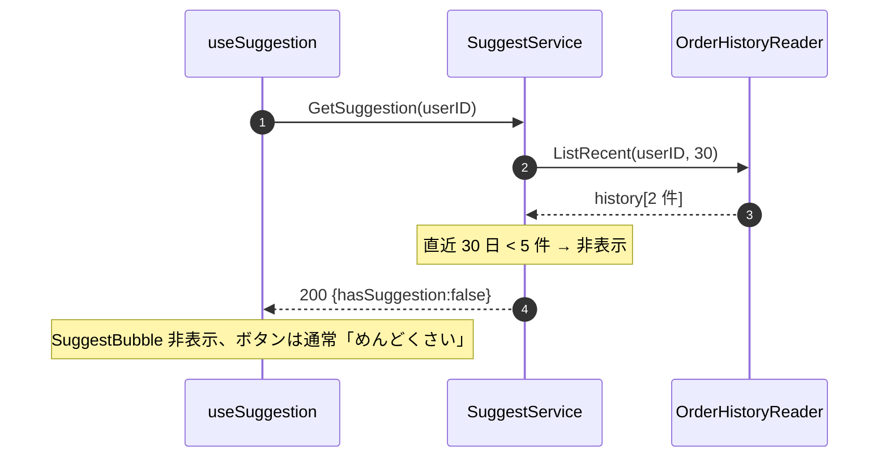
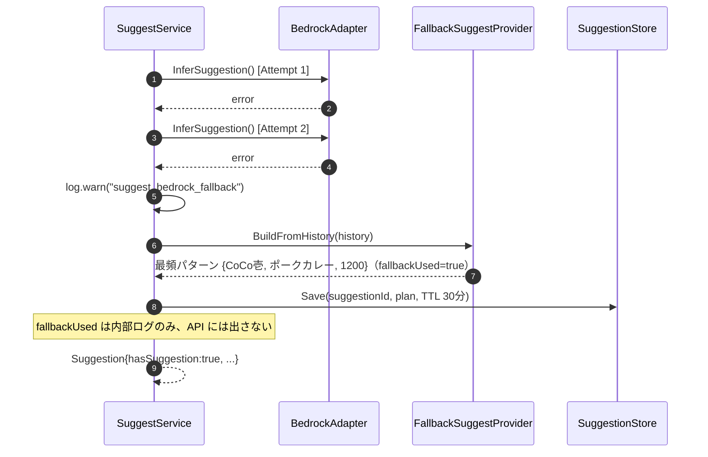
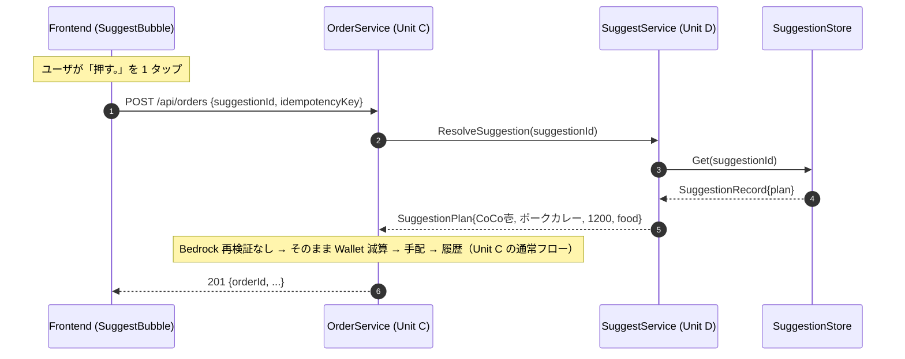
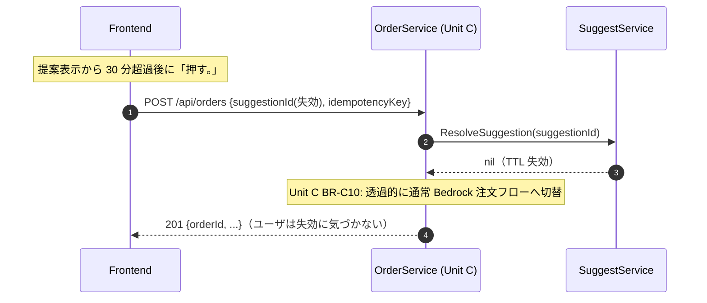
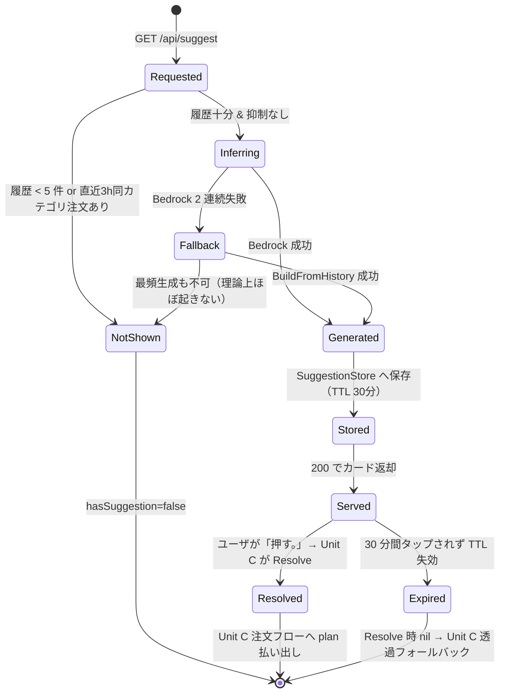

# Unit D (`suggest`) — Business Logic Model

**Document Version**: 1.0
**Created**: 2026-05-25
**Stage**: Construction / Functional Design
**Unit**: D — `suggest`（学習・先回り）
**Depth**: Standard
**Related**: [business-rules.md](./business-rules.md)、[domain-entities.md](./domain-entities.md)、[frontend-components.md](./frontend-components.md)、凍結契約 [unit-interfaces.md](../../interfaces/unit-interfaces.md) §5・§7、横串 [_design-system/design-spec.md](../../_design-system/design-spec.md) §3.3（PR #94）
**Aligned with**: 凍結契約 §5（SuggestService 公開 API / REST / DynamoDB キー）、Plan 回答 Q-DF1〜Q-DF10（全 A）

本ドキュメントは Unit D `suggest` の **業務ロジック構造** を技術非依存で記述する。Standard 深度として 2 ユースケース（GetSuggestion / ResolveSuggestion）の処理フロー・主要シナリオ・状態・横串/他 Unit との相互作用を定義する。

---

## 1. ユースケース概要

### 1.1 主要ユースケース

| UC ID | 名称 | エントリポイント | 担当ストーリー |
|---|---|---|---|
| **UC-D-01** | **先回りサジェスト取得（GetSuggestion）** | `GET /api/suggest` | US-2-01 / US-2-02 / US-2-04 / US-X-02 |
| **UC-D-02** | **サジェスト復元（ResolveSuggestion）** | Unit C `OrderService` からの内部呼び出し | US-2-03（Unit C 共同） |

### 1.2 ユースケース間関係

```
UC-D-01 (GetSuggestion)  ← メイン画面マウント時に 1 回
  └─ Bedrock 推論 or フォールバック → suggestionId 採番 → 一時保存(TTL 30分) → カード返却

UC-D-02 (ResolveSuggestion)  ← ユーザが「押す。」を 1 タップ
  └─ Unit C OrderService.PlaceOrder(suggestionId) が内部で呼ぶ
       └─ 保存済み plan を返す（有効）／ nil を返す（失効）→ Unit C が透過フォールバック
```

UC-D-01 で出した提案を、UC-D-02 で Unit C が回収して注文に変換する。Unit D は「提案の生成・一時保存」と「保存値の払い出し」に責務を限定し、**注文の実行・課金・履歴記録は一切行わない**（すべて Unit C）。

---

## 2. UC-D-01 GetSuggestion の処理フロー

### 2.1 高レベル擬似コード

Plan 回答（Q-DF1=5件 / Q-DF2=未満は出さない / Q-DF3=3h抑制 / Q-DF4=1.5s×1 / Q-DF5=BuildFromHistory）を統合。

```
GetSuggestion(userID):
  STEP 1: 履歴読み込み
    history = OrderHistoryReader.ListRecent(userID, limit=30)   # Unit C 所有、読取参照

  STEP 2: 履歴十分判定（BR-D01 / Q-DF1）
    recent30 = history において orderedAt が 直近 30 日のもの
    if len(recent30) < 5:
      return Suggestion{HasSuggestion: false}                   # BR-D02 / US-2-02

  STEP 3: 直近注文の抑制判定（BR-D03 / Q-DF3）
    if exists o in history where
         o.category == TARGET_CATEGORY ("food") and
         now - o.orderedAt <= 3h:
      log.info("suggest_suppressed_recent_order", userID)
      return Suggestion{HasSuggestion: false}

  STEP 4: Bedrock 推論（BR-D04, タイムアウト/リトライは business-logic §2.2）
    inferOut = InferSuggestionWithRetry(userID, history)
    if inferOut != nil and inferOut.HasSuggestion:
      plan = inferOut.Plan
      title = inferOut.Title          # API では返すが表示は固定（BR-D13）
      fallbackUsed = false
    else:
      # STEP 5: フォールバック（BR-D05 / Q-DF5）
      plan = FallbackSuggestProvider.BuildFromHistory(history)
      if plan == nil:
        return Suggestion{HasSuggestion: false}                 # BR-D06
      title = nil
      fallbackUsed = true             # 内部ログのみ（BR-D12）

  STEP 6: suggestionId 採番 + 一時保存（BR-D07/D08/D09）
    suggestionId = ulid.Make()
    SuggestionStore.Save(SuggestionRecord{
      SuggestionID: suggestionId,
      UserID:       userID,
      Plan:         plan,
      CreatedAt:    now,
      ExpiresAt:    now.Add(30*time).Unix(),    # TTL 30 分
    })

  STEP 7: 応答組み立て
    log.info("suggest_served", userID, suggestionId, fallbackUsed)
    return Suggestion{
      HasSuggestion: true,
      SuggestionID:  suggestionId,
      Title:         "そろそろご飯めんどくさいですよね？",   # 契約 §5.1（フロント表示は固定、BR-D13）
      Plan:          plan,
      FallbackUsed:  fallbackUsed,                          # API レスポンスには出さない（BR-D12）
    }
```

### 2.2 InferSuggestionWithRetry サブルーチン

Q-DF4（order と同じ 1.5 秒・1 リトライ）。共有 `BedrockAdapter` を利用。リトライ/タイムアウトは **Unit D 側で制御**（Adapter 自体は単純な Bedrock 呼び出し）。SLI 数値は NFR Requirements で追認。

```
InferSuggestionWithRetry(userID, history):
  brief = history を OrderHistoryBrief[] に変換（category/store/menu/amount/orderedAt）

  ATTEMPT 1:
    ctx = WithTimeout(parent, 1.5s)
    out, err = BedrockAdapter.InferSuggestion(ctx, {UserID, History: brief, NowJST})
    if err == nil: return out

  ATTEMPT 2 (即時、待機なし):
    ctx = WithTimeout(parent, 1.5s)
    out, err = BedrockAdapter.InferSuggestion(ctx, {...})
    if err == nil: return out

  log.warn("suggest_bedrock_fallback", userID, error=err)
  return nil   # 呼び出し側が FallbackSuggestProvider へ
```

> 永続エラー（ValidationException 等）は 1 回目で即フォールバック（Unit C BR-C01 と同じ分類方針）。

### 2.3 ResolveSuggestion サブルーチン（UC-D-02）

Q-DF7。Unit C `OrderService` が 1 タップ注文時に呼ぶ。

```
ResolveSuggestion(suggestionID):
  rec = SuggestionStore.Get(suggestionID)
  if rec == nil:                       # TTL 30 分超過 or 不在
    log.warn("suggestion_expired_or_missing", suggestionID)
    return nil                         # Unit C が透過フォールバック（Unit C BR-C10）
  return SuggestionPlan{
    StoreName: rec.Plan.StoreName,
    MenuName:  rec.Plan.MenuName,
    Amount:    rec.Plan.Amount,
    Category:  rec.Plan.Category,
  }                                    # Bedrock 再検証なし（BR-D11 / Unit C BR-C09）
```

---

## 3. シーケンス図（主要 5 シナリオ）

### 3.1 S-D-01: ハッピーパス（起動時サジェスト成功）



### 3.2 S-D-02: 履歴不足 → 非表示（US-2-02）



### 3.3 S-D-03: Bedrock 失敗 → フォールバック発動



**特性**: 履歴 5 件以上が前提（STEP 2 通過済み）なので `BuildFromHistory` は必ず最頻パターンを返せる。ユーザは AI 失敗に気づかない（透過、NFR-DEG-05 と同方針）。

### 3.4 S-D-04: 1 タップ注文（Resolve、Unit C 連携）



### 3.5 S-D-05: サジェスト失効 → Unit C 透過フォールバック



---

## 4. 状態モデル（サジェスト 1 件のライフサイクル）



**観測可能な状態のログ対応**:

| 状態 | ログイベント |
|---|---|
| NotShown（履歴不足） | `event="suggest_insufficient_history"` |
| NotShown（抑制） | `event="suggest_suppressed_recent_order"` |
| Fallback | `event="suggest_bedrock_fallback"` |
| Served | `event="suggest_served"` |
| Expired（Resolve 時） | `event="suggestion_expired_or_missing"` |

---

## 5. 横串コンポーネント・他 Unit との相互作用

| 相手 | 種別 | Unit D の利用 |
|---|---|---|
| `OrderHistoryReader`（Unit C 所有） | 読取参照 | `ListRecent(userID, 30)` で履歴取得（学習・抑制判定の入力）。Insert は行わない |
| `BedrockAdapter`（横串 / Unit C・D 共有） | 推論 | `InferSuggestion(input)`。タイムアウト/リトライは Unit D 側で制御 |
| `FallbackSuggestProvider`（横串 / Unit C・D 共有） | フォールバック | `BuildFromHistory(history)`（Bedrock 失敗時） |
| `SuggestionStore`（Unit D 内部） | 保存 | `Save` / `Get`（GoroPay_Suggestion、TTL 30分） |
| `OrderService`（Unit C） | 被呼び出し | Unit C が `ResolveSuggestion(suggestionId)` を呼ぶ |
| `AuthContextService`（Unit A） | 前提 | middleware が `userID` を Context 注入済み |

---

## 6. Unit 間境界の確認

| 領域 | Unit D やる | Unit D やらない（誰が） |
|---|---|---|
| サジェスト推論（Bedrock 呼び出し） | ✓ | — |
| Bedrock 失敗時のフォールバック（最頻） | ✓ | — |
| suggestionId 採番・一時保存（TTL 30分） | ✓ | — |
| 保存済み plan の払い出し（Resolve） | ✓ | — |
| 履歴の Insert | — | Unit C |
| 注文実行・Wallet 減算・課金 | — | Unit C / Unit B |
| 1 タップ注文の idempotencyKey 発行 | — | Frontend（Unit C フロー） |
| 認証 / userId 注入 | — | Unit A |

---

## 7. ダメ化UX の織り込み（業務ロジック観点）

| ダメ化UX 観点 | Unit D 業務ロジックでの実装 |
|---|---|
| NFR-DEG-02: 先回り（フェーズ2の体現） | GetSuggestion がマウント時に履歴学習 → 「そろそろだろ。」を先回り提示 |
| NFR-DEG-01: 1 タップ完結 | Resolve は Bedrock 再検証なしで即 plan 払い出し → Unit C の 1 タップ注文に合流 |
| NFR-DEG-05: 失敗の透過性 | Bedrock 失敗→最頻フォールバック、失効→Unit C 透過フォールバック、いずれもユーザに気づかせない |
| US-X-02: 自己委譲の心地よさ | 履歴から「いつものやつ」を先回り。佐藤は選ばない |

---

## 8. 次ドキュメントへの引き継ぎ

- **business-rules.md**: 本フローの分岐条件・閾値・ログ・将来余地を BR-D カタログ化
- **domain-entities.md**: `Suggestion` / `SuggestionPlan` / `SuggestionRecord(GoroPay_Suggestion)` / `InferSuggestionInput/Output` の型・制約・ER
- **frontend-components.md**: `useSuggestion` hook と `SuggestBubble`（design spec §3.3）の構造・状態・API 統合、契約⇄spec 命名対応表
