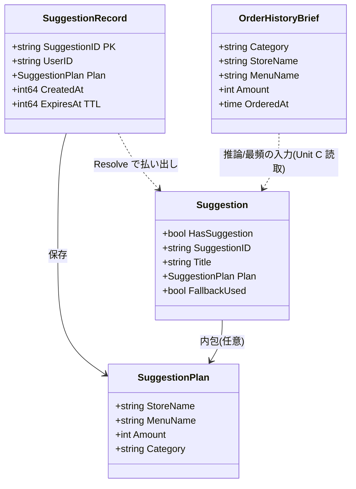

# Unit D (`suggest`) — Domain Entities

**Document Version**: 1.0
**Created**: 2026-05-25
**Stage**: Construction / Functional Design
**Unit**: D — `suggest`
**Depth**: Standard
**Related**: [business-logic-model.md](./business-logic-model.md)、[business-rules.md](./business-rules.md)、[frontend-components.md](./frontend-components.md)、凍結契約 [unit-interfaces.md](../../interfaces/unit-interfaces.md) §5・§7
**Aligned with**: 凍結契約 §5.1（`Suggestion`/`SuggestionPlan`）、§5.3（`GoroPay_Suggestion` キー）、§5.4（内部依存）、§7.1（`BedrockAdapter.InferSuggestion`）

本ドキュメントは Unit D `suggest` のドメインエンティティ・DTO・永続スキーマを技術非依存で定義する。**公開型は凍結契約を正**とし、内部型・属性のみ本書で補完する。

---

## 1. エンティティ関連図（概念）



---

## 2. 公開 DTO（凍結契約 §5.1、正本）

### 2.1 `Suggestion`（`GetSuggestion` の戻り値）

```go
type Suggestion struct {
    HasSuggestion bool           // false のとき他フィールドは無効（カード非表示）
    SuggestionID  string         // ULID（HasSuggestion=true のとき必須）
    Title         string         // 契約値。フロント表示は固定文言優先（BR-D13）
    Plan          *SuggestionPlan // 提案内容
    FallbackUsed  bool           // 内部ログ用。API レスポンスには出さない（BR-D12）
}
```

| フィールド | 制約 | 備考 |
|---|---|---|
| `HasSuggestion` | — | false の場合 `SuggestionID`/`Plan` は空。US-2-02 の非表示 |
| `SuggestionID` | ULID 26 文字（true 時） | BR-D07。Resolve のキー |
| `Title` | 任意文字列 | API は返すが表示は固定「そろそろだろ。」（BR-D13） |
| `Plan` | `HasSuggestion=true` のとき非 nil | §2.2 |
| `FallbackUsed` | — | API JSON 非出力（BR-D12）。EMF/ログのみ |

### 2.2 `SuggestionPlan`（提案 1 件の中身）

```go
type SuggestionPlan struct {
    StoreName string
    MenuName  string
    Amount    int    // 円、整数
    Category  string // MVP は "food"
}
```

| フィールド | 制約 |
|---|---|
| `StoreName` | 非空 |
| `MenuName` | 非空 |
| `Amount` | 1 〜 100,000（円・整数）。Unit C BR-C17/C18 と同レンジ |
| `Category` | "food"（MVP、BR-D17） |

> `SuggestionPlan` は Unit C の `Plan`（内部）/ `OrderHistoryBrief` と相互変換され、Unit C の `PlaceOrder` が受け取って注文を実行する。

---

## 3. 入力 DTO（横串 BedrockAdapter、凍結契約 §7.1）

### 3.1 `InferSuggestionInput` / `InferSuggestionOutput`

```go
type InferSuggestionInput struct {
    UserID  string
    History []OrderHistoryBrief // 直近 30 件の要約
    NowJST  time.Time
}

type InferSuggestionOutput struct {
    HasSuggestion bool
    Title         string
    Plan          *SuggestionPlan
}
```

### 3.2 `OrderHistoryBrief`（Unit C 読取、凍結契約 §7.1）

```go
type OrderHistoryBrief struct {
    Category  string
    StoreName string
    MenuName  string
    Amount    int
    OrderedAt time.Time
}
```

> `OrderHistoryReader.ListRecent(userID, 30)`（凍結契約 §4.2、Unit C 所有）の戻り `[]OrderRecord` を `OrderHistoryBrief` に変換して推論・最頻判定・抑制判定に使う。**PII（userId 以外の個人情報）は含めない**（BR-D18）。

---

## 4. 永続エンティティ：`GoroPay_Suggestion`（Unit D 所有）

### 4.1 内部レコード型

```go
// SuggestionRecord は SuggestionStore（Unit D 内部）が永続化する型
type SuggestionRecord struct {
    SuggestionID string         // PK
    UserID       string
    Plan         SuggestionPlan // JSON シリアライズ保存
    CreatedAt    int64          // Unix epoch（秒）
    ExpiresAt    int64          // Unix epoch（秒）= CreatedAt + 1800（TTL 30分）
}
```

### 4.2 DynamoDB キー設計（凍結契約 §5.3、正本）

| テーブル | PK | SK | TTL 属性 | 主要属性 |
|---|---|---|---|---|
| `GoroPay_Suggestion` | `suggestionId` | （なし） | `expiresAt`（30分） | `userId`, `plan`(JSON), `createdAt` |

- **属性名規約**: DynamoDB は camelCase（`suggestionId`, `userId`, `expiresAt`, `createdAt`）、Go 型は PascalCase
- **GSI**: なし（MVP では suggestionId 単独 Get で完結。userId 別の一覧取得要件はない）
- **物理設計詳細**（キャパシティ等）は Infrastructure Design で確定

### 4.3 アクセスパターン

| 操作 | パターン | 用途 |
|---|---|---|
| `Save` | PutItem（suggestionId） | GetSuggestion STEP 6 |
| `Get` | GetItem（suggestionId） | ResolveSuggestion |
| 失効削除 | DynamoDB TTL 自動 | 30 分超過、WCU 消費なし |

---

## 5. 整合性ルール（不変条件）

| ID | 不変条件 |
|---|---|
| INV-D-1 | `Suggestion.HasSuggestion == false` ⇒ `SuggestionID == ""` かつ `Plan == nil`（カード非表示時は中身を持たない） |
| INV-D-2 | `SuggestionRecord.ExpiresAt == CreatedAt + 1800`（TTL 30 分、BR-D08） |
| INV-D-3 | `SuggestionPlan.Amount` は 1〜100,000 の整数（BR の金額レンジと統一） |
| INV-D-4 | `ResolveSuggestion` は保存値をそのまま返す。返却値は保存時の `Plan` と一致（Bedrock 再検証で変化しない、BR-D11） |
| INV-D-5 | 同一 `suggestionId` は採番時にグローバルユニーク（ULID により実質保証） |

---

## 6. 型の所有・参照マトリクス

| 型 | 所有 | 参照 |
|---|---|---|
| `Suggestion` / `SuggestionPlan` | Unit D（公開、契約 §5.1） | Unit C（`SuggestResolver` 経由で `SuggestionPlan`）、Frontend |
| `SuggestionRecord` / `GoroPay_Suggestion` | Unit D（内部） | — |
| `InferSuggestionInput/Output` | 横串 BedrockAdapter（契約 §7.1） | Unit D / Unit C |
| `OrderHistoryBrief` | 横串（契約 §7.1） | Unit D（読取変換） |
| `OrderRecord` / `OrderHistoryReader` | Unit C（契約 §4） | Unit D（読取参照） |

---

## 7. 次ドキュメントへの引き継ぎ

- **frontend-components.md**: `Suggestion` / `SuggestionPlan` をフロントの `useSuggestion` 戻り型（契約 §9）にマップし、`SuggestBubble` の props を定義
- **NFR Requirements**: `GoroPay_Suggestion` のキャパシティ・TTL 運用、Bedrock 推論 SLI、ログ項目を数値化
