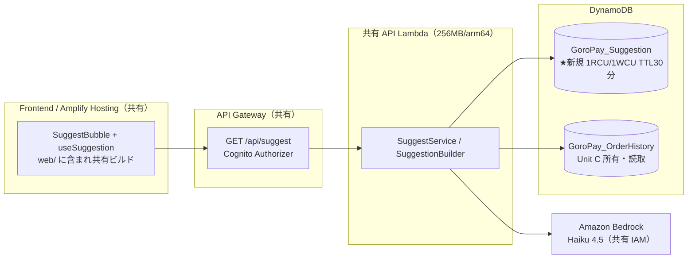

# Unit D (`suggest`) — Deployment Architecture

**Document Version**: 1.0
**Created**: 2026-05-25
**Stage**: Construction / Infrastructure Design
**Unit**: D — `suggest`
**Depth**: Standard
**Related**: [infrastructure-design.md](./infrastructure-design.md)、継承元 [order/infrastructure-design/deployment-architecture.md](../../order/infrastructure-design/deployment-architecture.md)
**方針**: Unit D は専用のデプロイ経路を持たず、**Unit A が構築した共有パイプライン・共有 API Lambda・Amplify に相乗り**する。新規プロビジョニングは `GoroPay_Suggestion` テーブルのみ。

---

## 1. デプロイ構成（全体、Unit D 視点）

- **新規リソース**: `GoroPay_Suggestion` テーブル（+ IAM policy）のみ
- **相乗り**: API Gateway / Lambda / Amplify / Cognito / Bedrock / CloudWatch Logs はすべて既存（Unit A/C 構築）

---

## 2. デプロイフロー（既存パイプライン相乗り）

| 対象 | デプロイ経路 | 新規/既存 |
|---|---|---|
| Backend（SuggestService 等） | 共有 API Lambda のコンテナイメージに含まれ、既存 CodePipeline → CodeBuild → ECR → Lambda 更新（Unit A 構築）で配布 | 既存経路 |
| Frontend（useSuggestion/SuggestBubble） | `web/` に含まれ Amplify Hosting の既存ビルドで配信 | 既存経路 |
| `GoroPay_Suggestion` テーブル | `terraform apply`（`envs/dev`）で `module.suggestion` を新規作成 | ★新規 |
| API Gateway ルート | `terraform apply` で `routes.tf` の `GET /api/suggest` を追加 | 既存 module 追記 |
| IAM | `terraform apply` で suggestion policy を lambda_api ロールに追加 | 既存 module 追記 |

> Unit D 専用の Lambda / パイプライン / ECR は不要。単一モノリシック API Lambda（unit-of-work.md §4.1）に同居。

---

## 3. デプロイ順序・依存

1. `terraform apply`（`envs/dev`）: `module.suggestion` 作成 → lambda_api の policy/env 更新 → api_gateway ルート追加
2. Backend イメージ再ビルド・デプロイ（SuggestService を含む新イメージ）— 既存 CodePipeline
3. Frontend デプロイ（useSuggestion/SuggestBubble）— 既存 Amplify

> 1（テーブル + env）が先、その後 2（コード）。env `DDB_TABLE_SUGGESTION` が無いと SuggestionStore が初期化できないため。

---

## 4. リージョン・コスト

- **リージョン**: `ap-northeast-1`（凍結契約 §10、全 Unit 共通）
- **追加コスト**:
  - DynamoDB `GoroPay_Suggestion`: 1RCU/1WCU（無料枠内）+ TTL 削除（WCU 消費なし）
  - Bedrock: Unit C 予算に相乗り（合算 $10/月、NFRD-D16）
  - Lambda/API GW: 既存共有（追加コストは呼び出し増分のみ、デモ規模で軽微）

---

## 5. ロールバック・運用

- **ロールバック**: `module.suggestion` は独立リソースのため、問題時は `terraform` で個別に巻き戻し可。コードは既存 Lambda のイメージロールバック（Unit A runbook 準拠）
- **手動リカバリ**: サジェスト機能停止時もメイン機能（注文 Unit C）は影響を受けない（`hasSuggestion=false` 相当に丸まりカード非表示）。可用性の独立性を担保（NFRD-D07）

---

## 6. 文書管理

- **凍結契約への影響**: なし
- **次ステージ**: Code Generation（`modules/suggestion/` 実体 + 追記 + Go/Frontend 実装）
