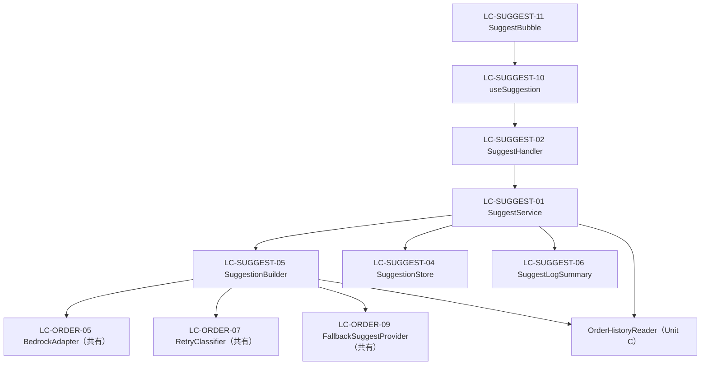

# Unit D (`suggest`) — Logical Components

**Document Version**: 1.0
**Created**: 2026-05-25
**Stage**: Construction / NFR Design
**Unit**: D — `suggest`（学習・先回り）
**Depth**: Standard
**Related**: [nfr-design-patterns.md](./nfr-design-patterns.md)（P-SG-*）、継承元 [order/nfr-design/logical-components.md](../../order/nfr-design/logical-components.md)（LC-ORDER-*）、凍結契約 [unit-interfaces.md](../../interfaces/unit-interfaces.md) §5・§7
**方針**: Q-DD3=A。suggest 所有を `LC-SUGGEST-xx` で定義、共有 Adapter 系は Unit C の `LC-ORDER-*` を参照（重複定義しない）。

---

## 1. コンポーネント識別子規則

- 形式: `LC-SUGGEST-{番号}`（Logical Component / suggest）
- 共有コンポーネント（Bedrock/Fallback/Retry/client init）は **Unit C の LC-ORDER-* を参照**し再定義しない

---

## 2. Backend コンポーネント（Unit D 所有）

### LC-SUGGEST-01: SuggestService
- **責務**: `GetSuggestion` / `ResolveSuggestion`（凍結契約 §5.1）の実装。抑制判定 + Builder orchestrate + 保存 + ログ集約
- **依存先**: `SuggestionBuilder`(LC-SUGGEST-05) / `SuggestionStore`(LC-SUGGEST-04) / `OrderHistoryReader`(Unit C, 抑制判定の履歴) / `SuggestLogSummary`(LC-SUGGEST-06)
- **パターン**: P-SG-BUILD-01（SuggestService 側の責務）/ P-DI-01
- **配置**: `apps/api/internal/suggest/service.go`

### LC-SUGGEST-02: SuggestHandler
- **責務**: `GET /api/suggest` の Gin handler。userId を Context から取得し SuggestService 呼出、`Suggestion` を JSON 応答（`FallbackUsed` は除外、BR-D12）
- **依存先**: `SuggestService`(LC-SUGGEST-01)、`auth.UserIDFromContext`(Unit A)
- **配置**: `apps/api/internal/handlers/suggest_handler.go`

### LC-SUGGEST-03: Suggestion / SuggestionPlan（DTO）
- **責務**: 凍結契約 §5.1 の公開 DTO。`Suggestion{HasSuggestion, SuggestionID, Title, Plan, FallbackUsed}` / `SuggestionPlan{StoreName, MenuName, Amount, Category}`
- **配置**: `apps/api/internal/suggest/types.go`

### LC-SUGGEST-04: SuggestionStore（GoroPay_Suggestion Repository）
- **責務**: `Save(SuggestionRecord)` / `Get(suggestionID)`。TTL 30分（`expiresAt`）。失効/不在は nil（BR-D10）
- **依存先**: `dynamodb.Client`（共有 LC-ORDER-15 の package-level client 流用）
- **パターン**: P-INIT-01（client 共有）
- **配置**: `apps/api/internal/repo/suggestion/repository.go`（+ test-only inmemory）

### LC-SUGGEST-05: SuggestionBuilder
- **責務**: P-SG-BUILD-01 の orchestration（履歴十分 → Bedrock 推論+リトライ → フォールバック）。`Build(ctx, userID) → (Plan, fallbackUsed, ok)`
- **依存先**: `BedrockAdapter`(LC-ORDER-05 共有) / `RetryClassifier`(LC-ORDER-07 共有) / `FallbackSuggestProvider`(LC-ORDER-09 共有) / `OrderHistoryReader`(Unit C)
- **パターン**: P-SG-BUILD-01 / P-RETRY-01 / P-OBS-01（Measure）
- **配置**: `apps/api/internal/suggest/builder.go`

### LC-SUGGEST-06: SuggestLogSummary
- **責務**: P-SG-OBS-01。共通 8 項目 + suggest 固有 7 項目を 1 行集約。Bedrock 本文非記録
- **依存先**: `slog`（共有 LC-AUTH-05 の ContextAwareSlogHandler）
- **配置**: `apps/api/internal/suggest/logsummary.go`

---

## 3. 共有コンポーネント（Unit C 所有 / 横串、参照のみ）

| 参照 LC | 名称 | suggest での用途 |
|---|---|---|
| LC-ORDER-05 | `BedrockAdapter` | `InferSuggestion` 呼出（凍結契約 §7.1） |
| LC-ORDER-07 | `RetryClassifier` | Bedrock リトライ判定（P-RETRY-01） |
| LC-ORDER-09 | `FallbackSuggestProvider` | `BuildFromHistory`（フォールバック、凍結契約 §7.3） |
| LC-ORDER-14 | `BedrockClientInit` | package-level Bedrock client |
| LC-ORDER-15 | `DynamoClientInit` | package-level DynamoDB client |
| （Unit C）`OrderHistoryReader` | 凍結契約 §4.2 | 履歴読取（学習・抑制判定・フォールバック入力） |
| （Unit A）`AttachUserID` / `UserIDFromContext` | 凍結契約 §2.1 | 認証 |

> 共有 Adapter の IF は凍結契約 §7 のまま。Unit D は実装を追加せず利用のみ。

---

## 4. テスト専用 Backend コンポーネント

### LC-SUGGEST-07: MockBedrockAdapter（再利用）
- Unit C LC-ORDER-16 の Function-Field Mock（P-MOCK-01）を流用。`InferSuggestion` の closure を差し替え、成功/Throttle/Timeout/永続エラーを再現

### LC-SUGGEST-08: InmemorySuggestionStore（test-only）
- `SuggestionStore` の in-memory 実装。TTL は時刻 mock で検証

### LC-SUGGEST-09: MockFallbackProvider / InmemoryHistory（再利用）
- Unit C LC-ORDER-18 / LC-ORDER-20 を流用

---

## 5. Frontend コンポーネント（Unit D 所有）

### LC-SUGGEST-10: useSuggestion
- **責務**: `GET /api/suggest` をマウント時 1 回取得（P-SG-FE-01）。`queryKey ['suggestion']`、staleTime 実質無限、retry 0。取得失敗は `hasSuggestion:false` に丸め
- **依存先**: `apiClient`(LC-AUTH-09 共有, BFF 経由)、TanStack Query、P-FE-LOAD-01（isLoading）
- **配置**: `web/hooks/useSuggestion.ts`

### LC-SUGGEST-11: SuggestBubble
- **責務**: GoroButton 内蔵の表示専用吹き出し。`screenState==='suggested'` で「そろそろだろ。」表示（design spec §3.3、BR-D13/D16）。`data-testid="suggest-bubble"`
- **依存先**: `useSuggestion`(LC-SUGGEST-10) の結果（GoroButton 経由で props 供給）
- **配置**: `web/components/order/SuggestBubble.tsx`

> 「押す。」押下時の注文送信は Unit C `useOrder`(LC-ORDER-22) に委譲（Unit D は表示まで）。`['balance']` invalidate も Unit C 責務（凍結契約 §9.1）。

---

## 6. コンポーネント依存図

---

## 7. NFR トレーサビリティ（NFRD-Dxx → LC）

| NFRD-D | LC |
|---|---|
| NFRD-D01/D02（レイテンシ） | LC-SUGGEST-01/05（Measure）、LC-SUGGEST-04（Get） |
| NFRD-D03/D04（Bedrock/fallback） | LC-SUGGEST-05 + LC-ORDER-05/07/09 |
| NFRD-D05（TTL/失効nil） | LC-SUGGEST-04 |
| NFRD-D08（DynamoDB容量） | LC-SUGGEST-04（Infra Design で容量確定） |
| NFRD-D10/D11（観測性/ログ） | LC-SUGGEST-06 |
| NFRD-D12/D13（PBT/mock） | LC-SUGGEST-07/08/09 |
| NFRD-D17（FE） | LC-SUGGEST-10/11 |
| NFRD-D18（認証） | LC-SUGGEST-02（UserIDFromContext） |

---

## 8. 文書管理

- **凍結契約への影響**: なし（LC-SUGGEST-* は内部、公開 IF は凍結契約 §5 のまま）
- **次ステージ**: Infrastructure Design（Standard）。`suggestion` module（DynamoDB）、`GET /api/suggest` ルート、Bedrock IAM 共有参照を引き継ぐ
