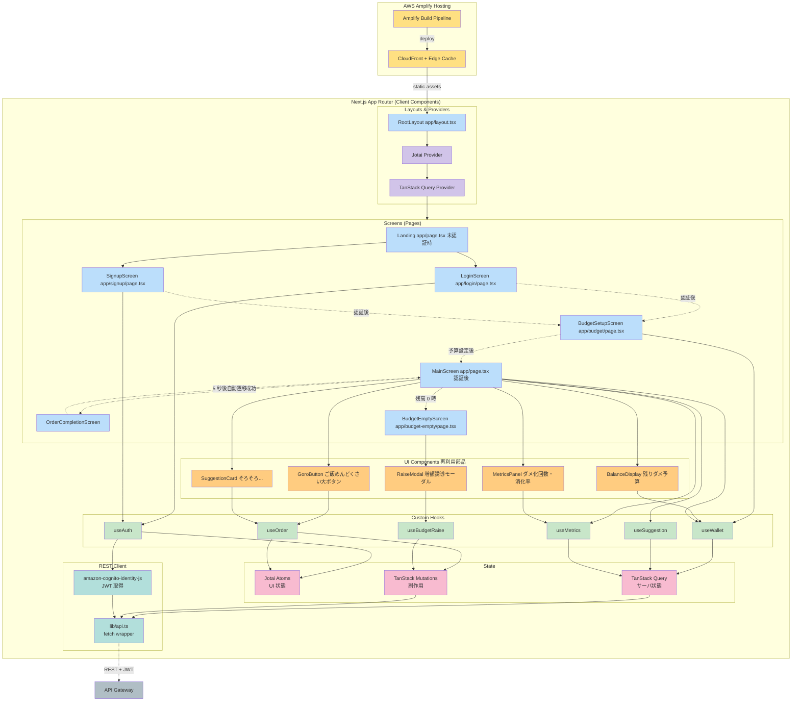
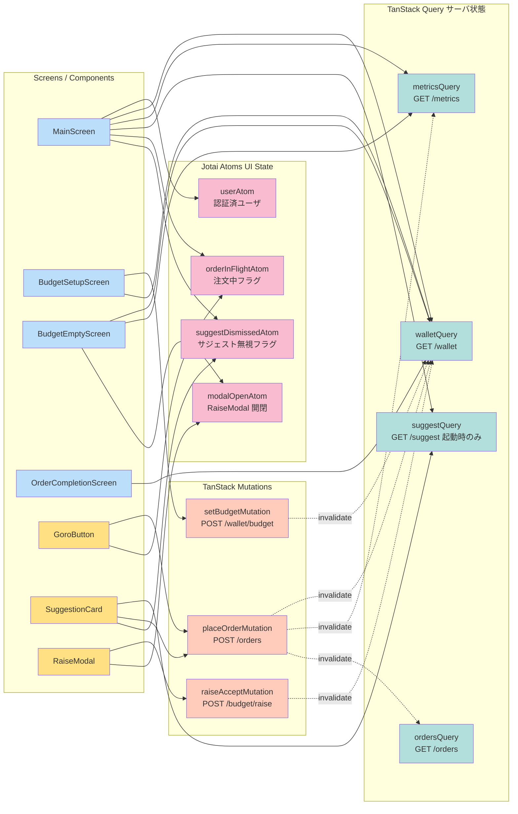
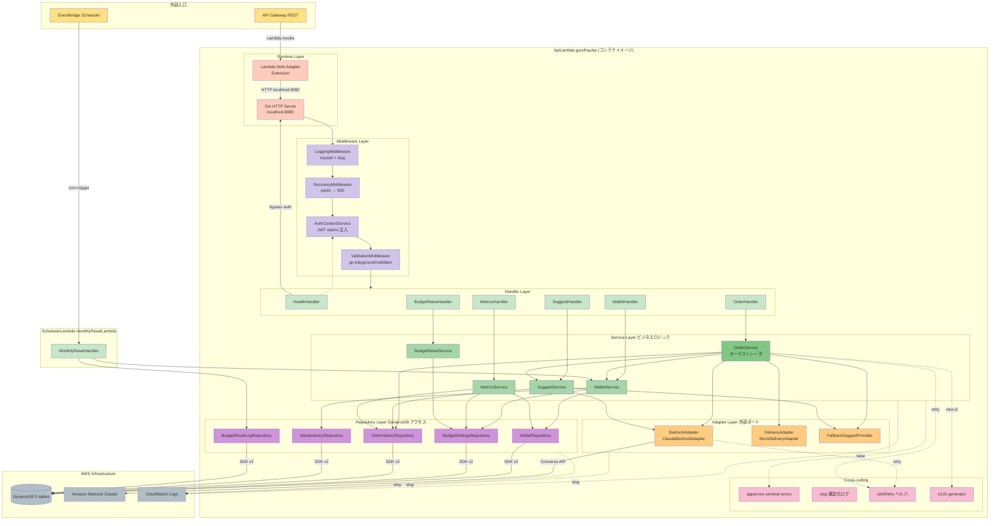
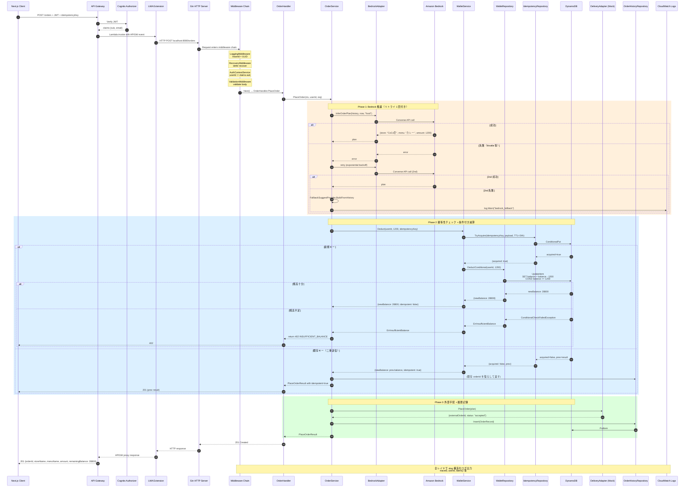
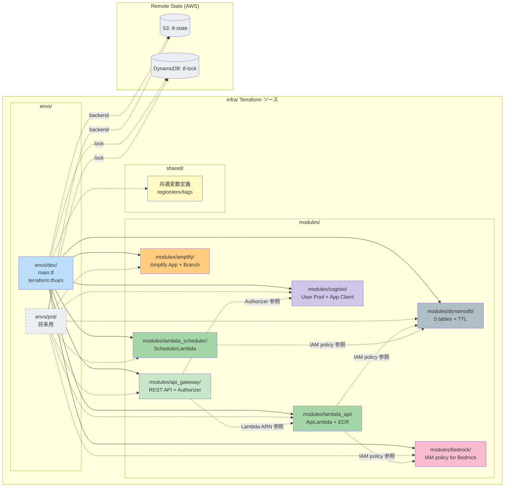
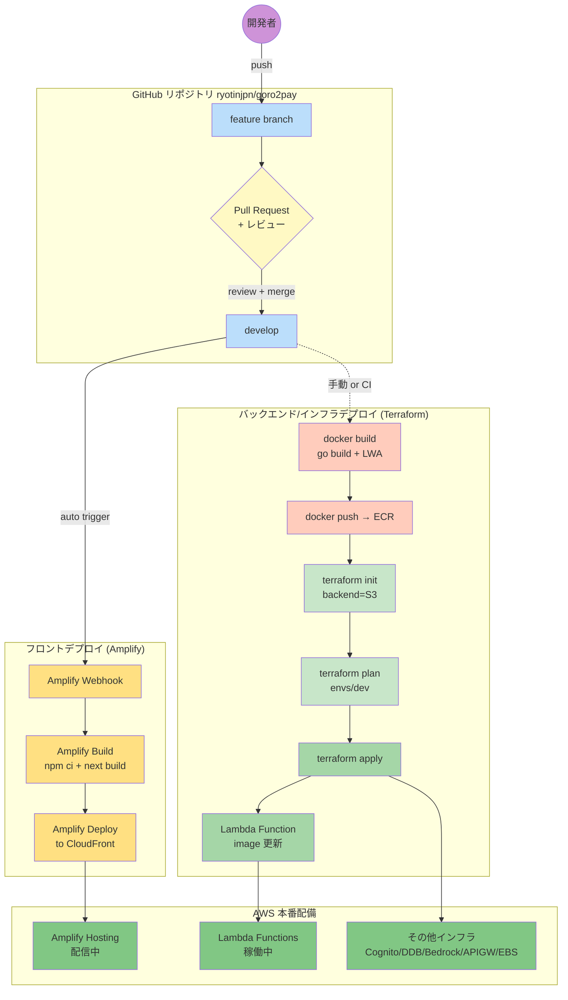

# Component Dependency — ゴロゴロPay

**Document Version**: 1.0
**Created**: 2026-05-07

本ドキュメントは、コンポーネント・サービス・アダプタ・リポジトリの **依存関係** と **通信パターン** を可視化する。

---

## 1. 全体依存関係図（Mermaid）

```mermaid
flowchart TB
    %% Presentation Layer
    subgraph PRESENTATION["Presentation Layer (Next.js / Amplify Hosting)"]
        PA[PresentationApp]
        AS[AuthScreens]
        BSS[BudgetSetupScreen]
        MS[MainScreen]
        OCS[OrderCompletionScreen]
        BES[BudgetEmptyScreen]
        STATE[Jotai Atoms + TanStack Query Hooks]
    end

    %% API Gateway
    subgraph GATEWAY["API Gateway + Cognito Authorizer"]
        APIGW[REST API]
        AUTHZ[Cognito User Pool Authorizer]
    end

    %% Application Layer
    subgraph APPLICATION["Application Layer (Go + Gin + LWA)"]
        subgraph ALAMBDA["ApiLambda (goroPayApi)"]
            MW[AuthContextService middleware]
            HH[HealthHandler]
            WH[WalletHandler]
            OH_H[OrderHandler]
            MH[MetricsHandler]
            SH[SuggestHandler]
            BRH[BudgetRaiseHandler]

            subgraph SERVICES["Services"]
                WS[WalletService]
                OS[OrderService]
                SS[SuggestService]
                MS_S[MetricsService]
                BRS[BudgetRaiseService]
            end

            subgraph ADAPTERS["Adapters"]
                DA[DeliveryAdapter<br/>impl: MockDeliveryAdapter]
                BA[BedrockAdapter<br/>impl: ClaudeBedrockAdapter]
                FB[FallbackSuggestProvider]
            end

            subgraph REPOS["Repositories"]
                WR[WalletRepository]
                BSR[BudgetSettingsRepository]
                OHR[OrderHistoryRepository]
                IR[IdempotencyRepository]
                BRLR[BudgetResetLogRepository]
            end
        end

        subgraph SLAMBDA["SchedulerLambda (monthlyResetLambda)"]
            MRH[MonthlyResetHandler]
        end
    end

    %% Infrastructure Layer
    subgraph INFRA["Infrastructure Layer"]
        COG[Amazon Cognito User Pool]
        DDB_W[(DynamoDB GoroPay_Wallet)]
        DDB_B[(DynamoDB GoroPay_BudgetSettings)]
        DDB_O[(DynamoDB GoroPay_OrderHistory)]
        DDB_I[(DynamoDB GoroPay_IdempotencyKeys)]
        DDB_L[(DynamoDB GoroPay_BudgetResetLog)]
        BR[Amazon Bedrock Claude]
        EBS[EventBridge Scheduler]
        CWL[CloudWatch Logs]
    end

    %% Presentation → API Gateway
    PA --> STATE
    AS --> STATE
    BSS --> STATE
    MS --> STATE
    OCS --> STATE
    BES --> STATE
    STATE -->|REST| APIGW

    %% Auth Screens → Cognito
    AS -.->|amplify-js / amazon-cognito-identity-js| COG

    %% Gateway routing
    APIGW --> AUTHZ
    AUTHZ -->|JWT claims| MW

    %% Handlers
    MW --> HH
    MW --> WH
    MW --> OH_H
    MW --> MH
    MW --> SH
    MW --> BRH

    %% Handler → Service
    WH --> WS
    OH_H --> OS
    MH --> MS_S
    SH --> SS
    BRH --> BRS

    %% Service interactions
    OS --> WS
    OS --> SS
    OS --> BA
    OS --> DA
    OS --> FB
    SS --> BA
    SS --> FB

    %% Services → Repositories
    WS --> WR
    WS --> BSR
    WS --> IR
    OS --> OHR
    SS --> OHR
    MS_S --> OHR
    MS_S --> WR
    MS_S --> BSR
    BRS --> BSR

    %% Repositories → DynamoDB
    WR -->|SDK| DDB_W
    BSR -->|SDK| DDB_B
    OHR -->|SDK| DDB_O
    IR -->|SDK| DDB_I
    BRLR -->|SDK| DDB_L

    %% Adapter → External
    BA -->|Converse API| BR

    %% Scheduler
    EBS -->|Cron trigger| MRH
    MRH --> WS
    MRH --> BRLR

    %% Logs
    SERVICES -.-> CWL
    ADAPTERS -.-> CWL
    REPOS -.-> CWL
    MRH -.-> CWL

    style PA fill:#BBDEFB
    style AS fill:#BBDEFB
    style BSS fill:#BBDEFB
    style MS fill:#BBDEFB
    style OCS fill:#BBDEFB
    style BES fill:#BBDEFB
    style STATE fill:#BBDEFB
    style APIGW fill:#FFE082
    style AUTHZ fill:#FFE082
    style MW fill:#C8E6C9
    style HH fill:#C8E6C9
    style WH fill:#C8E6C9
    style OH_H fill:#C8E6C9
    style MH fill:#C8E6C9
    style SH fill:#C8E6C9
    style BRH fill:#C8E6C9
    style WS fill:#A5D6A7
    style OS fill:#A5D6A7
    style SS fill:#A5D6A7
    style MS_S fill:#A5D6A7
    style BRS fill:#A5D6A7
    style DA fill:#FFCC80
    style BA fill:#FFCC80
    style FB fill:#FFCC80
    style WR fill:#CE93D8
    style BSR fill:#CE93D8
    style OHR fill:#CE93D8
    style IR fill:#CE93D8
    style BRLR fill:#CE93D8
    style MRH fill:#C8E6C9
    style COG fill:#B0BEC5
    style DDB_W fill:#B0BEC5
    style DDB_B fill:#B0BEC5
    style DDB_O fill:#B0BEC5
    style DDB_I fill:#B0BEC5
    style DDB_L fill:#B0BEC5
    style BR fill:#B0BEC5
    style EBS fill:#B0BEC5
    style CWL fill:#B0BEC5
```



---

## 1.1 フロントエンドアーキテクチャ（詳細）

§1 の全体図ではフロント側を簡略化していた。ここでは Presentation Layer の**内部構造**、画面遷移、状態フローを 3 つの図で詳細化する。

### 1.1.A フロントエンド階層構造図

Amplify Hosting に配信される Next.js (App Router) のコンポーネント・フック・状態・通信層の階層を可視化する。



**凡例（色）**:
- 🟦 Screens: Next.js ページコンポーネント
- 🟧 UI Components: 再利用可能な UI 部品
- 🟩 Custom Hooks: ビジネスロジックのカプセル化
- 🟪 Providers: Jotai / TanStack Query のルート
- 🌸 State: atoms / queries / mutations（色は便宜上同系）
- 🏁 REST Client: API Gateway との通信層

---

### 1.1.B 画面遷移図（ユーザージャーニー × ダメ化フェーズ）

ペルソナ「佐藤陽介」のダメ化フェーズ 1→2→3 に対応する画面遷移を可視化する。

```mermaid
stateDiagram-v2
    [*] --> Landing: 初回訪問

    state "フェーズ 0 準備" as Phase0 {
        Landing --> Signup: はじめる
        Landing --> Login: ログイン
        Signup --> BudgetSetup: 登録成功
        Login --> MainAuth: ログイン成功
        BudgetSetup --> MainAuth: 予算設定完了
    }

    state "フェーズ 1 ボタンを押すだけ" as Phase1 {
        MainAuth --> OrderInProgress: ご飯めんどくさい押下
        OrderInProgress --> OrderCompletion: 注文成功
        OrderInProgress --> MainAuth: 残高不足
        OrderCompletion --> MainAuth: 5 秒後自動遷移
    }

    state "フェーズ 2 ボタンすら不要" as Phase2 {
        MainAuth: メイン画面起動時
        MainAuth --> SuggestCard: 履歴 5 件以上で表示
        SuggestCard --> OrderInProgress: YES 1 タップ
        SuggestCard --> MainAuth: 無視してスクロール
    }

    state "フェーズ 3 完全に人がダメになる" as Phase3 {
        MainAuth --> BudgetEmpty: 残高 0 到達
        BudgetEmpty --> RaiseModal: 画面表示時に自動
        RaiseModal --> BudgetEmpty: あとで（再表示）
        RaiseModal --> [*]_Accept: 増額承諾
        [*]_Accept --> MainAuth: 翌月予算 +50 percent 設定済
    }

    Phase0 --> Phase1
    Phase1 --> Phase2: 履歴蓄積 5 件以上
    Phase2 --> Phase3: 予算枯渇
```



**ストーリー対応**:

| 遷移 | 対応ストーリー | ペルソナ感情 |
|---|---|---|
| Landing → Signup / Login | US-0-01 / US-0-02 | 「試してみるか」（半信半疑） |
| BudgetSetup → MainAuth | US-0-03 / US-0-04 | 「月 3 万でどこまでダメになれるか」 |
| MainAuth → OrderInProgress → OrderCompletion | US-1-01 / US-1-07 | 「え、もう終わったの？」（驚きと快感） |
| MainAuth → 残高不足 | US-1-04 / US-1-06 | 「今月ダメになれない…」（無力感予告） |
| MainAuth → SuggestCard → OrderInProgress | US-2-01 / US-2-03 | 「分かってくれてる」（自己委譲） |
| MainAuth → BudgetEmpty → RaiseModal → 増額承諾 | US-3-03 / US-3-04 / US-X-03 | 「来月もっとダメになろう」（退化ループ完成） |

---

### 1.1.C State Flow 図（Jotai / TanStack Query）

クライアント状態管理における atoms / queries / mutations の関係と、画面コンポーネントの subscribe 関係を可視化する。



**責務分担の指針**:

| 種別 | 対象 | 例 |
|---|---|---|
| Jotai Atoms | UI 状態・クライアント固有状態 | モーダル開閉、注文中フラグ、サジェスト無視 |
| TanStack Query | サーバ状態（GET 系） | ウォレット残高、メトリクス、サジェスト、履歴 |
| TanStack Mutation | サーバ副作用（POST 系） | 注文、予算設定、増額承諾 |
| Query Invalidation | 副作用後の状態同期 | placeOrderMutation 成功 → wallet/metrics/orders を invalidate |

**設計上の重要点**:

- 注文（placeOrderMutation）は成功時に `walletQuery`・`metricsQuery`・`ordersQuery` を同時 invalidate → MainScreen の残高・消化率・履歴が自動更新
- `orderInFlightAtom` はボタン連打防止（US-1-05 冪等性の UI 側補強）と注文中ローディング表示に使用
- `suggestDismissedAtom` はサジェストカードを無視したユーザに対し、同一起動中は再表示しないための UI 状態
- サジェスト取得は **起動時 1 回のみ**（FR-SUGGEST-05、`refetchOnMount: 'always'` + `staleTime: Infinity`）

---

## 1.2 バックエンドアーキテクチャ（詳細）

§1 の全体図ではバックエンド（Application Layer）を簡略化していた。ここでは **ApiLambda 内部のレイヤ構造**、**リクエスト処理シーケンス**、**データアクセス権限マトリクス** を 3 つの図で詳細化する。

### 1.2.A バックエンド階層構造図（ApiLambda 内部）

ApiLambda（Go + Gin + LWA コンテナ）内部のレイヤ別コンポーネント構造を可視化する。



**レイヤの責務**:

| レイヤ | 責務 | パッケージ（Go） |
|---|---|---|
| Runtime Layer | Lambda イベント → HTTP 変換、Gin サーバの起動 | `main.go` + LWA extension |
| Middleware Layer | 横断関心事（認証・ログ・バリデーション・panic 回復） | `internal/auth`, `internal/middleware` |
| Handler Layer | HTTP リクエスト受理とレスポンス構築（薄い、ロジックなし） | `internal/handlers` |
| Service Layer | ビジネスロジック・トランザクション境界・オーケストレーション | `internal/wallet`, `internal/order`, `internal/suggest`, `internal/metrics`, `internal/budget_raise` |
| Adapter Layer | 外部システムへの port（interface + 実装） | `internal/adapters/{delivery,bedrock,fallback}` |
| Repository Layer | DynamoDB への CRUD ラッパ | `internal/repo/{wallet_repo,budget_settings,order_history,idempotency,budget_reset_log}` |
| Cross-cutting | 横断ユーティリティ | `internal/apperrors`, slog, retry ヘルパ |

**アーキテクチャの性質**:

- **Hexagonal 風の薄い実装**（ドメイン層を厳密には切り出さず、Service 層がその役目を兼ねる MVP 構成）
- **依存方向は上から下に片方向**（Handler → Service → Adapter/Repository → 外部）
- **循環依存なし**（Unit Generation ステージの分解の基礎となる）
- **モノリシック 1 Lambda**（Q-E=B' の決定）だが**パッケージ境界で論理分割**されているため、将来 Unit ごとの Lambda 分離にリファクタ可能

---

### 1.2.B コアユースケース シーケンス図（US-1-01 詳細）

バックエンド内部の **1 リクエストの処理フロー** を層を跨いで可視化する。US-1-01（「ご飯めんどくさい」ボタン押下）を例にとる。



**パフォーマンス目標（NFR-PERF-01）**:

| フェーズ | 想定レイテンシ | 備考 |
|---|---|---|
| Phase 1（Bedrock 成功） | 500 ms ~ 1.5 s | Claude Haiku なら 500 ms 台を目指す |
| Phase 2（DynamoDB CAS） | 20 ~ 50 ms | 単一キー UpdateItem |
| Phase 3（Mock + Insert） | 10 ~ 30 ms | PutItem のみ |
| Lambda cold start | +200 ~ 500 ms（初回のみ） | Go コンテナイメージ |
| 合計（通常時） | **< 2 秒** | 体感 3 秒以内（NFR-PERF-01）を満たす |

**エラー分岐サマリ**:

| シナリオ | 応答 | 対応ストーリー |
|---|---|---|
| Bedrock 失敗 + Fallback 成功 | 201（内部 log.Warn） | US-1-01（体験維持） |
| 残高不足 | 402 INSUFFICIENT_BALANCE | US-1-04, US-1-06 |
| 二重送信（idempotent） | 201（前回結果を復元） | US-1-05 |
| バリデーション失敗 | 400 VALIDATION_FAILED | （横断） |
| 内部エラー | 500 INTERNAL_ERROR + panic recovery | （横断） |

---

### 1.2.C データアクセス権限マトリクス

各 Service がどの外部リソース（DynamoDB テーブル / Bedrock）に対してどの操作をするかを可視化する。IAM ポリシー設計の根拠であり、Unit Generation ステージで Unit ごとの最小権限を定義する際の土台となる。

| Service / Scheduler | Wallet table | BudgetSettings table | OrderHistory table | IdempotencyKeys table | BudgetResetLog table | Bedrock Claude |
|---|---|---|---|---|---|---|
| **WalletService** | RW (UpdateItem cond) | RW | - | RW (ConditionalPut) | - | - |
| **OrderService** | - (WalletService 経由) | - | W (Insert) / R (ListRecent) | - | - | (BedrockAdapter 経由) |
| **SuggestService** | - | - | R (ListRecent) | - | - | (BedrockAdapter 経由) |
| **MetricsService** | R | R | R (Count/Sum) | - | - | - |
| **BudgetRaiseService** | - | RW (Update + RaiseLog 追記) | - | - | - | - |
| **SchedulerLambda** (WalletService 経由) | RW (ResetTo) + Scan | R | - | - | W (Insert) | - |
| **BedrockAdapter** | - | - | - | - | - | bedrock-runtime:Converse |

**凡例**: R=Read / W=Write / - =アクセスなし

**IAM 設計指針**:

- **ApiLambda の IAM Role**: 上記表の Service 側集計（Wallet/BudgetSettings/OrderHistory/IdempotencyKeys への RW、Bedrock Converse の呼び出し権限）。BudgetResetLog は書き込み不要。
- **SchedulerLambda の IAM Role**: Wallet RW + Scan、BudgetSettings R、BudgetResetLog W のみ（最小権限）。
- **条件付き書き込みの IAM 権限**: `dynamodb:UpdateItem` に追加の条件指定権限は不要（ConditionExpression はアクション権限の範囲内）。
- **Bedrock の IAM 権限**: `bedrock:InvokeModel` もしくは `bedrock-runtime:Converse`（利用 API に応じて）+ 対象モデル ARN を限定。

この表は Infrastructure Design ステージでの Terraform IAM ポリシー定義に直接転写される。

---

## 1.3 インフラアーキテクチャ（詳細）

§1 の全体図では Infrastructure Layer を個別リソースとして列挙するのみだった。本 MVP のインフラは **AWS 内完結のサーバレス構成** + **Terraform IaC** のため、ここでは以下 3 視点で可視化する：

1. **リソース配置図** — AWS アカウント内のリソースを論理的に配置
2. **Terraform モジュール構成図** — `infra/modules/` と `envs/` の関係
3. **デプロイフロー図** — ソースコードから本番稼働までの流れ

なお、**詳細なインフラ実装（リソース属性、IAM ポリシー細部、容量モード、パラメータシート等）は Construction フェーズの Infrastructure Design（per-unit）で確定する**。本セクションは Application Design 視点の overview。

### 1.3.A AWS リソース配置図

```mermaid
flowchart TB
    subgraph AWS["AWS Account (ap-northeast-1 東京リージョン)"]
        subgraph EDGE["Edge / グローバル"]
            CF[CloudFront<br/>Amplify 内包]
            WAF[WAF<br/>将来対応]
        end

        subgraph HOSTING["Amplify Hosting"]
            AMP_APP[Amplify App<br/>Next.js App Router]
            AMP_BRANCH[Amplify Branch<br/>main = develop 連携]
        end

        subgraph AUTH_BLOCK["認証 Cognito"]
            UP[User Pool<br/>メール + パスワード]
            APP_CLIENT[App Client<br/>PWA 向け]
        end

        subgraph API_BLOCK["API 層"]
            APIGW_BLOCK[API Gateway REST]
            AUTHZ_BLOCK[Cognito Authorizer]
            ECR[ECR Repository<br/>goropay-api コンテナ]
            LAMBDA_API_B[Lambda: goroPayApi<br/>Go + Gin + LWA<br/>コンテナイメージ]
        end

        subgraph COMPUTE["スケジュール処理"]
            EBS_B[EventBridge Scheduler<br/>cron 月初 00:00 JST]
            LAMBDA_SCHED_B[Lambda: monthlyResetLambda<br/>Go]
        end

        subgraph DATA["データ層 DynamoDB オンデマンド"]
            T_W[(GoroPay_Wallet)]
            T_B[(GoroPay_BudgetSettings)]
            T_O[(GoroPay_OrderHistory<br/>TTL 90 日)]
            T_I[(GoroPay_IdempotencyKeys<br/>TTL 24 時間)]
            T_L[(GoroPay_BudgetResetLog<br/>TTL 12 ヶ月)]
        end

        subgraph AI_BLOCK["AI"]
            BR_B[Amazon Bedrock<br/>Claude Haiku/Sonnet<br/>Converse API]
        end

        subgraph IAM_BLOCK["IAM"]
            ROLE_API[IAM Role: ApiLambdaRole<br/>DDB RW + Bedrock Invoke]
            ROLE_SCHED[IAM Role: SchedulerLambdaRole<br/>DDB RW 最小権限]
            ROLE_EBS[IAM Role: EventBridgeSchedulerRole<br/>Lambda Invoke]
        end

        subgraph OBS["観測"]
            CW_LOGS[CloudWatch Log Groups<br/>/aws/lambda/goropay-*]
            CW_METRICS[CloudWatch Metrics<br/>Lambda/DDB/Bedrock 標準]
        end

        subgraph STATE_BLOCK["Terraform State"]
            S3_STATE[(S3: tf-state bucket)]
            DDB_LOCK[(DynamoDB: tf-lock table)]
        end
    end

    USER((佐藤陽介<br/>PWA)) -->|HTTPS| CF
    CF --> AMP_APP
    AMP_BRANCH -.->|provision| AMP_APP

    USER -->|REST + JWT| APIGW_BLOCK
    USER -.->|OAuth code/password flow| APP_CLIENT
    APP_CLIENT -.-> UP

    APIGW_BLOCK --> AUTHZ_BLOCK
    AUTHZ_BLOCK -.->|JWT 検証| UP
    APIGW_BLOCK --> LAMBDA_API_B
    ECR -.->|image pull| LAMBDA_API_B

    LAMBDA_API_B -.->|assume| ROLE_API
    LAMBDA_API_B --> T_W
    LAMBDA_API_B --> T_B
    LAMBDA_API_B --> T_O
    LAMBDA_API_B --> T_I
    LAMBDA_API_B --> BR_B

    EBS_B -.->|assume| ROLE_EBS
    EBS_B -->|InvokeLambda| LAMBDA_SCHED_B
    LAMBDA_SCHED_B -.->|assume| ROLE_SCHED
    LAMBDA_SCHED_B --> T_W
    LAMBDA_SCHED_B --> T_B
    LAMBDA_SCHED_B --> T_L

    LAMBDA_API_B -.-> CW_LOGS
    LAMBDA_SCHED_B -.-> CW_LOGS
    LAMBDA_API_B -.-> CW_METRICS
    LAMBDA_SCHED_B -.-> CW_METRICS

    TF[Terraform CLI<br/>開発者] -.->|read/write state| S3_STATE
    TF -.->|lock| DDB_LOCK

    style USER fill:#CE93D8
    style CF fill:#FFE082
    style WAF fill:#ECEFF1,stroke-dasharray:5 5
    style AMP_APP fill:#BBDEFB
    style AMP_BRANCH fill:#BBDEFB
    style UP fill:#D1C4E9
    style APP_CLIENT fill:#D1C4E9
    style APIGW_BLOCK fill:#C8E6C9
    style AUTHZ_BLOCK fill:#C8E6C9
    style ECR fill:#FFCCBC
    style LAMBDA_API_B fill:#A5D6A7
    style EBS_B fill:#FFE082
    style LAMBDA_SCHED_B fill:#A5D6A7
    style T_W fill:#B0BEC5
    style T_B fill:#B0BEC5
    style T_O fill:#B0BEC5
    style T_I fill:#B0BEC5
    style T_L fill:#B0BEC5
    style BR_B fill:#F8BBD0
    style ROLE_API fill:#FFCC80
    style ROLE_SCHED fill:#FFCC80
    style ROLE_EBS fill:#FFCC80
    style CW_LOGS fill:#B2DFDB
    style CW_METRICS fill:#B2DFDB
    style S3_STATE fill:#ECEFF1
    style DDB_LOCK fill:#ECEFF1
    style TF fill:#CE93D8
```



**ネットワーク方針**:

- **VPC 不使用**（Lambda は all public、DynamoDB / Bedrock / Cognito は AWS 管理のパブリックエンドポイント経由）
- **境界セキュリティは Cognito + API Gateway Authorizer のみ**（本 MVP スコープ、Q-16=B の opt-out に整合）
- 本番運用時に追加すべき要素: WAF / VPC Endpoint / Private Link（将来対応、Requirements §4.5 に留保済み）

**リージョン・マルチAZ**:

- `ap-northeast-1` 単一リージョン
- AWS マネージドサービスの標準可用性（DynamoDB / Lambda / Bedrock はリージョン内で自動冗長化）
- マルチリージョン / DR は対象外

**リソース命名規則**（Construction で確定、本 MVP 想定）:

| リソース | 命名パターン | 例 |
|---|---|---|
| DynamoDB テーブル | `GoroPay_<Entity>` | `GoroPay_Wallet` |
| Lambda Function | `goropay-<purpose>-<env>` | `goropay-api-dev` |
| IAM Role | `goropay-<purpose>-role-<env>` | `goropay-api-role-dev` |
| CloudWatch Log Group | `/aws/lambda/goropay-<purpose>-<env>` | `/aws/lambda/goropay-api-dev` |
| Amplify App | `goropay-web-<env>` | `goropay-web-dev` |

---

### 1.3.B Terraform モジュール構成図

プロジェクトの `terraform-plugin:terraform-module-design` 規約に従い、`infra/modules/` に機能別モジュールを配置、`infra/envs/<env>/` から呼び出す構成。



**モジュール依存の方針**:

- **envs → modules の単方向呼び出し**（modules 間は相互参照しない、必要な出力値は envs 層で配線）
- **例外**: IAM ポリシー参照は例外的にモジュール間で ARN を output / input で受け渡す
- **各モジュールは自己完結**（`variables.tf` / `main.tf` / `outputs.tf` / `versions.tf`）
- **Terraform コーディング規約**（`terraform-plugin:terraform-coding-rule`）に従う:
  - DRY 原則: 共通タグ・リージョン等は `shared/` で一元管理
  - 秘匿情報: `tfvars` にベタ書きせず、将来的には Secrets Manager 参照
  - Checkov スキップルール: `checkov-skip-rule-plugin:checkov-skip-rule` に従う

**パラメータシート**（`parameter-sheet-format-plugin:parameter-sheet-format` 準拠）は Infrastructure Design ステージで作成。

**コスト見積**（`aws-cost-estimate-plugin:aws-cost-estimate` 準拠）も同様に Infrastructure Design で作成。

---

### 1.3.C デプロイフロー図

ソースコード変更から本番稼働までの流れ。フロント（Amplify）とバックエンド / インフラ（Terraform）は**別系統**でデプロイされる。



**デプロイ方式の整理**:

| 対象 | ビルド | デプロイトリガ | 方法 |
|---|---|---|---|
| PWA（Next.js） | Amplify Build（内蔵パイプライン） | `develop` ブランチへの push | **自動**（Amplify Webhook 連携） |
| ApiLambda（Go コンテナ） | Docker build + ECR push | 手動 or 将来 GitHub Actions | 手動デプロイ（本 MVP）/ CI 化（将来） |
| SchedulerLambda（Go） | 同上 | 同上 | 同上 |
| インフラ（Terraform） | `terraform plan` | Pull Request レビュー後の手動 `apply` | 手動運用（本 MVP） |

**方針**:
- フロントは Amplify の自動デプロイに乗る（開発速度優先、ハッカソン向け）
- バックエンド / インフラは手動 apply（state の安全性と変更の可視化を優先）
- CI/CD（GitHub Actions）化は本 MVP スコープ外、Construction 後の将来対応

**ロールバック戦略**:
- フロント: Amplify Hosting の Branch History からワンクリックで前回デプロイに戻せる
- バックエンド: ECR の前回イメージタグで Lambda Function image を更新
- インフラ: Terraform state の rollback は原則行わず、新しい変更をフォワード適用（destructive な変更は事前に plan レビュー必須）

---

## 2. 依存関係マトリクス（呼び出し方向: 縦→横）

|            | WalletService | OrderService | SuggestService | MetricsService | BudgetRaiseService | BedrockAdapter | DeliveryAdapter | FallbackProvider | WalletRepo | BudgetSettingsRepo | OrderHistoryRepo | IdempotencyRepo | BudgetResetLogRepo |
|---|---|---|---|---|---|---|---|---|---|---|---|---|---|
| WalletHandler | ✓ | | | | | | | | | | | | |
| OrderHandler | | ✓ | | | | | | | | | | | |
| MetricsHandler | | | | ✓ | | | | | | | | | |
| SuggestHandler | | | ✓ | | | | | | | | | | |
| BudgetRaiseHandler | | | | | ✓ | | | | | | | | |
| WalletService | — | | | | | | | | ✓ | ✓ | | ✓ | |
| OrderService | ✓ | — | ✓ | | | ✓ | ✓ | ✓ | | | ✓ | | |
| SuggestService | | | — | | | ✓ | | ✓ | | | ✓ | | |
| MetricsService | | | | — | | | | | ✓ | ✓ | ✓ | | |
| BudgetRaiseService | | | | | — | | | | | ✓ | | | |
| MonthlyResetHandler | ✓ | | | | | | | | | | | | ✓ |

**凡例**: ✓ = 呼び出し依存あり、— = 自分自身（呼び出し対象外）

**循環依存チェック**: なし（全て階層が下位方向への片方向依存）

---

## 3. データフロー（シナリオ別）

### 3.1 「ご飯めんどくさい」ボタン押下（US-1-01）

```
User Click
  ↓
[Frontend] MainScreen → useOrder Hook → POST /orders { idempotencyKey }
  ↓
[API GW] JWT 検証 → Lambda invoke
  ↓
[Lambda] AuthContextService → OrderHandler → OrderService
  ↓
OrderService:
  1. BedrockAdapter.InferOrderPlan(history) → Bedrock API → InferOrderPlanOutput
     (失敗時: リトライ 1 回 → FallbackSuggestProvider)
  2. WalletService.Deduct → WalletRepository (conditional) + IdempotencyRepository → DynamoDB
  3. DeliveryAdapter.PlaceOrder (Mock 固定応答)
  4. OrderHistoryRepository.Insert → DynamoDB
  ↓
[Response] 201 { orderId, storeName, menuName, amount, remainingBalance }
  ↓
[Frontend] TanStack Query cache invalidation → MainScreen の残高・メトリクス更新 → OrderCompletionScreen
```

### 3.2 起動時サジェスト取得（US-2-01）

```
App Load
  ↓
[Frontend] MainScreen → useSuggestion Hook → GET /suggest
  ↓
[API GW] JWT 検証
  ↓
[Lambda] AuthContextService → SuggestHandler → SuggestService
  ↓
SuggestService:
  1. OrderHistoryRepository.ListRecent(userId, 30) → DynamoDB
  2. 履歴件数 < 5 なら { hasSuggestion: false } で早期返却
  3. BedrockAdapter.InferSuggestion(history) → Bedrock API
     (失敗時: リトライ 1 回 → FallbackSuggestProvider.BuildFromHistory)
  4. SuggestionID 採番、DynamoDB に TTL 30 分で一時保存
  ↓
[Response] 200 { hasSuggestion: true/false, suggestionId, title, plan }
  ↓
[Frontend] サジェストカードを MainScreen に表示、または非表示
```

### 3.3 月初リセット（US-3-05）

```
EventBridge Scheduler (cron: 月初 00:00 JST)
  ↓
SchedulerLambda.MonthlyResetHandler
  ↓
WalletService.ResetAll(ctx):
  1. WalletRepository.ListAllUserIDs → DynamoDB Scan
  2. 各ユーザについて:
     a. BudgetSettingsRepository.Get → monthlyBudget 取得
     b. WalletRepository.ResetTo(userId, monthlyBudget) → DynamoDB UpdateItem
     c. BudgetResetLogRepository.Insert → DynamoDB PutItem
  ↓
CloudWatch Logs に結果出力
```

---

## 4. 通信パターン

### 4.1 同期 REST (JSON over HTTPS)

全ての Presentation ↔ Application 通信。JSON body、Bearer JWT ヘッダ。

### 4.2 AWS SDK 呼び出し（Go: `aws-sdk-go-v2`）

全ての Application ↔ Infrastructure（DynamoDB / Bedrock）通信。コンテキスト伝播、エラー型による分岐。

### 4.3 EventBridge Scheduler → Lambda

月初リセットのみ。Cron ルールで `SchedulerLambda` を invoke。

### 4.4 SDK レベルの設定（Go 側の共通項）

- `aws-sdk-go-v2` の Client は Lambda 起動時（`init()`）に初期化し使い回す
- DynamoDB は `UpdateItem` に `ConditionExpression` を必ず指定（残高不変保証）
- Bedrock 呼び出しは timeout 設定（仮: 5 秒）、超過で独自リトライ判定

---

## 5. Unit 候補との境界線

Units Generation ステージで確定する想定の Unit 境界を、依存関係図の上で示す：

| Unit | 境界内コンポーネント | 境界外依存（他 Unit への依存） |
|---|---|---|
| Unit A: 認証・ユーザー管理 | AuthScreens, Cognito, AuthContextService | API Gateway Authorizer（Infra） |
| Unit B: ダメ予算・仮想ウォレット | BudgetSetupScreen, WalletHandler, WalletService, WalletRepository, BudgetSettingsRepository, IdempotencyRepository, SchedulerLambda, BudgetResetLogRepository | なし（他 Unit から呼ばれる側） |
| Unit C: 代行手配コア | OrderHandler, OrderService, OrderHistoryRepository, DeliveryAdapter, BedrockAdapter, FallbackSuggestProvider | Unit B (WalletService), Unit D (SuggestService.ResolveSuggestion) |
| Unit D: 行動学習・先回り提案 | SuggestHandler, SuggestService, BedrockAdapter 共有, FallbackSuggestProvider 共有 | Unit C (OrderHistoryRepository 共有参照) |
| Unit E: ダメ化メトリクス | MainScreen（メトリクス表示部）, BudgetEmptyScreen, MetricsHandler, MetricsService, BudgetRaiseHandler, BudgetRaiseService | Unit B (BudgetSettingsRepository, WalletRepository), Unit C (OrderHistoryRepository 参照) |
| Unit F: ダメ化UX 体験（横串） | なし（全 Unit に通底する NFR） | 全 Unit に制約として適用 |

**観察**:
- **Unit C は Unit B と D に依存**（WalletService、SuggestService.ResolveSuggestion）
- **Unit E は Unit B と C の読取依存**
- **BedrockAdapter / FallbackSuggestProvider は Unit C と D で共有**される横串コンポーネント

この依存構造は Units Generation ステージで確定する Unit 実装順序（B → C → D → E の順が素直）の基礎となる。

---

## 6. 結合度・凝集度の評価

### 6.1 結合度
- **Handlers → Services**: 低結合（interface 経由、1:1 依存）
- **Services → Adapters**: 低結合（interface 経由、`MockDeliveryAdapter` のテスト差し替え可）
- **Services → Repositories**: 中結合（DynamoDB 固有の実装に依存、ただし interface 定義で差し替えテスト可能）
- **OrderService → WalletService, SuggestService**: 中結合（同一 Unit 内または隣接 Unit への直接呼び出し）

### 6.2 凝集度
- **各 Service は 1 つのドメイン概念に凝集**（Wallet / Order / Suggest / Metrics / BudgetRaise）
- **Handlers は 1 つの Service に対応**（例外なし）

---

## 7. 審査観点へのトレーサビリティ

| 審査観点 | 対応 |
|---|---|
| ビジネス意図の明確さ | 依存図でフロントから DB までの Intent の流れが視覚化される |
| 創造性とテーマ適合性 | SuggestService / BudgetRaiseService / FallbackSuggestProvider 等、ダメ化UX 専用コンポーネントの配置が明確 |
| Unit 分解の適切さ | §5 で依存図上の Unit 境界と横串共有コンポーネントを明示 |
| ドキュメント品質 | Mermaid 依存図 + 依存マトリクス + シナリオ別データフロー + 結合度評価で立体的に記述 |
