# Component Dependency — ゴロゴロPay

**Document Version**: 1.0
**Created**: 2026-05-07

本ドキュメントは、コンポーネント・サービス・アダプタ・リポジトリの **依存関係** と **通信パターン** を可視化する。

---

## 1. 全体依存関係図（Mermaid）

```mermaid
flowchart TB
    %% Presentation Layer
    subgraph PRESENTATION["Presentation Layer (Next.js / Amplify Hosting)"]
        PA[PresentationApp]
        AS[AuthScreens]
        BSS[BudgetSetupScreen]
        MS[MainScreen]
        OCS[OrderCompletionScreen]
        BES[BudgetEmptyScreen]
        STATE[Jotai Atoms + TanStack Query Hooks]
    end

    %% API Gateway
    subgraph GATEWAY["API Gateway + Cognito Authorizer"]
        APIGW[REST API]
        AUTHZ[Cognito User Pool Authorizer]
    end

    %% Application Layer
    subgraph APPLICATION["Application Layer (Go + Gin + LWA)"]
        subgraph ALAMBDA["ApiLambda (goroPayApi)"]
            MW[AuthContextService middleware]
            HH[HealthHandler]
            WH[WalletHandler]
            OH_H[OrderHandler]
            MH[MetricsHandler]
            SH[SuggestHandler]
            BRH[BudgetRaiseHandler]

            subgraph SERVICES["Services"]
                WS[WalletService]
                OS[OrderService]
                SS[SuggestService]
                MS_S[MetricsService]
                BRS[BudgetRaiseService]
            end

            subgraph ADAPTERS["Adapters"]
                DA[DeliveryAdapter<br/>impl: MockDeliveryAdapter]
                BA[BedrockAdapter<br/>impl: ClaudeBedrockAdapter]
                FB[FallbackSuggestProvider]
            end

            subgraph REPOS["Repositories"]
                WR[WalletRepository]
                BSR[BudgetSettingsRepository]
                OHR[OrderHistoryRepository]
                IR[IdempotencyRepository]
                BRLR[BudgetResetLogRepository]
            end
        end

        subgraph SLAMBDA["SchedulerLambda (monthlyResetLambda)"]
            MRH[MonthlyResetHandler]
        end
    end

    %% Infrastructure Layer
    subgraph INFRA["Infrastructure Layer"]
        COG[Amazon Cognito User Pool]
        DDB_W[(DynamoDB GoroPay_Wallet)]
        DDB_B[(DynamoDB GoroPay_BudgetSettings)]
        DDB_O[(DynamoDB GoroPay_OrderHistory)]
        DDB_I[(DynamoDB GoroPay_IdempotencyKeys)]
        DDB_L[(DynamoDB GoroPay_BudgetResetLog)]
        BR[Amazon Bedrock Claude]
        EBS[EventBridge Scheduler]
        CWL[CloudWatch Logs]
    end

    %% Presentation → API Gateway
    PA --> STATE
    AS --> STATE
    BSS --> STATE
    MS --> STATE
    OCS --> STATE
    BES --> STATE
    STATE -->|REST| APIGW

    %% Auth Screens → Cognito
    AS -.->|amplify-js / amazon-cognito-identity-js| COG

    %% Gateway routing
    APIGW --> AUTHZ
    AUTHZ -->|JWT claims| MW

    %% Handlers
    MW --> HH
    MW --> WH
    MW --> OH_H
    MW --> MH
    MW --> SH
    MW --> BRH

    %% Handler → Service
    WH --> WS
    OH_H --> OS
    MH --> MS_S
    SH --> SS
    BRH --> BRS

    %% Service interactions
    OS --> WS
    OS --> SS
    OS --> BA
    OS --> DA
    OS --> FB
    SS --> BA
    SS --> FB

    %% Services → Repositories
    WS --> WR
    WS --> BSR
    WS --> IR
    OS --> OHR
    SS --> OHR
    MS_S --> OHR
    MS_S --> WR
    MS_S --> BSR
    BRS --> BSR

    %% Repositories → DynamoDB
    WR -->|SDK| DDB_W
    BSR -->|SDK| DDB_B
    OHR -->|SDK| DDB_O
    IR -->|SDK| DDB_I
    BRLR -->|SDK| DDB_L

    %% Adapter → External
    BA -->|Converse API| BR

    %% Scheduler
    EBS -->|Cron trigger| MRH
    MRH --> WS
    MRH --> BRLR

    %% Logs
    SERVICES -.-> CWL
    ADAPTERS -.-> CWL
    REPOS -.-> CWL
    MRH -.-> CWL

    style PA fill:#BBDEFB
    style AS fill:#BBDEFB
    style BSS fill:#BBDEFB
    style MS fill:#BBDEFB
    style OCS fill:#BBDEFB
    style BES fill:#BBDEFB
    style STATE fill:#BBDEFB
    style APIGW fill:#FFE082
    style AUTHZ fill:#FFE082
    style MW fill:#C8E6C9
    style HH fill:#C8E6C9
    style WH fill:#C8E6C9
    style OH_H fill:#C8E6C9
    style MH fill:#C8E6C9
    style SH fill:#C8E6C9
    style BRH fill:#C8E6C9
    style WS fill:#A5D6A7
    style OS fill:#A5D6A7
    style SS fill:#A5D6A7
    style MS_S fill:#A5D6A7
    style BRS fill:#A5D6A7
    style DA fill:#FFCC80
    style BA fill:#FFCC80
    style FB fill:#FFCC80
    style WR fill:#CE93D8
    style BSR fill:#CE93D8
    style OHR fill:#CE93D8
    style IR fill:#CE93D8
    style BRLR fill:#CE93D8
    style MRH fill:#C8E6C9
    style COG fill:#B0BEC5
    style DDB_W fill:#B0BEC5
    style DDB_B fill:#B0BEC5
    style DDB_O fill:#B0BEC5
    style DDB_I fill:#B0BEC5
    style DDB_L fill:#B0BEC5
    style BR fill:#B0BEC5
    style EBS fill:#B0BEC5
    style CWL fill:#B0BEC5
```



---

## 2. 依存関係マトリクス（呼び出し方向: 縦→横）

|            | WalletService | OrderService | SuggestService | MetricsService | BudgetRaiseService | BedrockAdapter | DeliveryAdapter | FallbackProvider | WalletRepo | BudgetSettingsRepo | OrderHistoryRepo | IdempotencyRepo | BudgetResetLogRepo |
|---|---|---|---|---|---|---|---|---|---|---|---|---|---|
| WalletHandler | ✓ | | | | | | | | | | | | |
| OrderHandler | | ✓ | | | | | | | | | | | |
| MetricsHandler | | | | ✓ | | | | | | | | | |
| SuggestHandler | | | ✓ | | | | | | | | | | |
| BudgetRaiseHandler | | | | | ✓ | | | | | | | | |
| WalletService | — | | | | | | | | ✓ | ✓ | | ✓ | |
| OrderService | ✓ | — | ✓ | | | ✓ | ✓ | ✓ | | | ✓ | | |
| SuggestService | | | — | | | ✓ | | ✓ | | | ✓ | | |
| MetricsService | | | | — | | | | | ✓ | ✓ | ✓ | | |
| BudgetRaiseService | | | | | — | | | | | ✓ | | | |
| MonthlyResetHandler | ✓ | | | | | | | | | | | | ✓ |

**凡例**: ✓ = 呼び出し依存あり、— = 自分自身（呼び出し対象外）

**循環依存チェック**: なし（全て階層が下位方向への片方向依存）

---

## 3. データフロー（シナリオ別）

### 3.1 「ご飯めんどくさい」ボタン押下（US-1-01）

```
User Click
  ↓
[Frontend] MainScreen → useOrder Hook → POST /orders { idempotencyKey }
  ↓
[API GW] JWT 検証 → Lambda invoke
  ↓
[Lambda] AuthContextService → OrderHandler → OrderService
  ↓
OrderService:
  1. BedrockAdapter.InferOrderPlan(history) → Bedrock API → InferOrderPlanOutput
     (失敗時: リトライ 1 回 → FallbackSuggestProvider)
  2. WalletService.Deduct → WalletRepository (conditional) + IdempotencyRepository → DynamoDB
  3. DeliveryAdapter.PlaceOrder (Mock 固定応答)
  4. OrderHistoryRepository.Insert → DynamoDB
  ↓
[Response] 201 { orderId, storeName, menuName, amount, remainingBalance }
  ↓
[Frontend] TanStack Query cache invalidation → MainScreen の残高・メトリクス更新 → OrderCompletionScreen
```

### 3.2 起動時サジェスト取得（US-2-01）

```
App Load
  ↓
[Frontend] MainScreen → useSuggestion Hook → GET /suggest
  ↓
[API GW] JWT 検証
  ↓
[Lambda] AuthContextService → SuggestHandler → SuggestService
  ↓
SuggestService:
  1. OrderHistoryRepository.ListRecent(userId, 30) → DynamoDB
  2. 履歴件数 < 5 なら { hasSuggestion: false } で早期返却
  3. BedrockAdapter.InferSuggestion(history) → Bedrock API
     (失敗時: リトライ 1 回 → FallbackSuggestProvider.BuildFromHistory)
  4. SuggestionID 採番、DynamoDB に TTL 30 分で一時保存
  ↓
[Response] 200 { hasSuggestion: true/false, suggestionId, title, plan }
  ↓
[Frontend] サジェストカードを MainScreen に表示、または非表示
```

### 3.3 月初リセット（US-3-05）

```
EventBridge Scheduler (cron: 月初 00:00 JST)
  ↓
SchedulerLambda.MonthlyResetHandler
  ↓
WalletService.ResetAll(ctx):
  1. WalletRepository.ListAllUserIDs → DynamoDB Scan
  2. 各ユーザについて:
     a. BudgetSettingsRepository.Get → monthlyBudget 取得
     b. WalletRepository.ResetTo(userId, monthlyBudget) → DynamoDB UpdateItem
     c. BudgetResetLogRepository.Insert → DynamoDB PutItem
  ↓
CloudWatch Logs に結果出力
```

---

## 4. 通信パターン

### 4.1 同期 REST (JSON over HTTPS)

全ての Presentation ↔ Application 通信。JSON body、Bearer JWT ヘッダ。

### 4.2 AWS SDK 呼び出し（Go: `aws-sdk-go-v2`）

全ての Application ↔ Infrastructure（DynamoDB / Bedrock）通信。コンテキスト伝播、エラー型による分岐。

### 4.3 EventBridge Scheduler → Lambda

月初リセットのみ。Cron ルールで `SchedulerLambda` を invoke。

### 4.4 SDK レベルの設定（Go 側の共通項）

- `aws-sdk-go-v2` の Client は Lambda 起動時（`init()`）に初期化し使い回す
- DynamoDB は `UpdateItem` に `ConditionExpression` を必ず指定（残高不変保証）
- Bedrock 呼び出しは timeout 設定（仮: 5 秒）、超過で独自リトライ判定

---

## 5. Unit 候補との境界線

Units Generation ステージで確定する想定の Unit 境界を、依存関係図の上で示す：

| Unit | 境界内コンポーネント | 境界外依存（他 Unit への依存） |
|---|---|---|
| Unit A: 認証・ユーザー管理 | AuthScreens, Cognito, AuthContextService | API Gateway Authorizer（Infra） |
| Unit B: ダメ予算・仮想ウォレット | BudgetSetupScreen, WalletHandler, WalletService, WalletRepository, BudgetSettingsRepository, IdempotencyRepository, SchedulerLambda, BudgetResetLogRepository | なし（他 Unit から呼ばれる側） |
| Unit C: 代行手配コア | OrderHandler, OrderService, OrderHistoryRepository, DeliveryAdapter, BedrockAdapter, FallbackSuggestProvider | Unit B (WalletService), Unit D (SuggestService.ResolveSuggestion) |
| Unit D: 行動学習・先回り提案 | SuggestHandler, SuggestService, BedrockAdapter 共有, FallbackSuggestProvider 共有 | Unit C (OrderHistoryRepository 共有参照) |
| Unit E: ダメ化メトリクス | MainScreen（メトリクス表示部）, BudgetEmptyScreen, MetricsHandler, MetricsService, BudgetRaiseHandler, BudgetRaiseService | Unit B (BudgetSettingsRepository, WalletRepository), Unit C (OrderHistoryRepository 参照) |
| Unit F: ダメ化UX 体験（横串） | なし（全 Unit に通底する NFR） | 全 Unit に制約として適用 |

**観察**:
- **Unit C は Unit B と D に依存**（WalletService、SuggestService.ResolveSuggestion）
- **Unit E は Unit B と C の読取依存**
- **BedrockAdapter / FallbackSuggestProvider は Unit C と D で共有**される横串コンポーネント

この依存構造は Units Generation ステージで確定する Unit 実装順序（B → C → D → E の順が素直）の基礎となる。

---

## 6. 結合度・凝集度の評価

### 6.1 結合度
- **Handlers → Services**: 低結合（interface 経由、1:1 依存）
- **Services → Adapters**: 低結合（interface 経由、`MockDeliveryAdapter` のテスト差し替え可）
- **Services → Repositories**: 中結合（DynamoDB 固有の実装に依存、ただし interface 定義で差し替えテスト可能）
- **OrderService → WalletService, SuggestService**: 中結合（同一 Unit 内または隣接 Unit への直接呼び出し）

### 6.2 凝集度
- **各 Service は 1 つのドメイン概念に凝集**（Wallet / Order / Suggest / Metrics / BudgetRaise）
- **Handlers は 1 つの Service に対応**（例外なし）

---

## 7. 審査観点へのトレーサビリティ

| 審査観点 | 対応 |
|---|---|
| ビジネス意図の明確さ | 依存図でフロントから DB までの Intent の流れが視覚化される |
| 創造性とテーマ適合性 | SuggestService / BudgetRaiseService / FallbackSuggestProvider 等、ダメ化UX 専用コンポーネントの配置が明確 |
| Unit 分解の適切さ | §5 で依存図上の Unit 境界と横串共有コンポーネントを明示 |
| ドキュメント品質 | Mermaid 依存図 + 依存マトリクス + シナリオ別データフロー + 結合度評価で立体的に記述 |
