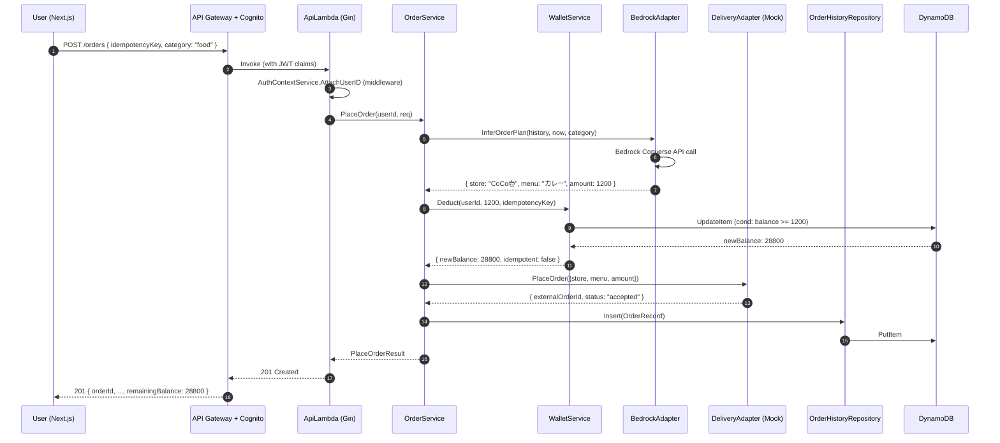
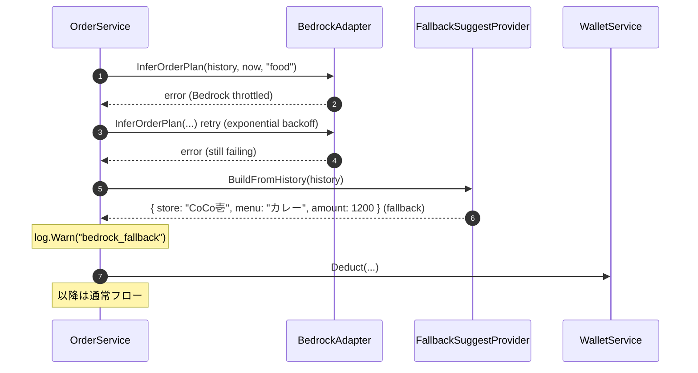
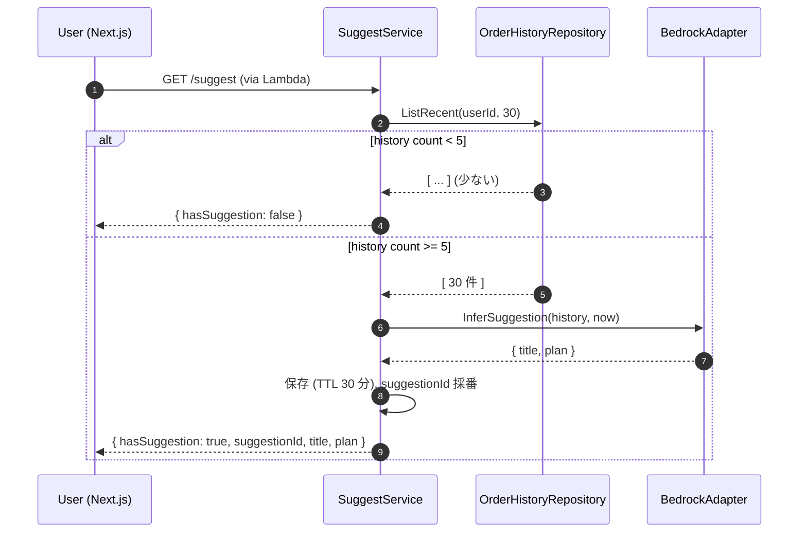
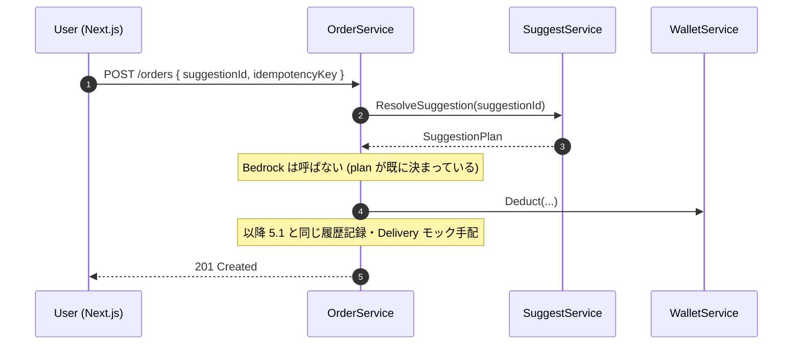
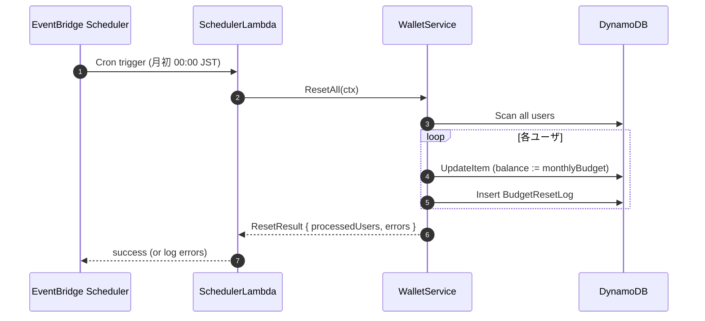

# Services — ゴロゴロPay

**Document Version**: 1.0
**Created**: 2026-05-07

本ドキュメントは、ゴロゴロPay MVP の **サービス層（ビジネスロジック層）** の定義とオーケストレーションパターンを記述する。

---

## 1. サービス一覧

| サービス | 責務 | 担当 Unit 候補 | パッケージ（Go） |
|---|---|---|---|
| AuthContextService | JWT claims → userId の注入（Gin middleware） | A: 認証 | `internal/auth` |
| WalletService | 残高・予算管理の中核ロジック | B: ダメ予算 | `internal/wallet` |
| OrderService | 代行手配ユースケースのオーケストレータ | C: 代行手配コア | `internal/order` |
| SuggestService | 先回り提案の生成 | D: 学習・先回り | `internal/suggest` |
| MetricsService | ダメ化メトリクス集計 | E: ダメ化メトリクス | `internal/metrics` |
| BudgetRaiseService | 予算増額の推奨値算出と適用 | E: ダメ化メトリクス | `internal/budget_raise` |

全サービスは `internal/` 配下に配置し、外部から直接 import されないクローズドなドメイン層とする。

---

## 2. サービス詳細

### 2.1 AuthContextService（Gin middleware）

**責務**: API Gateway Cognito Authorizer から渡される JWT claims を検証し、`userId` を `gin.Context` に注入する。

**依存**: なし（JWT はゲートウェイ側で検証済み、claims を読むのみ）

**処理フロー**:
```
1. event.requestContext.authorizer.claims.sub を取り出す
2. gin.Context に userID として set
3. 以降のハンドラは UserIDFromContext(c) で参照
```

**エラーケース**:
- claims が空 → `ErrUnauthorized` を返し 401 応答

---

### 2.2 WalletService

**責務**: 仮想ウォレット残高・月間予算に関する全ロジック。二重引き落とし防止・残高不変条件の保証はこのサービスの責任。

**依存**:
- `WalletRepository`
- `BudgetSettingsRepository`
- `IdempotencyRepository`

**主な処理フロー**:

#### 2.2.1 `GetBalance(userID)`
```
1. WalletRepository.Get(userID)
2. BudgetSettingsRepository.Get(userID)
3. WalletSnapshot を組み立てて返す
```

#### 2.2.2 `SetBudget(userID, monthlyBudget)`
```
1. バリデーション: 1 ≤ monthlyBudget ≤ 100,000
2. effectiveFrom = 翌月1日 00:00 JST
3. BudgetSettingsRepository.Set(...)
4. 初回の場合のみ、Wallet を即座に初期化（balance := monthlyBudget）
```

#### 2.2.3 `Deduct(userID, amount, idempotencyKey)` — 最重要
```
1. IdempotencyRepository.TryAcquire(key, payload=amount, ttl=24h)
   → acquired=false なら prev を復元して Idempotent=true で返す（二重処理防止）
2. WalletRepository.DeductConditional(userID, amount)
   → DynamoDB UpdateItem with ConditionExpression: balance >= amount
   → 失敗 → ErrInsufficientBalance
3. 減算後 balance と Idempotent=false を返す
```

**不変条件**（PBT で検証、NFR-TEST-03）:
- 残高は常に `0 以上`
- 同一 idempotencyKey の 2 回目以降の呼び出しで残高はさらに減らない
- 履歴合計減算額 == 初期残高 - 現在残高（月初リセット + Deduct の合計で成立）

#### 2.2.4 `ResetAll(ctx)` — Scheduler Lambda から呼ばれる
```
1. WalletRepository.ListAllUserIDs() で全ユーザ列挙
2. 各ユーザについて BudgetSettingsRepository.Get で monthlyBudget 取得
3. WalletRepository.ResetTo(userID, monthlyBudget)
4. BudgetResetLogRepository.Insert(prev/new balance 記録)
5. 失敗は errors 配列に集約、全件処理継続（一部失敗でも全体停止しない）
6. ResetResult を返す
```

---

### 2.3 OrderService — 代行手配ユースケースの中核オーケストレータ

**責務**: 「ご飯めんどくさい」ボタン押下から完了表示までの全体フロー制御。US-1-01（本 MVP のコア）の Intent を具現化する。

**依存**:
- `WalletService`
- `BedrockAdapter`（InferOrderPlan）
- `DeliveryAdapter`（MockDeliveryAdapter）
- `OrderHistoryRepository`
- `SuggestService.ResolveSuggestion`（Suggest 経由の注文時）
- `FallbackSuggestProvider`（Bedrock 失敗時）

**処理フロー**:

```
PlaceOrder(userID, req):
  1. suggestionID が指定されていれば:
       plan = SuggestService.ResolveSuggestion(suggestionID)
     そうでなければ:
       history = OrderHistoryRepository.ListRecent(userID, 30)
       plan, err = BedrockAdapter.InferOrderPlan(history, now, req.category)
       if err after retry:
           plan = FallbackSuggestProvider.BuildFromHistory(history) or Default()
           log.Warn("bedrock_fallback", userID=userID)

  2. Wallet 減算（冪等性保証）
     result, err = WalletService.Deduct(userID, plan.Amount, req.idempotencyKey)
     if err == ErrInsufficientBalance:
         return 402 INSUFFICIENT_BALANCE
     if result.Idempotent:
         # 既存の注文結果を OrderHistory から復元して返す
         return existingOrder

  3. 外部手配（Adapter 経由、モック）
     deliveryOutput, err = DeliveryAdapter.PlaceOrder(plan)
     if err:
         # 補償: Wallet を戻す（本 MVP は実装せず、ログで警告のみ）
         log.Error("delivery_failed", userID=userID, ...)
         return 500

  4. 履歴記録
     OrderHistoryRepository.Insert({
       OrderID: ulid,
       UserID, Category, StoreName, MenuName, Amount, OrderedAt: now
     })

  5. 応答組み立て
     return {
       OrderID, StoreName, MenuName, Amount,
       RemainingBalance: result.NewBalance,
       Idempotent: result.Idempotent,
     }
```

**ダメ化UX 観点**:
- 全ステップが 3 秒以内に完了することを体感目標（NFR-PERF-01）
- ユーザは「考える・選ぶ」一切なし。全ては Bedrock と OrderService の中で決定

**エッジケース**:
- Bedrock 失敗 × リトライ × フォールバック → 動作継続（NFR-DEG-01「即時解決」の維持）
- 残高不足 → `402` 応答、US-1-04（今月ダメになれません）画面へ誘導
- 連打 → `idempotencyKey` で 1 回分のみ減算、2 回目以降は同一結果を返す

---

### 2.4 SuggestService — 先回り提案の生成

**責務**: アプリ起動時に表示するサジェストカードの内容を推論・生成する。US-2-01 / US-2-02 / US-2-03 を担当。

**依存**:
- `OrderHistoryRepository`
- `BedrockAdapter`（InferSuggestion）
- `FallbackSuggestProvider`

**処理フロー**:

```
GetSuggestion(userID):
  1. OrderHistoryRepository.ListRecent(userID, 30)
  2. if len(history) < 5:
       return { hasSuggestion: false }

  3. suggestion, err = withRetry(1, BedrockAdapter.InferSuggestion(history, now))
     if err:
       plan = FallbackSuggestProvider.BuildFromHistory(history)
       suggestion = { Title: "そろそろご飯めんどくさいですよね？", Plan: plan, HasSuggestion: true, FallbackUsed: true }
       log.Warn("suggest_fallback", userID=userID)

  4. SuggestionID を採番（ULID）し、DynamoDB に一時保存（TTL 30 分）
     - OrderService.PlaceOrder で suggestionId を指定されたときに ResolveSuggestion で復元するため

  5. 応答を返す
```

**ダメ化UX 観点**:
- US-X-02「自己委譲の体験」を技術的に具現化するサービス
- 「サジェスト表示 → 1 タップ注文」の摩擦ゼロ動線を支える

**注意事項**:
- Bedrock 呼び出しは SuggestService 起動ごとに発生 → 頻度が高ければキャッシュ検討（本 MVP では未実装、Functional Design で判断）

---

### 2.5 MetricsService — ダメ化メトリクス集計

**責務**: メイン画面に表示するダメ化回数・消化率を計算する。US-3-01 / US-3-02 を担当。

**依存**:
- `OrderHistoryRepository`
- `WalletRepository`
- `BudgetSettingsRepository`

**処理フロー**:

```
GetMetrics(userID):
  1. damageCount = OrderHistoryRepository.CountThisMonth(userID)
  2. wallet = WalletRepository.Get(userID)
  3. settings = BudgetSettingsRepository.Get(userID)
  4. consumptionRate = 1.0 - (wallet.Balance / settings.MonthlyBudget)
  5. thresholdExceeded = consumptionRate > 0.8
  6. summaryText = fmt.Sprintf("今月のダメ化回数: %d 回、消化額 ¥%d", damageCount, settings.MonthlyBudget - wallet.Balance)

  return Metrics{...}
```

**ダメ化UX 観点**:
- `thresholdExceeded=true` の場合、フロントは警告色表示（US-3-02、NFR-DEG-03 不安の演出）
- 残高 0 時はフロントで `BudgetEmptyScreen` に遷移（US-3-03）

---

### 2.6 BudgetRaiseService — 予算増額の提案と適用

**責務**: 残高 0 時の予算増額推奨値を算出し、ユーザ承諾時に翌月からの予算を更新する。US-3-04（退化ループの完成）を担当。

**依存**:
- `BudgetSettingsRepository`

**処理フロー**:

```
ComputeRecommendedBudget(userID):
  1. current = BudgetSettingsRepository.Get(userID).MonthlyBudget
  2. recommended = min(current * 1.5, 100_000)
  3. return recommended  # 端数は 1000 円単位で切り上げ

Accept(userID, newMonthlyBudget):
  1. バリデーション: 1 ≤ newMonthlyBudget ≤ 100_000
  2. effectiveFrom = 翌月1日 00:00 JST
  3. BudgetSettingsRepository.Set(userID, newMonthlyBudget, effectiveFrom)
       （RaiseHistory に prev/new/at を追記）
  4. return BudgetRaiseResult{newMonthlyBudget, appliedFrom}
```

**ダメ化UX 観点**:
- これは物語的に「依存ループの完成点」（US-X-03）
- 推奨額の計算式は「ペルソナが迷わず OK を押せる」数字感を重視（+50% 前後）
- 上限 100,000 円は NFR-DEG-04 の「ペルソナを過度に圧迫しない」制約

---

## 3. サービス間の相互作用パターン

### 3.1 Synchronous Call（同期呼び出し）

本 MVP では全てのサービス間呼び出しを **同期呼び出し（メソッド呼び出し）** とする。メッセージキュー（SQS / SNS / EventBridge）を使う非同期パターンは採用しない。理由:

- MVP スコープの単純さ
- モノリシック Lambda（Q-E=B'）内の呼び出しは Goroutine 越しでも問題なし
- EventBridge Scheduler は Scheduler Lambda のトリガのみに使用

### 3.2 Orchestration vs Choreography

- **Orchestration を採用**: OrderService / SuggestService がそれぞれのユースケース全体を制御
- Choreography（イベント伝播）は不採用（本 MVP 規模では過剰）

### 3.3 横断関心事

| 横断関心事 | 実装パターン |
|---|---|
| 認証（userId 取り出し） | Gin middleware (`AuthContextService.AttachUserID`) |
| ロギング | 構造化ログ（Go 標準 `slog`）をサービス単位で出力、traceId を context に載せて流す |
| リトライ | サービス層で `withRetry(maxAttempts=1, backoff=exponential)` ヘルパーを用意 |
| バリデーション | Gin + `go-playground/validator` でハンドラ入り口で完結 |
| エラーハンドリング | sentinel errors → ハンドラで HTTP ステータスにマッピング |
| 冪等性 | WalletService が IdempotencyRepository 経由で保証（OrderService が要求元） |

---

## 4. オーケストレーションの代表シーケンス

### 4.1 シナリオ A: 初めての「ご飯めんどくさい」（US-1-01）



### 4.2 シナリオ B: Bedrock 失敗 → フォールバック



### 4.3 シナリオ C: 起動時サジェスト（US-2-01）



### 4.4 シナリオ D: サジェストからの 1 タップ注文（US-2-03）



### 4.5 シナリオ E: 月初リセット（US-3-05）



---

## 5. ダメ化UX フェーズごとのサービス寄与度

| フェーズ | 主に寄与するサービス | 具体的な貢献 |
|---|---|---|
| フェーズ 0（準備） | AuthContextService, WalletService | 認証フロー、予算の初期化 |
| フェーズ 1（快感） | OrderService（特にコア） | 3 秒以内の完了体感 |
| フェーズ 2（依存） | SuggestService | 起動時サジェストで「考えずに済む」体験 |
| フェーズ 3（退化） | MetricsService, BudgetRaiseService | 無力感の可視化 + 増額誘導 |

---

## 6. 審査観点へのトレーサビリティ

| 審査観点 | 対応 |
|---|---|
| ビジネス意図の明確さ | 各サービスの「ダメ化UX 観点」記述で Intent を明示 |
| 創造性とテーマ適合性 | SuggestService / MetricsService / BudgetRaiseService の 3 つがテーマ独自サービスとして位置付けられる |
| Unit 分解の適切さ | §1 でサービスと Unit 候補の対応を表で明示 |
| ドキュメント品質 | 処理フロー擬似コード + Mermaid シーケンス図で視覚的に可読 |
