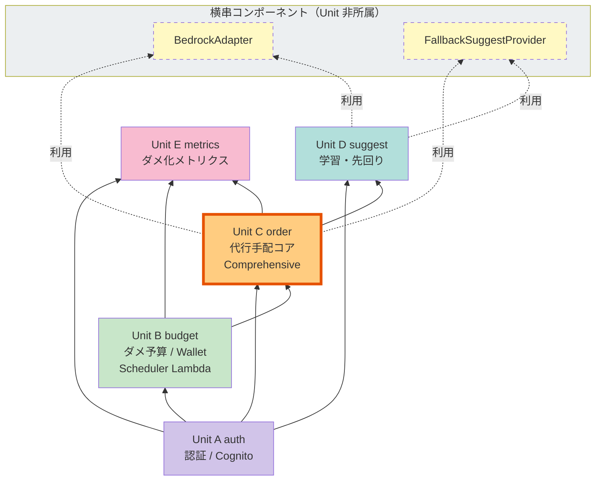

# Unit of Work Dependency — ゴロゴロPay

**Document Version**: 1.0
**Created**: 2026-05-07
**Related**: [unit-of-work.md](./unit-of-work.md), [component-dependency.md](./component-dependency.md)

本ドキュメントは、5 つの Unit of Work の **依存関係** を可視化する。実装順序（A→B→C→D→E）の根拠となる。

---

## 1. Unit 依存グラフ（Mermaid）



**凡例**:
- 矢印: 依存方向（`X → Y` は「X は Y に依存する」）
- 🟪 Unit A: 最下位レイヤ（他から依存される側）
- 🟧 Unit C: 本 MVP のコア（Comprehensive 深度、視認性のため枠線強調）
- 点線: 横串コンポーネントの利用

**依存方向の原則**:
- 下位から上位への単方向依存のみ（循環依存なし）
- 横串コンポーネント（BedrockAdapter / FallbackSuggestProvider）は Unit 非所属で C/D から利用される

---

## 2. Unit 依存マトリクス

### 2.1 直接依存（矢印の有無）

|              | → Unit A | → Unit B | → Unit C | → Unit D | → Unit E | → 横串 Bedrock | → 横串 Fallback |
|---|---|---|---|---|---|---|---|
| **Unit A (auth)** | — | | | | | | |
| **Unit B (budget)** | ✓ | — | | | | | |
| **Unit C (order)** | ✓ | ✓ | — | ✓ | | ✓ | ✓ |
| **Unit D (suggest)** | ✓ | | ✓ (履歴参照) | — | | ✓ | ✓ |
| **Unit E (metrics)** | ✓ | ✓ | ✓ (履歴参照) | | — | | |

**記号**:
- `✓`: 直接依存あり
- `—`: 自分自身
- 空: 依存なし

### 2.2 推移依存を含めた依存レイヤ

```
Layer 0 (最下位): 横串コンポーネント
  ├─ BedrockAdapter
  └─ FallbackSuggestProvider

Layer 1: Unit A (auth)
  └─ 依存先: なし

Layer 2: Unit B (budget)
  └─ 依存先: A

Layer 3: Unit C (order), Unit D (suggest)
  ├─ Unit C 依存先: A, B, D（SuggestService.ResolveSuggestion のため）, 横串 Bedrock/Fallback
  └─ Unit D 依存先: A, 横串 Bedrock/Fallback、Unit C の OrderHistoryRepository（読取参照）

  ※ Unit C と D は相互に関係する:
     - C → D: 1 タップ注文時、Suggest の plan を resolve する
     - D → C: 履歴テーブル（Unit C 所有）を読取参照する
     → 読取参照 vs 機能呼び出しで方向が異なるため、厳密な循環ではなく、
       「C が D の機能を呼ぶ / D が C の読取専用リソースを参照する」の片方向パターン

Layer 4: Unit E (metrics)
  └─ 依存先: A, B, C（読取参照のみ）
```

### 2.3 依存の強さ（結合度）

| 依存元 → 依存先 | 結合度 | 依存内容 |
|---|---|---|
| B → A | 弱 | JWT claims から userId を取得するだけ |
| C → A | 弱 | 同上 |
| C → B | **中** | `WalletService.Deduct` の関数呼び出し（トランザクション境界） |
| C → D | 弱 | `SuggestService.ResolveSuggestion` の関数呼び出し（nullable suggestionId） |
| D → A | 弱 | JWT claims 参照のみ |
| D → C (読取) | 弱 | OrderHistoryRepository の読取専用アクセス |
| E → A | 弱 | 同上 |
| E → B (読取) | 弱 | WalletRepository / BudgetSettingsRepository の読取 |
| E → C (読取) | 弱 | OrderHistoryRepository の読取 |

**最も結合が強いのは C → B**（残高減算というトランザクションを跨いでの関数呼び出し）。ここが本 MVP の統合テストの最重要箇所となる。

---

## 3. 共有コンポーネントの扱い

### 3.1 BedrockAdapter（Unit 非所属、Unit C/D から利用）

- **配置**: `apps/api/internal/adapters/bedrock/`
- **責務**: Bedrock Converse API 呼び出しのラッパ
- **所有者**: プロジェクト全体（Unit 非所属）
- **利用者**:
  - Unit C: `OrderService.PlaceOrder` で `InferOrderPlan` を呼ぶ
  - Unit D: `SuggestService.GetSuggestion` で `InferSuggestion` を呼ぶ
- **変更時の影響**: 両 Unit の受入テストに影響するため、慎重に扱う
- **Terraform**: `infra/modules/bedrock/` で IAM ポリシーを定義、Unit C/D 両方の Lambda に attach

### 3.2 FallbackSuggestProvider（Unit 非所属、Unit C/D から利用）

- **配置**: `apps/api/internal/adapters/fallback/`
- **責務**: Bedrock 失敗時の固定プラン提供（`BuildFromHistory` / `Default`）
- **利用者**: BedrockAdapter と同じ
- **インフラ依存**: なし（純粋な Go コード）

### 3.3 横串コンポーネントの変更管理

Application Design の原則（§2.3 application-design.md）に従い:
- 共有コンポーネント変更は **Unit C / D の両方の Functional Design に反映必須**
- Construction フェーズでの Functional Design 更新時、両 Unit の該当箇所を同時更新

---

## 4. Unit 共有リソース（DynamoDB テーブル）

### 4.1 テーブルの所有と参照

| テーブル | 所有 Unit | 読取参照 Unit | 書込参照 Unit |
|---|---|---|---|
| `GoroPay_Wallet` | Unit B | E | B（Wallet Service 経由のみ）, SchedulerLambda |
| `GoroPay_BudgetSettings` | Unit B | E | B（WalletService.SetBudget 等、BudgetRaiseService.Accept 経由） |
| `GoroPay_OrderHistory` | Unit C | D, E | C（OrderService.PlaceOrder 経由のみ） |
| `GoroPay_IdempotencyKeys` | Unit B | — | B（WalletService.Deduct 経由のみ） |
| `GoroPay_BudgetResetLog` | Unit B | — | B（SchedulerLambda 経由のみ） |

### 4.2 横断参照の原則

- **書込権限は所有 Unit に限定**（最小権限、NFR-REL-01/02 の保証を明確化）
- **読取参照は Repository interface 経由のみ**（直接 DynamoDB Client を参照しない）
- **Unit E の MetricsService** は他 Unit の読取専用 Repository を直接 import する（interface で疎結合）

---

## 5. 実装順序と根拠

### 5.1 実装順序（Plan Q-C=A）

```
Step 1: Unit A (auth)          [依存なし]
Step 2: Unit B (budget)        [A に依存、基盤完成]
Step 3: Unit C (order) ★core   [A,B,D,横串に依存]
  ※ D は C のリリース時点では SuggestService のスタブ実装でも可
Step 4: Unit D (suggest)       [A, C(履歴読取), 横串に依存]
Step 5: Unit E (metrics)       [A, B, C(履歴読取)に依存]
Step 6: Build and Test（全 Unit 統合）
```

### 5.2 実装順序の根拠

| ステップ | 根拠 |
|---|---|
| A を最初 | 他全 Unit が JWT claims / userId 前提。先に固めれば以降の受入テストが書きやすい |
| B を A の次 | Wallet が存在しないと C の動作テストができない。Scheduler Lambda の動作確認もここで完結 |
| C を B の次 | 本 MVP のコア、デモ映えの核。D はこの時点でスタブ実装にしておき、後続で置き換え |
| D を C の次 | C の履歴データが蓄積される設計のため、C 完成後に D の受入テストが自然に可能になる |
| E を最後 | 全 Unit のデータを集計するため、最後に実装 |

### 5.3 並列化の可能性

以下は理論上並列実装可能だが、本 MVP はシングルトラックを推奨（ハッカソン個人作業想定）:
- **A と B の一部**（Cognito と DynamoDB のインフラ構築）
- **D と E**（両方とも読取中心、C 完成後に並列可）

---

## 6. 横串 NFR（ダメ化UX）の Unit 割り当て

ダメ化UX（NFR-DEG-01 ~ NFR-DEG-05）は独立 Unit ではなく、各 Unit の受入基準に織り込む（Plan Q-A=B）。

| NFR | 主に織り込む Unit | 具体的な項目 |
|---|---|---|
| NFR-DEG-01（認知負荷ゼロ） | A, B, C | 登録 5 タップ以下、1 画面 1 入力、注文 1 タップ |
| NFR-DEG-02（起動時サジェスト） | D | SuggestService の主要機能 |
| NFR-DEG-03（常時可視化） | B, E | 残高表示 + ダメ化メトリクス表示 |
| NFR-DEG-04（増額誘導） | E | BudgetRaiseService の主要機能 |
| NFR-DEG-05（自虐的コピー） | C, D, E | 全 Unit の UI 文言設計 |

---

## 7. 変更影響分析テンプレート

Construction フェーズで変更があった場合の影響範囲を素早く見積もるための雛形。

### 7.1 影響分析マトリクス

| 変更箇所 | 影響を受ける Unit |
|---|---|
| `WalletService.Deduct` interface 変更 | C（直接利用）, E（読取は影響小） |
| DynamoDB `GoroPay_Wallet` スキーマ変更 | B（所有）, E（読取）, Scheduler |
| `BedrockAdapter.InferSuggestion` 変更 | D（直接利用） |
| `BedrockAdapter.InferOrderPlan` 変更 | C（直接利用） |
| Bedrock モデル ID 変更 | C, D（両方の Functional Design 更新必須） |
| Cognito User Pool 設定変更 | A（直接）, B/C/D/E（認証フロー経由で間接的） |
| API Gateway Authorizer 変更 | 全 Unit（全 API 保護対象） |

---

## 8. 審査観点へのトレーサビリティ

| 審査観点 | 対応 |
|---|---|
| ビジネス意図の明確さ | §6 で各 NFR-DEG-* がどの Unit に吸収されるかを明示 |
| 創造性とテーマ適合性 | Unit 構成（A→B→C→D→E）が Persona のダメ化フェーズ（準備→フェーズ 1→フェーズ 2→フェーズ 3）と縦に整合 |
| Unit 分解の適切さ | §1 依存図 + §2 マトリクス + §5 実装順序 + §7 影響分析で多面的に説明 |
| ドキュメント品質 | Mermaid + マトリクス + レイヤ整理 + 具体例で立体化 |
