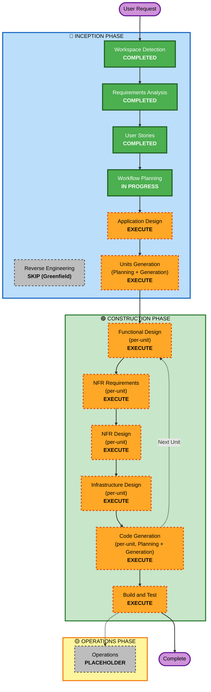

# Execution Plan — ゴロゴロPay

**Document Version**: 1.0
**Created**: 2026-05-07
**Project Type**: Greenfield
**Deadline (Inception 完了)**: 2026-05-10

---

## 1. 背景サマリ

- **User Request**: AI-DLC を使って、idea.md に記載のサービス「ゴロゴロPay」を作成する。
- **Business Intent**: 「人をダメにする」を最優先価値とするライフスタイル代行 PWA（AWS Summit Japan 2026 AI-DLC ハッカソン応募）。
- **Problem Statement**: AI 時代の知的労働者が仕事で意思決定リソースを使い切っているにも関わらず、生活雑事は依然として「何を/どこに/いくらで」をユーザーに問い続ける。本サービスは生活雑事の意思決定そのものを AI に委任し、人間らしい時間と本来業務への集中を取り戻す（詳細: requirements.md §2.3）。
- **Business Model**: 金融グループ連携モデル（クレカ加盟店手数料 + キャッシング金利 + ダメ化履歴データのクロスセル活用）。詳細: requirements.md §2.5。
- **Requirements**: Comprehensive depth、機能要件 7 領域、独自 NFR「ダメ化UX」。
- **User Stories**: 23 本 / 1 メインペルソナ「佐藤陽介」（requirements.md §2.2.1 / personas.md） / Epic-Based（フェーズ0/1/2/3 + ダメ化UX独立章） / Gherkin 受入基準。
- **Stack**: PWA + AWS サーバレス（Lambda / API Gateway / DynamoDB / Cognito / Bedrock / EventBridge Scheduler） + Terraform IaC。
- **Extensions**: Security=No / PBT=Partial。

---

## 2. Detailed Scope and Impact Analysis

### 2.1 Change Impact Assessment

| Impact Area | Yes/No | Description |
|---|---|---|
| User-facing changes | **Yes** | 全体が新規ユーザ向け PWA。ダメ化UX を中核に据えた新機能群 |
| Structural changes | **Yes** | AWS サーバレス構成を新規構築（Lambda 群、API Gateway、DynamoDB テーブル群、Cognito、Bedrock 連携、EventBridge Scheduler） |
| Data model changes | **Yes** | ウォレット残高、注文履歴、ユーザ、サジェスト等の DynamoDB テーブル設計が必要 |
| API changes | **Yes** | 新規 API（authN/Z + order + suggest + metrics + budget）定義が必要 |
| NFR impact | **Yes** | 独自 NFR「ダメ化UX」、体感 3 秒以内、残高不変条件、二重引き落とし防止（冪等性） |

### 2.2 Application Layer Impact

- **Code**: PWA フロント（フレームワーク未定、Application Design で決定）、Lambda バックエンド（**言語未定、Application Design で決定**）、アダプタ層（`DeliveryAdapter` + `MockDeliveryAdapter`）、Bedrock 呼び出しラッパ、ウォレットサービス、サジェストサービス、メトリクスサービス
- **Dependencies**: Cognito SDK、DynamoDB SDK、Bedrock SDK、JSON スキーマバリデーション、fast-check（PBT）
- **Configuration**: 環境変数（モデル ID、テーブル名、Cognito User Pool ID 等）、Terraform パラメータシート
- **Testing**: ユニット（通常 + PBT）、統合テスト、受入テスト（Gherkin → Jest/Vitest 等）

### 2.3 Infrastructure Layer Impact

- **Deployment Model**: サーバレス（Lambda + API Gateway + DynamoDB オンデマンド）
- **Networking**: API Gateway パブリックエンドポイント（VPC 利用なし）、AWS Amplify Hosting で PWA 配信
- **Storage**: DynamoDB（複数テーブル）、AWS Amplify Hosting（PWA ホスティング）
- **Scaling**: AWS マネージドサービスの自動スケール特性に依存
- **Region**: `ap-northeast-1` 単一リージョン

### 2.4 Operations Layer Impact

- **Monitoring**: CloudWatch Logs（Lambda 標準ログ）
- **Logging**: 構造化ログ推奨（MVP では緩い準拠）
- **Alerting**: 本 MVP ではアラーム設定なし
- **Deployment**: Terraform apply による IaC デプロイ

### 2.5 Risk Assessment

- **Risk Level**: **Medium**
  - 新規技術要素（Bedrock 連携、EventBridge Scheduler、月初リセット）と複数コンポーネントの統合
  - ただしスコープは MVP（デモ用途）、利用者数が限定的で、データ量も少ない
- **Rollback Complexity**: Easy（Terraform destroy で環境破棄、DB データはデモ用のため喪失許容）
- **Testing Complexity**: Moderate（冪等性・残高不変条件・先回り提案等の統合挙動テストが必要）

---

## 3. Workflow Visualization

**凡例**:
- 🟢 **緑（実行済み・必須）**: Workspace Detection、Requirements Analysis、User Stories、Workflow Planning
- 🟠 **オレンジ（実行予定・条件付き/必須）**: Application Design / Units Generation / Functional Design / NFR Requirements / NFR Design / Infrastructure Design / Code Generation / Build and Test
- ⚪ **灰色（スキップ）**: Reverse Engineering（Greenfield）、Operations（プレースホルダ）

---

## 4. Phases to Execute

### 🔵 INCEPTION PHASE

| ステージ | 判定 | 根拠 |
|---|---|---|
| Workspace Detection | **COMPLETED** | 2026-05-07 完了、Greenfield 判定 |
| Reverse Engineering | **SKIP** | Greenfield のため適用外 |
| Requirements Analysis | **COMPLETED** | 2026-05-07 完了、requirements.md 生成 |
| User Stories | **COMPLETED** | 2026-05-07 完了、23 ストーリー / 1 ペルソナ |
| Workflow Planning | **IN PROGRESS** | 本ドキュメントそのもの |
| **Application Design** | **EXECUTE** | 新規プロジェクトで複数コンポーネント構成。PWA + 複数 Lambda + DynamoDB テーブル + 外部アダプタ層のハイレベル設計が必要 |
| **Units Generation** | **EXECUTE** | MVP でも 5〜6 Unit の分解が示唆されており、AI-DLC 審査観点「Unit 分解の適切さ」に直接対応する必須成果物 |

### 🟢 CONSTRUCTION PHASE（per-unit）

| ステージ | 判定 | 根拠 |
|---|---|---|
| **Functional Design** | **EXECUTE**（per-unit） | 金融ドメインのビジネスロジック（ウォレット減算、冪等性、月初リセット、先回り提案の生成ロジック）を Unit 単位で詳細設計する必要あり |
| **NFR Requirements** | **EXECUTE**（per-unit） | 独自 NFR「ダメ化UX」、体感 3 秒以内、残高不変条件、二重引き落とし防止を Unit 単位で評価・数値化する必要あり |
| **NFR Design** | **EXECUTE**（per-unit） | NFR Requirements を受け、冪等性キー、条件付き書き込み、サジェスト生成プロンプト、EventBridge Scheduler 構成等を Unit 単位で設計 |
| **Infrastructure Design** | **EXECUTE**（per-unit） | Terraform による IaC 構築必須。DynamoDB テーブル設計、API Gateway ルーティング、Cognito User Pool、Bedrock IAM、EventBridge Scheduler ルールを Unit 単位でマッピング |
| **Code Generation** | **EXECUTE**（per-unit、ALWAYS） | MVP の動作するデモを作る最終目的 |
| **Build and Test** | **EXECUTE**（ALWAYS） | 統合的な Build と受入テスト |

### 🟡 OPERATIONS PHASE

| ステージ | 判定 | 根拠 |
|---|---|---|
| Operations | **PLACEHOLDER** | AI-DLC 仕様通り、将来拡張用プレースホルダ |

---

## 5. 締切制約と実行タイミング

### 5.1 締切: 2026-05-10（Inception 完了必須）

AWS Summit Japan 2026 AI-DLC ハッカソン応募要件として、**Inception フェーズの完了**（`aidlc-state.md` で Inception 完了、Inception の全成果物が揃っていること）が 2026-05-10 までに必要。

### 5.2 実行スケジュール

#### Phase A: Inception 完了（締切内、2026-05-07 〜 2026-05-10）

| 日付 | 実行ステージ | 成果物 |
|---|---|---|
| 2026-05-07 (完了) | Workspace Detection | aidlc-state.md |
| 2026-05-07 (完了) | Requirements Analysis | requirements.md |
| 2026-05-07 (完了) | User Stories | personas.md, stories.md |
| 2026-05-07 (本日) | Workflow Planning | execution-plan.md（本ドキュメント） |
| 2026-05-08 〜 2026-05-09 | Application Design | application-design.md |
| 2026-05-09 〜 2026-05-10 | Units Generation | units.md + 各 unit 概要 |

→ **2026-05-10 終了時点で Inception フェーズ完了**、ハッカソン応募可能状態になる。

#### Phase B: Construction（締切後、任意）

ハッカソン応募要件には **Inception 完了** が必要だが Construction は必須ではない。
本 execution-plan では Construction ステージも EXECUTE として計画するが、締切後に実施する。

---

## 6. Adaptive Depth 方針

**See `common/depth-levels.md`** — 各ステージの詳細度は以下の方針とする：

| ステージ | Depth | 理由 |
|---|---|---|
| Application Design | **Comprehensive** | 審査観点「ドキュメント品質」への訴求、新規構成のため厚めに |
| Units Generation | **Comprehensive** | 審査観点「Unit 分解の適切さ」への直接対応 |
| Functional Design (per-unit) | **Standard** | MVP スコープ、過度な詳細化は締切を圧迫 |
| NFR Requirements (per-unit) | **Standard** | ダメ化UX 関連のみ詳細、その他は簡潔 |
| NFR Design (per-unit) | **Standard** | 同上 |
| Infrastructure Design (per-unit) | **Comprehensive** | Terraform 準拠規約があり、パラメータシート・コスト見積等の厚い成果物が求められる |
| Code Generation (per-unit) | **Standard** | MVP の最小実装 |
| Build and Test | **Standard** | Gherkin 受入基準を活用、最低限のテスト整備 |

---

## 7. Success Criteria

### 7.1 Primary Goal

AWS Summit Japan 2026 AI-DLC ハッカソンの **Inception フェーズ成果物** を 2026-05-10 までに完成させ、「ゴロゴロPay」の設計意図（「人をダメにする」Intent）を審査観点 4 項目すべてで高評価が得られる状態にする。

### 7.2 Key Deliverables（Inception 完了時点）

- [x] `aidlc-docs/aidlc-state.md`
- [x] `aidlc-docs/audit.md`
- [x] `aidlc-docs/inception/requirements/requirements.md`
- [x] `aidlc-docs/inception/requirements/requirement-verification-questions.md`
- [x] `aidlc-docs/inception/user-stories/personas.md`
- [x] `aidlc-docs/inception/user-stories/stories.md`
- [x] `aidlc-docs/inception/plans/user-stories-assessment.md`
- [x] `aidlc-docs/inception/plans/story-generation-plan.md`
- [x] `aidlc-docs/inception/plans/execution-plan.md`（本ドキュメント）
- [ ] `aidlc-docs/inception/application-design/application-design.md`（次ステージ）
- [ ] `aidlc-docs/inception/application-design/units.md`（Units Generation ステージ）

### 7.3 Quality Gates

- 各ステージ末の承認ゲートをユーザが明示承認すること
- 全ドキュメントが `idea.md` のビジョン「人をダメにする」と縦串で一貫すること
- 審査観点 4 項目（Intent 明確さ / 創造性・テーマ適合性 / Unit 分解 / ドキュメント品質）すべてに対応するトレーサビリティが維持されること
- `audit.md` に全ユーザ入力・承認ゲート・AI 応答が時系列で記録されること

---

## 8. Estimated Timeline（Inception フェーズ）

| 項目 | 推定 |
|---|---|
| 残ステージ数（Inception） | 2（Application Design + Units Generation） |
| 推定所要時間 | 合計 数時間 〜 半日（対話・承認ゲート含む） |
| 締切までの余裕 | 3 日（2026-05-07 〜 2026-05-10） |

---

## 9. Package Change Sequence

**N/A** — Greenfield プロジェクトのため、既存パッケージの変更順序は適用外。

---

## 10. 審査観点へのトレーサビリティ

| 審査観点 | 本計画での対応箇所 |
|---|---|
| ビジネス意図（Intent）の明確さ | §1, §7.1, 次の Application Design / Units Generation で Intent を全 Unit に展開。requirements.md §2.3 Problem Statement で「意思決定リソースの委任」という解くべき課題を言語化済み |
| 創造性とテーマ適合性 | §6 Adaptive Depth で Application Design / Units Generation を Comprehensive、stories.md の Epic X（ダメ化UX）との連続性を保つ。requirements.md §2.5 Business Model で金融グループ連携モデル（クレカ + キャッシング + データ活用）として独自性を提示 |
| Unit 分解の適切さ | §4 の Units Generation を EXECUTE、stories.md 末尾の 6 Unit 候補を基礎に設計 |
| ドキュメント品質 | §7.2 Key Deliverables 全達成、§7.3 Quality Gates を維持 |
