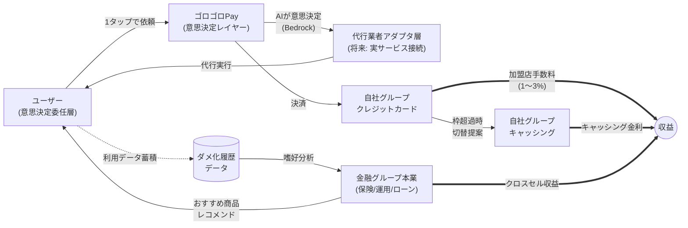
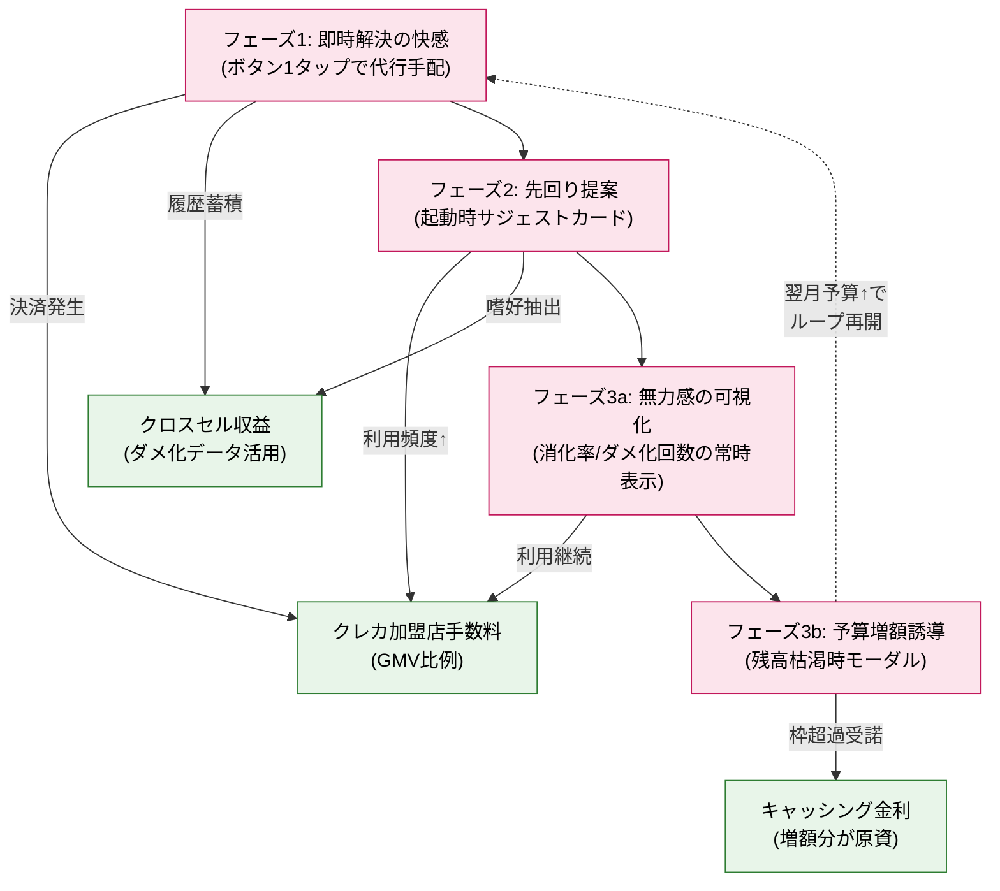

# ゴロゴロPay — Requirements Document

**Document Version**: 1.0
**Created**: 2026-05-07
**Project Type**: Greenfield
**Depth Level**: Comprehensive
**Deadline**: 2026-05-10 までに Inception フェーズ完了必須

---

## 1. Intent Analysis Summary

### 1.1 User Request
「AI-DLC を使って、idea.md に記載のサービスを作成したい。」

### 1.2 Request Type
**New Project（Greenfield）** — 新規プロジェクトの立ち上げ。既存コードベースなし。

### 1.3 Scope Estimate
**System-wide** — PWA フロントエンド、複数の Lambda バックエンド、AI 推論、外部サービス連携（モック経由）、認証基盤、スケジュール処理 を含む全体構成。

### 1.4 Complexity Estimate
**Complex** — 金融ドメイン（仮想ウォレット）、生成AI（Bedrock）、非同期処理（EventBridge Scheduler）、Terraform による IaC、独自コンセプト（ダメ化UX）を含む多層構造。

### 1.5 Business Intent（Mission Statement）
> **「人をダメにする」** ことを最優先価値として提供する、金融グループ発のライフスタイル代行アプリ。
>
> 生活のあらゆる「めんどくさい」を、月初に設定した「ダメ予算」からの即時引き落としでボタン1つ即時解決する体験を通じ、**ユーザの自立能力を快適に退化させる** ループ（即時解決の快感 → 先回り提案 → 無力感の可視化 → 予算増額誘導）を構築する。
>
> 本プロジェクトは AWS Summit Japan 2026 AI-DLC ハッカソン提出物であり、テーマ「人をダメにするサービスを考えよう」への直接的回答である。

---

## 2. Business Context

> **本章の構成**: 抽象→具体の順で並べる。
> §2.1〜2.5 はビジネス文脈（なぜ・誰に・どんな問題で・どこで・どう稼ぐ）、§2.6 はその達成基準、§2.7〜2.9 は技術スコープと前提条件・制約。

### 2.1 Background
- 金融グループのシステム開発チームがハッカソン提出用に企画。
- キャッシングの「必要なときに即使える」利便性を、生活全般の「面倒ごと」に拡張することで、金融ドメイン知識（即時決済 UX・予算管理・利用履歴）を直接転用する。
- 利便性が高度化した限界でユーザー体験がどう変わるかを探索する、思考実験としての企画でもある。

### 2.2 Target Persona

#### 2.2.1 メインペルソナ: 佐藤 陽介（27歳・Web ディレクター）

| 項目 | 内容 |
|---|---|
| 名前（仮） | 佐藤 陽介（さとう ようすけ） |
| 年齢 | 27 歳 |
| 居住 | 東京都内、賃貸 1LDK で一人暮らし（実家は近郊） |
| 職業 | 都内 IT 企業の Web ディレクター（新卒 5 年目） |
| 年収 | 約 550 万円 / 月の自由に使える額 約 8 万円 |
| 婚姻 | 独身、恋人なし |

**生活の輪郭**:
- 実家暮らしの間は、家事・食事・手続きを家族がほぼ担っていた。一人暮らし開始から 3 年、生活雑事の全てが自分の意思決定に乗ってきている。
- 仕事では Web ディレクターとして日中ずっと意思決定（仕様判断・優先順位・調整）を続けている。**1 日の意思決定リソースは仕事でほぼ使い切っている**。
- 帰宅後、夕食を「何にするか」「どこから取るか」「いくらまで出すか」を決めるだけで疲れる。デリバリーアプリは入れているが、店選びの段階で離脱してコンビニに行くことが多い。

**特性**:
- **認知エネルギーが希少**: 仕事で頭を使うので、プライベートでは「考えない」ことが快感。
- **金銭感覚**: 「1,000 円で面倒が消えるなら安い」と思える派。コスパより労力コスパ。
- **時間に対する飢え**: 帰宅後に趣味・自己研鑽・休息に使える「**自分の時間**」を増やしたいが、生活雑事の意思決定にすり減らされて捻出できていない。

#### 2.2.2 拡張セグメント（将来）
将来の拡張対象として、構造的に同じ問題を抱える層を想定する：
- **仕事没頭型の専門職**（プログラマー・研究者・クリエイター等）— 雑事の意思決定で創造的思考が削られる
- **共働き子育て世帯** — 生活雑事と家族時間がトレードオフになっている層

### 2.3 Problem Statement

陽介が抱える本質的な問題は、「家事・食事・手続きをやる体力がない」ことではない。**「日々の生活雑事に対して、無数の小さな意思決定を強いられること」** である。

#### 2.3.1 問題（Problem）
- AI 時代の知的労働者は、仕事で意思決定リソースを使い切っている。
- それにも関わらず、生活雑事は依然として「**何を**頼むか／**どこに**頼むか／**いくら**まで出すか」をユーザーに問い続ける。
- 既存のデリバリーアプリ・家事代行・サブスク代行系は「実行レイヤー」を効率化したが、**「意思決定そのもの」は依然としてユーザーの仕事のまま**である（§2.4.1 の表「残っている認知負荷」参照）。
- 結果、ユーザーは生活雑事のために創造的・人間的な時間を失い続けている。

#### 2.3.2 解決策（Solution）— ゴロゴロPay
ゴロゴロPay は、**生活雑事の意思決定そのものを AI に委任する** インターフェースを提供する。
- ユーザーは月初に「ダメ予算（=意思決定を委任する金額枠）」を設定するだけ。
- 以降、カテゴリボタン 1 タップで、店舗選び・メニュー選び・金額判断・配達手配のすべてを AI（Bedrock）が自動決定して実行する。
- ユーザーは「考える・選ぶ・決める」から完全に解放される。

#### 2.3.3 「ダメになる」ことで取り戻すもの（Positive Inversion）
本サービスのテーマは「**人をダメにする**」だが、それは **生活雑事に対して意図的にダメになる** ことを意味する。意思決定リソースを生活雑事から引き上げることで、ユーザーは以下を取り戻す：

| 取り戻すもの | 内容 |
|---|---|
| **人間らしい時間** | AI が雑事を処理する間、ユーザーは趣味・休息・人との対話など、**機械に置き換えられない時間**に集中できる |
| **本来の集中** | 仕事の意思決定リソースを温存し、**創造的・専門的な業務に深く没入する**余白が生まれる |
| **意思決定の選択と集中** | 「何にエネルギーを使うか」を能動的に選ぶ。生活雑事を AI に委任することは、自立の放棄ではなく **意思決定リソースの戦略的配分** である |

> **ポイント**: 「生活雑事ではダメになる」ことで、「**本当に大切なところでは冴えていられる**」という構造を提供するのが、ゴロゴロPay の価値命題である。テーマ「ダメにする」は、この反転を含めて初めて完成する。

### 2.4 Market & Competitive Landscape

#### 2.4.1 隣接サービスカテゴリ
ターゲットペルソナ（一人暮らしの社会人）の「めんどくさい」を部分的に解消している既存カテゴリ。

| カテゴリ | 解消する「めんどくさい」 | 残っている認知負荷 |
|---|---|---|
| **デリバリー系アプリ** | 食事の調達・移動 | 店舗選び、メニュー選び、金額判断、配達時間決め |
| **家事代行サービス** | 掃除・洗濯・料理等の物理労働 | 業者選び、見積もり比較、依頼内容の言語化、日程調整 |
| **サブスク代行・タスク代行系** | 手続き・買い物・予約等の単発タスク | 何を頼むかの決定、依頼文の作成、依頼先選び |
| **キャッシング・カードローン（金融グループ既存事業）** | 一時的な資金不足 | 借りる金額の決定、用途の整理 |

#### 2.4.2 ゴロゴロPay の位置付け（補完関係 × 別セグメント）

本プロジェクトは既存カテゴリと **同一市場で競合しない**。以下の二段構えで位置付ける。

**(A) 補完関係 — 上位レイヤーの「意思決定インターフェース」**
- 既存カテゴリは **「実行レイヤー」**（注文・派遣・手配を実行する層）。ユーザーは依然として「**何を**頼むか」「**どこに**頼むか」を自分で決定する必要がある。
- ゴロゴロPay は **「決定レイヤー」** を AI（Bedrock）で代行する上位インターフェース。下層の既存サービスは将来 Adapter 層（`DeliveryAdapter` 等）で接続可能な実装基盤として設計済み。
- すなわち、既存プレイヤーを倒すのではなく **「束ねて使い倒す上位レイヤー」** として位置付ける。

**(B) 別セグメント — 「効率化」ではなく「意思決定の委任」を価値とする層**
- 既存カテゴリの価値命題は **「便利さ・効率」**。ユーザーは「自分の意思決定をより速く実行する」ために使う。
- ゴロゴロPay の価値命題は **「意思決定そのものを AI に委ねる体験」**。ユーザーは「選ばずに済む」状態を能動的に選ぶ。
- セグメントは隣接するが重なっていない。利便性追求層から **「意思決定委任層」** を切り出す独自市場を形成する。

#### 2.4.3 競合との差別化軸

| 差別化軸 | 既存カテゴリ | ゴロゴロPay |
|---|---|---|
| **統合度** | カテゴリごとに別アプリを使い分け | 1 アプリで複数カテゴリの「めんどくさい」に一点集中 |
| **意思決定** | ユーザーが選ぶ・考える・決める | AI が候補確認なしに自動決定 |
| **認知負荷** | メニュー選び・業者選び・依頼文作成が残る | カテゴリボタン 1 タップで完結（FR-UX-01） |
| **価値命題** | 効率化（意思決定を速くする） | 委任（意思決定そのものを引き受ける） |
| **コピーのトーン** | 「ラクに、スマートに」 | テーマ性を反映した独自コピー（具体例は §4.1 NFR-DEG-05 を参照） |

### 2.5 Business Model

ハッカソン提出物としての仮説モデル。実運用を想定した金融グループ発の事業として、収益構造・コスト構造・KPI を整理する。

#### 2.5.1 全体像（Business Model Canvas 概観）

#### 2.5.2 価値提案（Value Proposition）

| ステークホルダ | 提供価値 |
|---|---|
| **ユーザー（意思決定委任層）** | 「考える・選ぶ・決める」を AI に委譲し、1 タップで生活の面倒ごとを解決できる体験。意思決定から解放される快適さと、それに伴うエンタメ性。 |
| **金融グループ（自社）** | 既存のクレジットカード・キャッシングのアセットを「ダメ化」UX に乗せて再活性化。新しい利用文脈とユーザーデータを獲得。 |
| **将来の加盟代行業者** | 上位の意思決定インターフェース経由で送客される需要。ユーザーは「業者選び」をしないため、価格競争ではなく品質・速度・在庫で評価される。 |

#### 2.5.3 顧客セグメント

- **コアセグメント**: 仕事で意思決定リソースを使い切る一人暮らしの知的労働者（§2.2.1 参照、ペルソナ「佐藤陽介」）
- **拡張セグメント**: 仕事没頭型の専門職、共働き子育て世帯（§2.2.2 参照）

#### 2.5.4 収益モデル — 金融グループ連携モデル

**核となる仕組み**: 「ダメ予算」をクレジットカード枠とキャッシング枠の二段構成として実装し、利用が増えるほど金融収益が増える構造をつくる。

**(A) クレジットカード手数料収入（メイン）**
- ダメ予算 = 自社グループ発行のクレジットカード利用枠にリンク
- 代行手配の決済はクレカ経由 → 加盟店手数料（一般的に 1〜3%）として収益化
- 利用頻度が高いほど月間流通総額（GMV）が増加 → 手数料収入が比例増加

**(B) キャッシング金利収入（オーバーフロー）**
- クレカ枠を使い切った時点（=「今月ダメになれません」モーダル発動時）、自動的にキャッシング枠への切り替え／翌月予算増額（実質ローン）を提案
- ユーザーが受諾するとキャッシング残高として計上 → 利息収入（年利数%〜十数%）
- **テーマ整合**: 「ダメ化ループ（即時解決の快感 → 無力感 → 予算増額）」がそのままキャッシング利用増加と一致。テーマ体現と収益拡大が同方向を向く。

**(C) 顧客データ活用によるクロスセル（中長期）**
- 「ダメ化履歴」（カテゴリ別利用頻度、時間帯、金額帯、季節変動）はユーザーのライフスタイル・嗜好の高解像データ
- 金融グループ本業（保険、資産運用、ローン、住宅、自動車関連）の **おすすめ商品レコメンド** に活用
- 例: 外食頻度が高い → 食費保険／健康関連保険の提案、家事代行利用が多い → 時短家電のショッピングローン、月末に予算逼迫が多い → リボ払い切替の提案
- **テーマ整合**: ユーザーの「自分では選べない」状態を逆手にとって、AI が金融商品まで自動レコメンド・自動加入させる「金融におけるダメ化」へ拡張可能

#### 2.5.5 ダメ化ループとマネタイズの対応関係

ダメ化ループ（テーマ体現の中核）と収益が同方向を向いていることを可視化する。

> **ポイント**: ダメ化が深まるほど（フェーズ1→2→3 が進行するほど）、3 種の収益すべてが拡大する。テーマ「人をダメにする」と金融グループ本業の収益拡大が完全に同方向を向く構造になっている。

#### 2.5.6 コスト構造

| コスト項目 | 種別 | 想定規模感（MVP / 本番） |
|---|---|---|
| **AWS インフラ（Lambda / DynamoDB / API Gateway / Cognito 等）** | 変動（従量） | デモ規模では月数千円〜、本番では MAU 数に比例 |
| **Bedrock 推論コスト（Claude）** | 変動（従量） | 1 注文あたり数円程度を想定。先回り提案でも別途トークン消費。最大コストドライバー候補 |
| **加盟代行業者への支払い（実運用時）** | 変動 | 注文金額の大半。手数料収入から差し引かれる |
| **クレジットリスク・貸倒引当金（キャッシング）** | 変動 | キャッシング残高の数%。ダメ化ループで残高が膨らむほどリスクも比例 |
| **コンプライアンス・監査・与信システム** | 固定 | 金融商品取扱に伴う固定コスト |
| **開発・運用人件費** | 固定 | 本 MVP のスコープ外、本番運用時に発生 |

**MVP（ハッカソン）でのコスト**: Bedrock 推論コスト + AWS インフラのみ（デモ規模で月数千円〜数万円想定）。

#### 2.5.7 ダメ化 KPI（North Star + 主要メトリクス）

ダメ化の進行度と収益貢献を同時に測る指標群。

**North Star Metric**
- **月間「ダメ化指数」**: ユーザー1人あたりの月間代行手配回数 × 平均消化率 — ダメ化の深さと広さを統合する独自指標

**ユーザーエンゲージメント系**
| KPI | 定義 | ダメ化観点 |
|---|---|---|
| MAU | 月間アクティブユーザー数 | 規模 |
| 代行手配頻度 | ユーザー1人あたり月間代行手配回数 | ダメ化の深さ |
| サジェスト受諾率 | 起動時サジェストカードのタップ率 | 先回り提案の効き具合（フェーズ2の達成度） |
| 平均ダメ予算 | ユーザー1人あたり月間予算設定額 | ダメ化の経済的深さ |
| ダメ予算消化率 | 月末時点の予算消化％ | フェーズ3の進行度 |
| 予算増額発生率 | 残高枯渇 → 翌月増額モーダルから増額に至った割合 | 退化ループの完成度 |

**収益系**
| KPI | 定義 | ビジネス観点 |
|---|---|---|
| ARPU | ユーザー1人あたり月間平均流通総額（GMV） | クレカ手数料の主要ドライバー |
| キャッシング転換率 | クレカ枠超え → キャッシング受諾に至った割合 | キャッシング金利収入の主要ドライバー |
| クロスセル受諾率 | レコメンドした金融商品の加入率（将来） | データ活用モデルの効果検証 |

---

### 2.6 Success Criteria（ハッカソン審査基準との対応）
本プロジェクトは以下の審査観点に最適化する：

| 審査観点 | 本プロジェクトでの対応 |
|---|---|
| **ビジネス意図（Intent）の明確さ** | テーマ「人をダメにする」を Intent として縦串に通し、全機能・全 Unit がこの Intent から演繹されることを明示（テーマ表現は §1.5 / §4.1 を参照） |
| **創造性とテーマ適合性** | 独自概念「ダメ化UX」を最優先 NFR として定義。「ダメ予算」「先回り提案カード」「ダメ化メトリクス」「予算増額誘導」等の独自機能をテーマから導出 |
| **Unit 分解の適切さ** | テーマの物語フェーズ1→2→3 に呼応する形で Unit を分解（詳細は Units Generation で確定） |
| **ドキュメント品質** | Comprehensive depth で Inception フェーズを実施。全成果物を Intent の縦串で一貫させる |

### 2.7 Scope / Out of Scope

**In Scope**
- PWA フロントエンド（ブラウザベース）
- 仮想ウォレット（DynamoDB 上の数値残高管理）
- Amazon Bedrock (Claude 系) による「最適代行プラン提案」「先回り提案」
- 外部サービス連携のアダプタ層（モック実装のみ、本番実装のインターフェースは定義）
- 認証（Amazon Cognito メール+パスワード）
- 行動学習（利用履歴の蓄積と解析）
- 先回り提案（起動時サジェストカード表示）
- 月初の予算リセット（EventBridge Scheduler）
- Terraform による IaC
- 日本語・円建て・日本国内向け

**Out of Scope**
- 実外部サービス連携（UberEats / 出前館 / 家事代行 / 役所手続き代行等の実API接続）
- 実決済プロバイダ連携（Stripe / PAY.JP 等）
- プッシュ通知（Service Worker / Web Push / SNS / APNs / FCM）
- 音声入力（Amazon Transcribe / Web Speech API 等）
- ネイティブモバイルアプリ（iOS / Android）
- 多言語対応・多通貨対応
- PCI DSS / 個人情報保護法 / 金融庁ガイドラインへの厳格準拠（要点のみ記載）
- ソーシャルログイン（Google / Apple 等）
- マイクロサービス的な厳格な可用性設計（Saga / Circuit Breaker / 多段DLQ 等）

### 2.8 Assumptions
- AWS アカウントが利用可能で、Bedrock Claude モデルへのアクセスが有効化されている
- ハッカソン提出物としてのデモ環境を想定（プロダクション運用は想定しない）
- 審査員およびチームメンバー（数人〜数十人）が触るレベルの規模

### 2.9 Constraints
- **締切**: 2026-05-10 までに Inception フェーズを完了する必要あり
- **コンセプト**: ハッカソンテーマへの整合が最優先（テーマ表現の詳細は §1.5 / §4.1）
- **技術**: 外部連携は AWS ネイティブサービスのみ実接続、それ以外はモック

---

## 3. Functional Requirements

機能要件は **ダメ化フェーズ1（ボタンを押すだけ）** → **フェーズ2（先回り提案）** → **フェーズ3（無力感の可視化・増額誘導）** の3層に対応させて記述する。

### 3.1 認証・ユーザー管理（FR-AUTH）

| ID | 要件 | 優先度 |
|---|---|---|
| FR-AUTH-01 | ユーザーは **メールアドレスとパスワード** で新規登録できる（Amazon Cognito User Pool） | MUST |
| FR-AUTH-02 | ユーザーはメール + パスワードでログインできる | MUST |
| FR-AUTH-03 | ログイン済みユーザーはセッションを維持したままアプリを利用できる（JWT） | MUST |
| FR-AUTH-04 | ユーザーはログアウトできる | MUST |
| FR-AUTH-05 | 未登録ユーザーには、ログイン前のランディング画面を表示する | SHOULD |

### 3.2 ダメ予算管理（FR-BUDGET） — フェーズ1基盤

| ID | 要件 | 優先度 |
|---|---|---|
| FR-BUDGET-01 | ユーザーは **月間のダメ予算（円）** を設定できる（初期値: 30,000円） | MUST |
| FR-BUDGET-02 | ユーザーはダメ予算を変更できる（増額・減額） | MUST |
| FR-BUDGET-03 | 仮想ウォレット残高は DynamoDB 上の数値として管理する（実決済は行わない） | MUST |
| FR-BUDGET-04 | 毎月1日 00:00 JST に、全ユーザーの残高を設定されたダメ予算値にリセットする（EventBridge Scheduler） | MUST |
| FR-BUDGET-05 | 残高は常時、メイン画面上部に **大きく表示** する（「残りダメ予算: ¥28,800」形式） | MUST |
| FR-BUDGET-06 | 残高不足時、代行手配の要求は失敗し、ユーザーに残高不足を通知する | MUST |
| FR-BUDGET-07 | 残高変動（減算・リセット）は履歴テーブルに記録する | MUST |

### 3.3 めんどくさい代行手配（FR-ORDER） — フェーズ1コア機能

本プロジェクトの最小ユースケース。

| ID | 要件 | 優先度 |
|---|---|---|
| FR-ORDER-01 | メイン画面中央に **「ご飯めんどくさい」ボタン** を大きく配置する | MUST |
| FR-ORDER-02 | ユーザーがボタンを押すと、フロントエンドはバックエンドの代行手配 API に注文要求を送る | MUST |
| FR-ORDER-03 | バックエンドは Bedrock（Claude）に対し、ユーザーの履歴・時刻・残予算を踏まえた最適なデリバリープラン（店舗・メニュー・金額想定）を問い合わせる | MUST |
| FR-ORDER-04 | バックエンドは `DeliveryAdapter` インターフェース経由で外部デリバリーサービスへ注文要求を送る。初期実装は `MockDeliveryAdapter` が固定応答を返す | MUST |
| FR-ORDER-05 | 注文応答受領時、ウォレットから注文金額を減算する（**二重引き落とし防止のため冪等性キーを利用**） | MUST |
| FR-ORDER-06 | 注文履歴に記録する（ユーザーID、カテゴリ、金額、店舗名、日時） | MUST |
| FR-ORDER-07 | ユーザーに完了画面を表示する（「注文完了: カレーハウスCoCo壱番屋 新宿店 ¥1,200 — 残りダメ予算 ¥28,800」） | MUST |
| FR-ORDER-08 | ボタン押下から完了画面表示までの **体感時間 3 秒以内** を目標とする（未達でも機能的には許容、将来改善） | SHOULD |
| FR-ORDER-09 | 将来拡張として、掃除・役所手続き等の他カテゴリを追加可能なアダプタ層設計とする（初期実装は「ご飯」カテゴリのみ） | SHOULD |

### 3.4 行動学習（FR-LEARNING） — フェーズ2基盤

| ID | 要件 | 優先度 |
|---|---|---|
| FR-LEARNING-01 | 代行手配が成功するたび、履歴テーブルに（ユーザーID、カテゴリ、時刻、曜日、金額、店舗名）を記録する | MUST |
| FR-LEARNING-02 | 履歴は少なくとも直近3ヶ月分を保持する（DynamoDB TTL で古いデータは自動削除） | SHOULD |

### 3.5 先回り提案（FR-SUGGEST） — フェーズ2コア

| ID | 要件 | 優先度 |
|---|---|---|
| FR-SUGGEST-01 | ユーザーがアプリを起動（メイン画面をロード）した際、バックエンドは履歴から「次にありうる代行要求」を Bedrock に推論させる | MUST |
| FR-SUGGEST-02 | 推論結果をメイン画面上部に **サジェストカード** として表示する（例: 「そろそろご飯めんどくさいですよね？」+ 1タップで注文ボタン） | MUST |
| FR-SUGGEST-03 | ユーザーはサジェストカードをタップすると、通常フローと同じ流れで代行手配が走る | MUST |
| FR-SUGGEST-04 | 履歴が不十分（例: 過去利用 0 回）な場合は、サジェストカードを表示せずデフォルトのカテゴリボタンのみ表示する | MUST |
| FR-SUGGEST-05 | プッシュ通知は実装しない（アプリ起動時にのみサジェストを提示） | MUST |

### 3.6 ダメ化メトリクス表示（FR-METRICS） — フェーズ3

| ID | 要件 | 優先度 |
|---|---|---|
| FR-METRICS-01 | メイン画面に「今月のダメ化回数」（代行手配回数）を表示する | MUST |
| FR-METRICS-02 | メイン画面に「ダメ予算消化率」（%）を表示する | MUST |
| FR-METRICS-03 | 予算消化率が 80% を超えた時、強調表示（色変化等）でユーザーの不安を煽る | SHOULD |
| FR-METRICS-04 | 残高 0 円到達時、「今月ダメになれません」画面とともに **翌月予算の増額提案モーダル** を表示する | MUST |
| FR-METRICS-05 | ユーザーは増額提案モーダルから翌月予算を変更できる（FR-BUDGET-02 との統合） | MUST |

### 3.7 一貫したユーザー体験（FR-UX）

「ダメ化UX」最優先方針の具体化。

| ID | 要件 | 優先度 |
|---|---|---|
| FR-UX-01 | ユーザーは「考える」「入力する」「選ぶ」を最小限とする。カテゴリボタン押下1回で代行手配を完結する | MUST |
| FR-UX-02 | 音声・テキスト自由入力は**実装しない**（全てボタンのみで完結） | MUST |
| FR-UX-03 | 代行手配の完了時、店舗・メニュー等の詳細決定は Bedrock がユーザーに確認することなく自動決定する | MUST |
| FR-UX-04 | メイン画面に戻る経路は **「完了 → 自動的にメインへ戻る」** を基本とし、ユーザーが明示的に操作する要素を最小化する | SHOULD |

---

## 4. Non-Functional Requirements

### 4.1 最優先 NFR: ダメ化UX（DegenerationQuality）

本プロジェクトのすべての NFR は、この **ダメ化UX** への貢献度で評価される。

| ID | 要件 | 根拠 |
|---|---|---|
| NFR-DEG-01 | ユーザーのアクション数（タップ/クリック）を 1 回の代行手配あたり最大 2 回以内とする | 認知負荷ゼロ |
| NFR-DEG-02 | アプリ起動時、ユーザーがボタンを押す前にサジェストカードが提示される | フェーズ2（先回り）の体現 |
| NFR-DEG-03 | 残高・消化率・今月のダメ化回数は常時可視化される | フェーズ3（無力感の可視化） |
| NFR-DEG-04 | 残高枯渇時、翌月予算の増額誘導を強めに提示する | 退化ループの完成 |
| NFR-DEG-05 | UI コピーは自虐的・依存促進的な文言を用いる（例:「残りダメ予算」「そろそろ◯◯めんどくさいですよね？」「今月ダメになれません」） | テーマ体現 |

### 4.2 パフォーマンス

| ID | 要件 | 目標値 |
|---|---|---|
| NFR-PERF-01 | ボタン押下から完了表示までの体感時間 | **3 秒以内**（目標） |
| NFR-PERF-02 | メイン画面の初期表示時間（サジェストカード含む） | 5 秒以内（目標） |
| NFR-PERF-03 | 想定同時利用者数 | **数人〜数十人**（デモ規模） |

### 4.3 可用性

| ID | 要件 |
|---|---|
| NFR-AVAIL-01 | AWS マネージドサービスの標準可用性に準拠（追加の冗長構成は実装しない） |
| NFR-AVAIL-02 | 本番相当の SLA は定めない（デモ用途のため） |

### 4.4 信頼性・データ整合性

| ID | 要件 |
|---|---|
| NFR-REL-01 | **仮想ウォレット残高が負の値にならない**ことをアプリケーションロジックで保証する（DynamoDB 条件付き書き込み） |
| NFR-REL-02 | **同一注文リクエストの二重処理（二重引き落とし）を防止する**（冪等性キーを利用） |
| NFR-REL-03 | 残高変動と注文履歴の記録は、可能な限りアトミックに実行する（DynamoDB TransactWriteItems の利用を検討） |
| NFR-REL-04 | 月初リセットが失敗した場合、手動リカバリ手順をドキュメント化する（自動リトライは実装しない） |

### 4.5 セキュリティ

**Security Extension は opt-out**（ブロッキング制約としての強制はしない）。以下は最低限の方針のみ記載する。

| ID | 要件 |
|---|---|
| NFR-SEC-01 | 認証は Amazon Cognito User Pool により管理し、バックエンド API は JWT 検証を必須とする |
| NFR-SEC-02 | データは AWS マネージドサービスのデフォルト暗号化を利用する（KMS 顧客管理キーは使用しない） |
| NFR-SEC-03 | API Gateway にレート制限を最小限設定する（任意） |
| NFR-SEC-04 | 本番運用時に考慮すべき事項（HTTPS 強制、WAF、CloudTrail 監査ログ、PCI DSS 準拠等）は将来対応として設計書に明記する |

### 4.6 コンプライアンス（要点のみ）

| ID | 要件 |
|---|---|
| NFR-COMP-01 | 本アプリは仮想ウォレット（数値管理のみ）を採用し、実カード情報・決済情報を扱わない。したがって PCI DSS の直接的対象外とする |
| NFR-COMP-02 | 個人情報は「メールアドレス」のみ取得する（Cognito User Pool 内で管理） |
| NFR-COMP-03 | 本番運用時は、個人情報保護法・金融庁ガイドラインへの適合性評価が別途必要である旨を設計書に注記する |

### 4.7 スケーラビリティ

| ID | 要件 |
|---|---|
| NFR-SCALE-01 | AWS サーバレス（Lambda + DynamoDB オンデマンド）の自動スケーリング特性に依存する |
| NFR-SCALE-02 | 本 MVP では明示的なスケール設計（プロビジョンドキャパシティ等）は行わない |

### 4.8 保守性・拡張性

| ID | 要件 |
|---|---|
| NFR-MAINT-01 | 外部サービス連携は **アダプタ層パターン** で抽象化し、`MockDeliveryAdapter` を `UberEatsDeliveryAdapter` 等の実装に差し替え可能とする |
| NFR-MAINT-02 | Terraform モジュール設計のプロジェクト規約（`terraform-plugin:terraform-module-design`）に準拠する |
| NFR-MAINT-03 | Terraform コーディング規約（`terraform-plugin:terraform-coding-rule`）に準拠する |

### 4.9 テスタビリティ

| ID | 要件 |
|---|---|
| NFR-TEST-01 | ビジネスロジックの純粋関数（残高計算・履歴集計等）に対し **Property-Based Testing** を適用する |
| NFR-TEST-02 | シリアライゼーション（JSON ラウンドトリップ）のテストには PBT を適用する |
| NFR-TEST-03 | 以下の不変条件を PBT で検証する: 「残高は負にならない」「同一冪等性キーの二重送信で残高は1回分しか減らない」「履歴合計引き落とし額 == 初期残高 - 現在残高」 |
| NFR-TEST-04 | 上記以外の IO・外部呼び出し部分は通常のユニットテスト/統合テストとする |

### 4.10 観測性

| ID | 要件 |
|---|---|
| NFR-OBS-01 | Lambda のログは CloudWatch Logs に出力する（構造化ログ推奨） |
| NFR-OBS-02 | 本 MVP では X-Ray・カスタムメトリクス等の高度な観測性は実装しない |

### 4.11 アクセシビリティ

| ID | 要件 |
|---|---|
| NFR-A11Y-01 | 基本的なセマンティック HTML（button, form 等）を利用する |
| NFR-A11Y-02 | 本 MVP では WCAG 準拠チェックは実施しない |

---

## 5. Technical Context

### 5.1 Frontend
- **形態**: レスポンシブ Web アプリ（PWA）
- **想定技術**: React / Next.js 等（詳細は Construction フェーズで確定）
- **配信**: AWS Amplify Hosting（フロントエンドは Amplify に統一してホスト）
- **入力手段**: ボタンのみ（音声・自由入力なし）

### 5.2 Backend
- **アーキテクチャ**: AWS サーバレス中心
- **API**: Amazon API Gateway + AWS Lambda
- **永続化**: Amazon DynamoDB
- **AI推論**: Amazon Bedrock（Claude 系モデル、Converse API を Lambda から直接呼び出し）
- **認証**: Amazon Cognito User Pool
- **スケジュール処理**: Amazon EventBridge Scheduler（月初の予算リセット）

### 5.3 Infrastructure as Code
- **ツール**: **Terraform**
- **準拠規約**:
  - `terraform-plugin:terraform-coding-rule`
  - `terraform-plugin:terraform-module-design`
  - `checkov-skip-rule-plugin:checkov-skip-rule`（Checkov のスキップルール運用）
  - `parameter-sheet-format-plugin:parameter-sheet-format`（パラメータシート作成）
  - `aws-cost-estimate-plugin:aws-cost-estimate`（コスト見積書作成）

### 5.4 External Integrations (Mocked)
以下はすべて **モック実装** とする。インターフェース（アダプタ層）だけ定義し、将来の差し替えポイントを残す。

- デリバリー: `DeliveryAdapter`（実装: `MockDeliveryAdapter`。将来: UberEats / 出前館 等）
- 清掃 / 手続き代行等: 初期スコープでは未実装。MVP は「ご飯」カテゴリのみ

### 5.5 Region
- プライマリ: `ap-northeast-1`（東京）
- マルチリージョン構成は行わない

---

## 6. User Scenarios（Happy Path と主要エッジケース）

### 6.1 Happy Path: 「ご飯めんどくさい」→ 代行手配完了

1. ユーザーが PWA にアクセスし、Cognito でログイン済み
2. メイン画面表示時、起動時サジェスト API が呼ばれ、Bedrock が履歴から「そろそろご飯めんどくさいですよね？」を生成
3. ユーザーはサジェストカードをタップ（または中央の「ご飯めんどくさい」ボタンを押す）
4. フロント → API Gateway → `orderHandler` Lambda
5. `orderHandler` は Bedrock で最適なデリバリープランを生成（例: カレーハウスCoCo壱番屋 新宿店、カレーライス、¥1,200）
6. `orderHandler` は `MockDeliveryAdapter.placeOrder()` を呼び出し、固定応答（`orderId`, `status=accepted` 等）を受領
7. `orderHandler` は DynamoDB で「ウォレット残高減算 + 注文履歴記録」を冪等性キー付きで実行
8. ユーザーに完了画面を表示（注文内容 + 残予算 + 今月のダメ化回数）
9. 数秒後、メイン画面に自動遷移

### 6.2 エッジケース: 残高不足

1. ユーザーが「ご飯めんどくさい」ボタンを押す
2. `orderHandler` が残高を検証し、推定注文額が残高を上回る
3. ユーザーに「今月ダメになれません」画面を表示し、翌月予算の増額提案モーダルを出す

### 6.3 エッジケース: 履歴なしの初回利用

1. 新規ユーザーが初ログイン
2. メイン画面のサジェスト API は「履歴なし」判定でサジェストカードを出さない
3. デフォルトの「ご飯めんどくさい」ボタンのみ表示

### 6.4 エッジケース: 月初リセット

1. 2026-06-01 00:00 JST、EventBridge Scheduler が `monthlyResetHandler` Lambda を起動
2. 全ユーザーの残高を設定された月間予算値にリセット
3. リセット操作を履歴テーブルに記録

### 6.5 エッジケース: 二重送信（ネットワーク不安定 / ボタン連打）

1. ユーザーが「ご飯めんどくさい」ボタンを連打
2. フロントは同一の冪等性キーで API 呼び出しを多重送信
3. `orderHandler` は冪等性キーをチェックし、2 回目以降は前回の結果を返す（残高は 1 回分しか減らない）

---

## 7. Quality Attributes Summary

| 品質特性 | 優先度 | 備考 |
|---|---|---|
| **ダメ化UX（独自）** | ★★★★★ | 本プロジェクトの魂。他のすべてがこれに奉仕 |
| 開発スピード | ★★★★ | 2026-05-10 締切（Inception 完了） |
| 信頼性（残高不変・冪等性） | ★★★ | 金融ドメインの最低限保証 |
| UX（即応性・シンプル） | ★★★ | ダメ化UXの表層 |
| 拡張性（アダプタ層） | ★★★ | 審査の「Unit分解」観点に寄与 |
| パフォーマンス | ★★ | デモ規模で十分 |
| セキュリティ | ★★ | 本番考慮は将来事項として記載のみ |
| 可用性 | ★★ | AWS 標準に依存 |
| コンプライアンス | ★ | 要点のみ記載 |
| 多言語対応 | - | スコープ外 |

---

## 8. Extension Configuration

| Extension | Enabled | Reason |
|---|---|---|
| Security Baseline | **No** | ハッカソン / PoC 方針。Q16 で opt-out |
| Property-Based Testing | **Partial** | 純粋関数・シリアライゼーションのみに適用。残高不変条件・冪等性・履歴整合を PBT で検証。Q17 で Partial |

---

## 9. Traceability: 審査観点への対応マップ

| 審査観点 | 関連する本ドキュメントのセクション |
|---|---|
| ビジネス意図の明確さ | §1.5 Business Intent、§2 Business Context、§4.1 最優先NFR |
| 創造性とテーマ適合性 | §4.1 ダメ化UX、§3.5 先回り提案、§3.6 ダメ化メトリクス表示、§3.7 FR-UX |
| Unit 分解の適切さ | §3 Functional Requirements のセクション分割（AUTH / BUDGET / ORDER / LEARNING / SUGGEST / METRICS / UX）、Units Generation ステージで確定 |
| ドキュメント品質 | 本ドキュメント全体（Comprehensive depth）、続く User Stories / Workflow Planning / Application Design / Units Generation のドキュメント一貫性 |

---

## 10. Open Questions / Future Considerations

以下は本 MVP のスコープ外だが、将来検討として記載する：

- Bedrock Agents への置き換えによる複数カテゴリ横断エージェント化
- プッシュ通知対応（Service Worker + Web Push + SNS）
- 実決済プロバイダ連携（Stripe Test モード等）
- 実外部サービス API 連携（UberEats / 出前館 等）
- 音声入力（Amazon Transcribe）
- ネイティブモバイルアプリ化（iOS / Android）
- ソーシャルログイン（Apple / Google）
- 多言語・多通貨対応
- PCI DSS / 個人情報保護法 / 金融庁ガイドラインへの厳格準拠
- Saga パターン / Circuit Breaker / 多段DLQ 等の高信頼構成
- CloudTrail 監査ログ / X-Ray トレーシング / カスタムメトリクス
- WCAG 準拠チェック

---

## 11. Requirements Summary

本 MVP は、**「ご飯めんどくさい」ボタン押下 → Bedrock で最適プラン提案 → モックアダプタ経由で代行手配 → 仮想ウォレットから減算 → 完了表示** のエンドツーエンド動線を中核に、**行動学習による先回り提案（起動時サジェストカード）** と **ダメ化メトリクス・予算増額誘導** を組み合わせることで、idea.md のビジョンとテーマ「人をダメにする」を忠実に体現する。

インフラは AWS サーバレス（Lambda + API Gateway + DynamoDB + Cognito + Bedrock + EventBridge Scheduler）、IaC は Terraform。フロントエンド（PWA）は AWS Amplify Hosting に統一してホスト。

Inception フェーズのドキュメント群は 2026-05-10 までに完成させ、審査観点「ビジネス意図の明確さ」「創造性とテーマ適合性」「Unit 分解の適切さ」「ドキュメント品質」のすべてを満たすことを目指す。
